# 第四章

# 图论初步

## Part 1 基本概念

<div class=hidden>

$\newcommand{\init}{\mathrm{init}}$
$\newcommand{\ter}{\mathrm{ter}}$
$\newcommand{\iso}{\simeq}$
$\newcommand{\dash}{\hspace{-0.65ex}-\hspace{-0.65ex}}$
$\DeclareMathOperator{\diam}{diam}$
$\DeclareMathOperator{\rad}{rad}$
$\DeclareMathOperator{\lca}{lca}$
$\newcommand{\Z}{\mathbb{Z}}$

</div>


---

# 图

一个<ruby>**图**<rt>graph</rt><ruby>是指资料 $G = (V, E)$，其中 $V$ 是集合，$E\subseteq\set{\set{x,y} : x, y\in V, x\ne y}$；即 $E$ 的元素是 $V$ 的二元子集。

为了避免记号混淆，我们总是假定 $V \cap E = \varnothing$。

$V$ 的元素称为图 $G$ 的<ruby>**顶点**<rt>vertex</rt></ruby>或**点**。$E$ 的元素称为图 $G$ 的<ruby>**边**<rt>edge</rt><ruby>。

称 $V$ 为图 $G$ 的**顶点集**，$E$ 为图 $G$ 的**边集**。

顶点集是 $V$ 的图也称为集合 $V$ **上的**图。我们讨论的图，顶点集都是有限的。

---

# 画图

我们常把一个图画成图形：为每个顶点画一个点，若两个顶点构成边则画一条线连接对应的两点。点和线的形状无关紧要，只要能表现出哪些顶点对构成边，哪些顶点对不构成边。


<figure>

<figcaption>

$V=\set{1, \dots, 7}$ 上的图，边集
$E = \set{\set{1,2},\set{1,5},\set{2,5},\set{3,4},\set{5,7}}$。

</figcaption>
</figure>

画图工具：[graph editor](https://csacademy.com/app/graph_editor/)

---

# 习惯说法与记号


- 把图 $G$ 的顶点集记为 $V(G)$，边集记为 $E(G)$。此记法与这两个集合的实际名称无关：图 $H = (W, F)$ 的顶点集 $W$ 仍记为 $V(H)$ 而非 $W(H)$。
- 我们并不总是严格区别一个图和它的顶点集或边集。比如，我们会说顶点 $v\in G$（而非 $v\in V(G)$），边 $e\in G$。
- 边 $\set{x,y}$ 常简写为 $xy$（或 $yx$）。
- 记号 $[V]^2$ 表示 $V$ 的全部二元子集构成的集合。换言之，$[V]^2$ 是 $V$ 上的图所有可能的边的集合。
- $G$ 的顶点数称为它的**阶**，记作 $|G|$；边数记作 $\Vert G \Vert$。
- **空图** $(\varnothing, \varnothing)$ 简写为 $\varnothing$。空图和只有一个顶点的图称为**平凡图**。


---


# 点边关系，点点关系，边边关系

设 $v$ 是图 $G$ 的一个顶点，$e$ 是 $G$ 的一条边，若 $v\in e$ 则称顶点 $v$ **关联**于边 $e$，称 $e$ 是 $v$ **处**的边。与一条边关联的两个点称为其**端点**,称其**连接**这两个点。

设 $u, v$ 是图 $G$ 的顶点，若 $\set{u,v}$ 是 $G$ 的边，则称 $u, v$ <ruby>**邻接**<rt>adjacent</rt></ruby>或**相邻**；此时也称 $u,v$ 互为<ruby>**邻点**<rt>neighbour</rt></ruby>。与点 $v$ 相邻的点构成的集合记作 $N_G(v)$，或简写为 $N(v)$；称为 $v$ 的**邻域**或**邻居**。


设 $e, f$ 是图 $G$ 的边，$e\ne f$，若它们有共同的端点，则称 $e,f$ **邻接**。

称两两不邻接的一族边或点**独立**。

---

# 完全图

若图 $G$ 的所有顶点两两邻接，则称 $G$ 是**完全图**。

$n$ 个顶点上的完全图记作 $K^n$；$K^3$ 也称为**三角形**。


:question: $K^n$ 有多少条边？

---

# 两个图的关系

- 同态和同构
- 子图


---

# 同态和同构

设 $G = (V, E)$ 和 $G'=(V', E')$ 为图，$f : V\to V'$ 为图之间的映射。若 $f$ 保持顶点的邻接性，即
$$\forall x,y\in V,\ \set{x,y}\in E \implies \set{f(x), f(y)}\in E',$$
则称 $f$ 为**图同态**。此时，对于 $f$ 的像集里的每个顶点 $x'$，它的原像集 $f^{-1}(x')$ 是 $G$ 里一族相互独立的顶点。
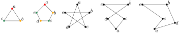
若 $f$ 是双射且其逆 $f^{-1}$ 也是同态，即使得
$$\forall x,y\in V,\ \set{x,y}\in E \iff\set{f(x),f(y)}\in E',$$
则称 $f$ 为**图同构**，也称图 $G$ 和 $G'$ 同构，记作 $G\simeq G'$。从图 $G$ 映到其自身的同构也称为**自同构**。


---

<!-- 
一般我们不区别同构的图。例如，我们通常写 $G=G'$ 而非 $G\iso G'$，当我们谈到 $17$ 顶点的完全图，不用管这些顶点是什么。--- -->


# 子图

设 $G=(V,E)$ 和 $G'=(V',E')$ 为图。
- 若 $V'\subseteq V$ 且 $E'\subseteq E$，则 $G'$ 是 $G$ 的<ruby>**子图**<rt>subgraph</rt></ruby>，记作 $G' \subseteq G$。我们也说 $G$ **包含** $G'$。若 $G'\subseteq G$ 且 $G'\ne G$，则 $G'$ 是 $G$ 的**真子图**。


设 $G'\subseteq G$。
- 若 $G'$ 包含 $G$ 里所有的两端点都在 $V'$ 里的边，则 $G'$ 是 $G$ 的<ruby>**导出子图**<rt>induced subgraph</rt></ruby>；我们说 $V'$ 在 $G$ 里**导出**或**张成** $G'$，记作 $G' =: G[V']$。换言之，对任意子集 $U\subseteq V$，$G[U]$ 指 $U$ 上的这样一个图，它的边恰是图 $G$ 里两端点都在 $U$ 里的边。
- 若 $V'$ 张成整个图 $G$，即若 $V' = V$，则 $G'$ 是 $G$ 的<ruby>**生成子图**<rt>spanning subgraph</rt></ruby>。


---

# 图的运算（操作）

- 二元运算：并，交，删点，加/减边
- 一元运算：补图，线图

---


# 并，交，删点，加/减边

设 $G= (V,E)$ 和 $G'=(V',E')$ 是图。$G$ 和 $G'$ 的**并**和**交**分别定义为 $G\cup G' := (V\cup V', E\cup E')$ 和 $G \cap G' = (V \cap V', E\cap E')$。

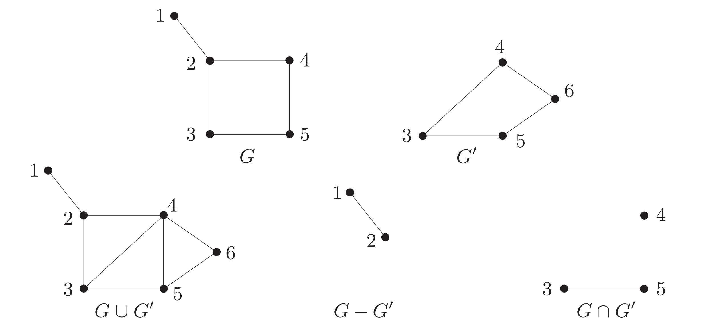

设 $U$ 是一族顶点（通常是图 $G$ 的），我们把 $G[V\smallsetminus U]$ 记为 $G - U$。换言之，$G-U$ 是从 $G$ 里删除 $U\cap V$ 里的所有顶点和与之关联的边而得到的图。若 $U = \set{v}$ 是独点集，我们写 $G - v$ 而非 $G-\set{v}$。我们把 $G - V(G')$ 简写为 $G - G'$。

对于 $[V]^2$ 的子集 $F$，定义 $G-F := (V, E\smallsetminus F)$ 和 $G + F := (V, E\cup F)$。同上，$G- \set{e}$ 和 $G+ \set{e}$ 简记为 $G - e$ 和 $G+ e$。 


---

# 补图，线图

设 $G=(V, E)$ 是图。

$G$ 的**补图** $\overline{G} := (V,\ [V]^2 \smallsetminus E)$

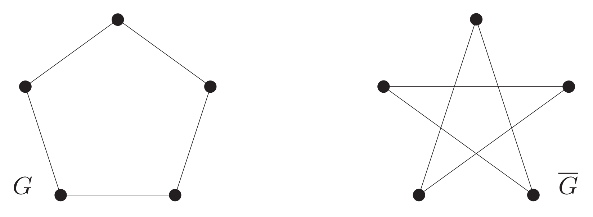

$G$ 的**线图** $L(G):= \left(E,\ \set{\set{x, y}\in [E]^2 :  x,y~作为~G~里的边邻接}\right)$


---

# 顶点的度

设 $G = (V, E)$ 为非空图。顶点 $v$ 的<ruby>**度**<rt>degree</rt></ruby> $d_G(v) = d(v)$ 定义为点 $v$ 处边的数量；根据图的定义，这也等于 $v$ 的邻点的数量。度是 $0$ 的顶点称为**孤立点**。图 $G$ 的**最小度**记为 $\delta(G) := \min\set{d(v) \mid  v\in V}$，而图 $G$ 的**最大度**记为 $\Delta(G) := \max\set{d(v) \mid v\in V}$。 若 $G$ 的所有顶点的度都是 $k$，则称 $G$ 是 $k$-**正则的**，或简称正则的。


---

# 练习

证明下述结果。设 $G = (V, E)$ 为图，有
$$
|E| = \tfrac{1}{2} \sum_{v\in V} d(v).
$$
作为推论，任一图里度是奇数的顶点总有偶数个。


---

# 3-正则图

:question: 连通的3-正则图是什么样的？注意到 3-正则图必有偶数个顶点。


---

# 习题 [abc262_e](https://atcoder.jp/contests/abc262/tasks/abc262_e) Red and Blue Graph

给你一个有 $N$ 个顶点和 $M$ 条边的图。

把图上的每个顶点涂成红色或蓝色，有 $2^{N}$ 种方式。求满足下列条件的染色方式的数量，模 $998244353$：

- 恰有 $K$ 个顶点被染成红色，有 $N-K$ 个顶点被染成蓝色。
- 两端点颜色不同的边有偶数条。

###### 限制

- $2 \leq N \leq 2 \times 10^5$
- $1 \leq M \leq 2 \times 10^5$
- $0 \leq K \leq N$

---

# 解法

- 设红红边有 $A$ 条，红蓝边有 $B$ 条。注意到 $2A + B = \sum_{红点v} d(v)$，所以 $B$ 是偶数当且仅当红点的度之和是偶数。

- 条件变成：选择 $K$ 个点使得它们的度之和是偶数。

- 只要这 $K$ 个点里度是奇数的点有偶数个即可。


---

# 代码

<div class=columns>

```cpp
const int mod = 998244353; //是素数

int inverse(long long x) { // 模p下的逆元
    if (x == 1) return 1;
    return mod - mod / x * inverse(mod % x) % mod;
}

const int maxn = 2e5 + 5;
int deg[maxn]; // 度
long long f[maxn]; // 阶乘

long long choose(int n, int m) { // 组合数
    if (m < 0 || m > n) return 0;
    return
        f[n] * inverse(f[m] * f[n - m] % mod) % mod;
}
```

```cpp
int main() {
    int n, m, k;
    cin >> n >> m >> k;
    while (m--) {
        int u, v;
        cin >> u >> v;
        deg[u]++;
        deg[v]++;
    }
    int odd = 0;
    for (int i = 1; i <= n; i++)
        if (deg[i] % 2)
            odd++;
    
    f[0] = 1;
    for (int i = 1; i <= n; i++)
        f[i] = f[i - 1] * i % mod;

    long long ans = 0;
    for (int i = 0; i <= min(odd, k); i += 2)
        ans += choose(odd, i) * choose(n - odd, k - i) % mod;
    cout << ans % mod << '\n';
}
```

---


# 路径

非空图 $P=(V, E)$ 称为<ruby>**路径**<rt>path</rt></ruby>，若它形如
$$
V= \set{x_0, x_1, \dots, x_k} \qquad E =\set{x_0x_1, x_1x_2, \dots, x_{k-1}x_k},
$$
其中诸 $x_i$ 互异。我们说顶点 $x_0$ 和 $x_k$ 被 $P$ **链接**并称之为 $P$ 的**端点**；而顶点 $x_1, \dots, x_{k-1}$ 是 $P$ 的**内部**顶点。路径的边数称为其**长度**。长度为 $k$ 的路径记作 $P^k$。路径的长度容许是 $0$，$P^0 = K^1$。

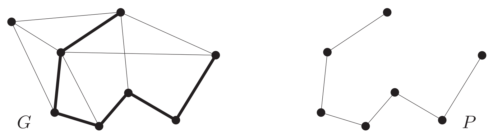
图 $G$ 里的路径 $P = P^6$

---

# 关于路径的习惯记号和说法

我们常把路径上的点依其自然顺序写出，记如 $P = x_0 x_1 \dots x_k$ 并称 $P$ 为一条**从** $x_0$ **到** $x_k$ 的路径，或 **$x_0$ 和 $x_k$ 之间**的路径。

对于 $0 \le i \le j \le k$，我们用下列记号表示 $P$ 的**子路径**
$$
\begin{aligned}
P x_i & := x_0\dots x_i \\
x_i P & := x_i \dots x_k \\
x_iPx_j & := x_i \dots x_j
\end{aligned}
$$


我们用类似的直观记号表示路径的**串接**；例如，若三条路径的并 $Px \cup xQy \cup yR$ 仍是路径，我们把它简记为 $PxQyR$。
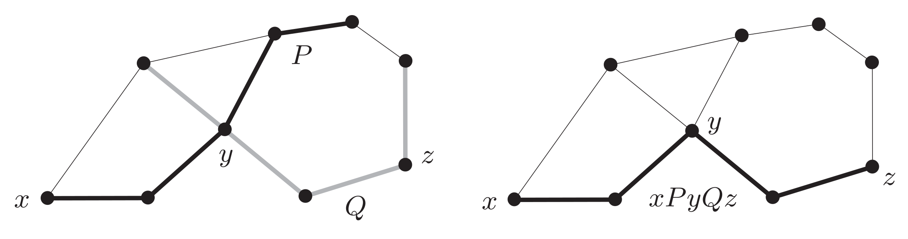

---

# $A$—$B$ 路径，$H$-路径

给定顶点集 $A,B$，我们称 $P = x_0 \dots x_k$ 为 $A\dash B$ 路径，若 $V(P)\cap A = \set{x_0}$ 且 $V(P)\cap B = \set{x_k}$。换言之，$P$ 只有两个端点分别在 $A$ 和 $B$ 里。一如先前，我们把 $\set{a}$—$B$ 路径简写为 $a$—$B$ 路径，$\set{a}$—$\set{b}$ 路径简写为 $a$—$b$ 路径，如此等等。


给定图 $H$，若路径 $P$ 非平凡且只有两端点落在 $H$ 里，我们称 $P$ 是一条 $H$-路径。注意，$H$-路径的边全都不在 $H$ 里。

称两条或多条路径**独立**，若其中每一条路径都不包含另一条路径的内部顶点。例如，两条 $a\dash b$ 路径独立当且仅当它们的公共顶点只有 $a$ 和 $b$。


---

# 环

设 $P = x_0 \dots x_{k-1}$ 是一条路径且 $k\ge 3$，则图 $C := P + x_{k-1}x_0$ 称为<ruby>**环**<rt>cycle</rt></ruby>或**圈**。同路径的记法一样，我们常把环表为其上点的排列；上述环 $C$ 也可表为 $x_0 \dots x_{k-1} x_0$。环的**长度**是它的边数（或顶点数）；长为 $k$ 的环称为 **$k$ 元环**，记作 $C^k$.

图 $G$ 里包含的环的长度的最小值称为 $G$ 的<ruby>**围长**<rt>girth</rt></ruby>，记作 $g(G)$；而环长的最大值称为 $G$ 的**周长**。若 $G$ 里没有环，我们置围长为 $\infty$，周长为 $0$。

<!-- Note: 围长（girth）和周长（circumference）都有“一圈有多长”的意思。
girth 指物体有多粗，例如树干，人的腰围等。circumference 指一个物体在平面上的边界的长度，例如圆的周长，国家的边界线长度，城的周长等-->

若一条边连接环上两点但它本身不是环的边，则称之为环的**弦**。若 $G$ 里的一个环是导出子图，则称之为**导出环**，它也就是一个没有弦的环。

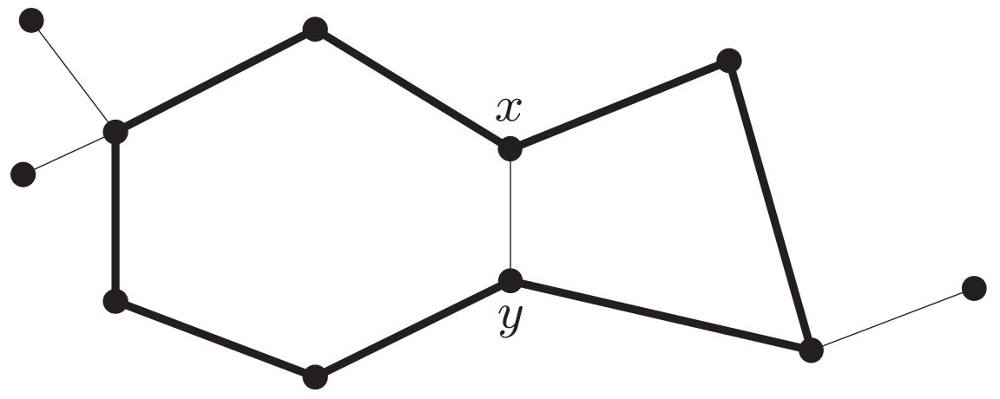
$\quad$ 环 $C^8$ 与其弦 $xy$，导出环 $C^4$ 和 $C^6$。

---

# 距离，直径，中心，半径

图 $G$ 里两顶点 $x,y$ 的<ruby>**距离**<rt>distance</rt></ruby>是 $G$ 里最短的 $x$—$y$ 路径的长度，记作 $d_G(x,y)$；若这样的路径不存在则命 $d(x,y) := \infty$。图 $G$ 里两顶点之间的距离的最大值称为 $G$ 的<ruby>**直径**<rt>diameter</rt></ruby>，记作 $\diam(G)$。换言之
$$
\diam(G) = \max_{x,y\in V(G)} d_G(x,y).
$$

$G$ 的一个顶点是**中心的**，若从任意顶点到它的距离的最大值最小。此距离是 $G$ 的<ruby>**半径**<rt>radius</rt></ruby>，记作 $\rad(G)$。换言之，
$$\rad(G) = \min_{x\in V(G)} \max_{y\in V(G)} d_G(x,y).$$

---

# 练习

设图 $G$ 连通。证明
$$\rad(G) \le \diam(G) \le 2 \rad(G).$$

**证明** 根据定义，显然有 $\rad(G) \le \diam(G)$。设 $d(a, b) = \diam(G)$，对任意顶点 $x\in G$，我们有 $d(a,x) + d(x, b) \ge d(a, b) = \diam(G)$，因此
$$
\diam(G) \le 2 \max(d(a, x), d(b, x)) \le 2 \max_{y\in G} d(x,y).
$$


---


# 围长和直径的关系

**命题** $\quad$ 每个有环的图 $G$ 都满足 $g(G) \le 2 \diam(G) + 1$。

**证明** 设 $C$ 是 $G$ 里一个最短环。若 $g(G) \ge 2 \diam(G) + 2$，则 $C$ 上有这样两个顶点：它们在 $C$ 上的距离至少是 $\diam(G) + 1$。在图 $G$ 里，这两顶点的距离不超过 $\diam(G)$；因此二者之间的任何最短路径 $P$ 都不是 $C$ 的子图。故 $P$ 含有一条 $C$-路径 $xPy$。此路径 $xPy$ 连同环 $C$ 里的两条 $x$—$y$ 路径中较短者，就构成一个比 $C$ 短的环，矛盾。

---

<!-- Note：比路径更宽松的概念 -->

# 途径

图 $G$ 里一个长为 $k$ 的<ruby>**途径**<rt>walk</rt></ruby> 是一个非空的点边交替序列 $v_0 e_0 v_1 e_1 \dots e_{k-1}v_k$，对所有 $i < k$ 都有 $e_i = \set{v_i, v_{i+1}}$。若 $v_0 = v_k$ 则称此途径是<ruby>**封闭的**<rt>closed</rt></ruby>。

若途径里的顶点相异，它就成为路径。

**注**：有的书上把这里定义的途径称为路径，而把我们前面定义的路径称为<ruby>**简单**<rt>simple</rt></ruby>路径。

---

# 连通度

- 连通图，连通块
- 连通度
- 割点，桥


---

# 连通图，连通块

若图 $G$ 非空且他的任意两个顶点都被 $G$ 中的路径链接，则称 $G$ 是<ruby>**连通的**<rt>connected</rt></ruby>。若 $U \subseteq V(G)$ 且 $G[U]$ 连通，我们也称 $U$ 自身（在 $G$ 里）连通。


设 $G=(V,E)$ 为图。称 $G$ 的极大连通子图为 $G$ 的**连通块**或连通分量。易见，连通块是导出子图，它们的顶点集是 $V$ 的划分。      


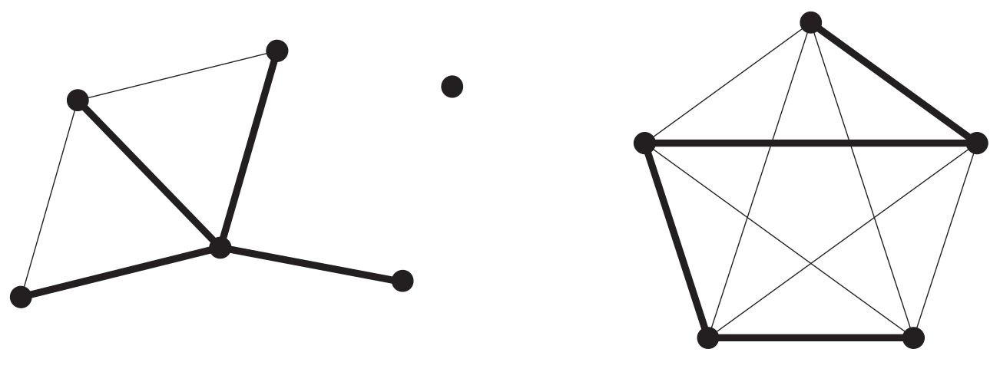
此图有三个连通块，加粗的部分是每个连通块里的一个极小连通生成子图。

---

# 连通度

称图 $G$ 是 **$k$-连通**的（$k\in\Z_{\ge 0}$），若 $|G| > k$ 并且对每个满足 $|X| < k$ 的子集 $X\subseteq V$ 都有图 $G-X$ 是连通的。

每个非空图都是 $0$-连通的，而 $1$-连通图恰是非平凡的连通图。

使得 $G$ 是 $k$-连通图的最大整数 $k$ 称为 $G$ 的**连通度**，记作 $\kappa(G)$。依此，$\kappa(G) = 0$ 当且仅当 $G$ 不连通或是 $K^{1}$，而对任意 $n \ge 1$，$\kappa(K^n) = n-1$。

换言之，删除 $G$ 中任意 $\kappa(G)-1$ 个点，$G$ 仍连通。删除 $G$ 中某 $\kappa(G)$ 个点，$G$ 不连通或只剩一个点。

---

# 边连通度


若 $|G| > 1$ 并且对每个少于 $\ell$ 条边的子集 $F\subseteq E$，$G-F$ 都是连通的，则称 $G$ 是 **$\ell$-边连通**的。使得 $G$ 是 $\ell$-边连通的最大整数 $\ell$ 称为 $G$ 的**边连通度**，记作 $\lambda(G)$。特别地，若 $G$ 不连通，我们有 $\lambda(G) = 0$。


换言之，删除 $G$ 中任意 $\lambda(G)-1$ 条边，$G$ 仍连通。删除 $G$ 中某 $\lambda(G)$ 条边，$G$ 不连通。


---

# 分离 :star:

为了今后表述方便，我们采用一个术语：分离。

设 $G = (V, E)$ 为图，$A, B\subseteq V$ 和 $X\subseteq V\cup E$。

若 $A, B$ 和 $X$ 使得 $G$ 里每一条 $A$—$B$ 路径上都有一个点或一条边在 $X$ 里，我们说 $X$ 在 $G$ 里<ruby>**分离**<rt>separate</rt></ruby>顶点集 $A$ 和 $B$。注意此时必有 $A\cap B \subseteq X$。若 $X$ 分离 $\set{a}$，$\set{b}$ 而 $a, b\not\in X$，我们说 $X$ 分离两顶点 $a, b$；若 $X$ 分离 $G$ 里某两个顶点，也说 $X$ 分离 $G$。

---

# 命题 :star:

若图 $G$ 非平凡，则 $\kappa(G) \le \lambda(G) \le \delta(G)$。

**证明**：$\lambda(G) \le \delta(G)$ 是因为和一个固定的顶点关联的所有边分离图 $G$。为证明 $\kappa(G) \le \lambda(G)$，令 $F$ 是一族 $\lambda(G)$ 条边使得 $G-F$ 不连通。根据 $\lambda$ 的定义，这样的一族边存在；而且 $F$ 里每条边连接 $G-F$ 的两个连通块。我们证明 $\kappa(G) \le |F|$。

先设 $G$ 有一个顶点 $v$ 不与 $F$ 里的边关联。令 $C$ 是 $G-F$ 的含有 $v$ 的连通块。那么 $C$ 里与 $F$ 的边关联的顶点使 $v$ 和 $G-C$ 分离。由于 $F$ 里没有一条边两端点都在 $C$ 里，至多有 $|F|$ 条这样的边，所以 $\kappa(G) \le |F|$。


---

再设每个顶点都与 $F$ 的边关联。令 $v$ 是任一顶点，$C$ 是 $G-F$ 里含有点 $v$ 的连通块。那么 $v$ 的每个满足边 $vw\notin F$ 的邻点 $w$ 都在 $C$ 里，并且这些 $w$ 都与 $F$ 里的边关联；因此 $d_G(v) \le |F|$。由于点 $v$ 的邻居 $N_G(v)$ 把 $v$ 和其他点分离，故有 $\kappa(G) \le |F|$——除非没有其他点，即除非 $\set{v} \cup N(v) = V$。但是由于 $v$ 是任一点。此时 $G$ 是完全图，有 $\kappa(G) = \lambda(G) = |G|-1$。


---

# 割点，桥

设 $G$ 是图，$v$ 是 $G$ 上一顶点，$e$ 是 $G$ 上一条边。若从图 $G$ 里删除点 $v$ 之后，连通块的数量增加，则 $v$ 是 $G$ 的<ruby>**割点**<rt>cutvertex</rt></ruby>。若从图 $G$ 里删除边 $e$ 后，连通块的数量增加，则 $e$ 是 $G$ 的<ruby>**桥**<rt>bridge</rt></ruby>。桥也称**割边**。

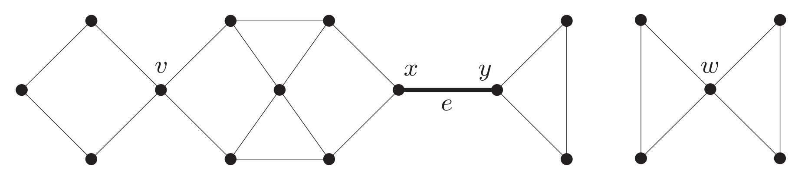
此图有割点 $v, x, y, w$ 和桥 $e = xy$。

---

# 图在程序里的表示

- 邻接矩阵
- 邻接表
  - 链式前向星
  - vector 数组

---

# 邻接表和邻接矩阵

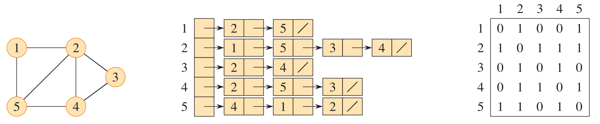


---

# 链式前向星：用数组实现邻接表

```cpp
const int maxn = 1e5 + 5;
const int maxm = 2e5 + 5;
struct Edge {
    int to;
    int next;
};
Edge edge[maxm];
int head[maxn];
int e_cnt;

void init() {
    memset(head, -1, sizeof head);
    e_cnt = 0;
}

void add(int from, int to) {
    edge[e_cnt] = {to, head[from]};
    head[from] = e_cnt++;
}
```

---


# 用 std::vector 实现邻接表


```cpp
const int maxn = 1e5 + 5;
vector<int> g[maxn];

void add(int from, int to) {
    g[from].push_back(to);
    g[to].push_back(from);
}
//对于边uv，add(u, v) 和 add(v, u)
```


---

# 特殊图

- 树和森林

- 二分图

- 欧拉图

---

# 树和森林

<ruby>**无环**<rt>acyclic</rt><ruby>图，即不含有任何环的图，也称为<ruby>**森林**<rt>forest</rt><ruby>。连通的森林称为<ruby>**树**<rt>tree</rt></ruby>。树里度是 $1$ 的顶点称为<ruby>**叶子**<rt>leaf</rt></ruby>，其他顶点称为**内部顶点**。

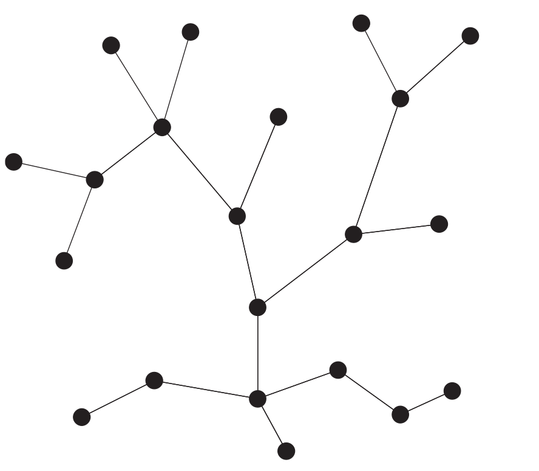

不难验证，每个非平凡的树都有叶子。从树里删除一个叶子，剩下的图仍是树。


---

# 树的等价定义

对于图 $T$，下列命题等价：

- $T$ 是树；
- $T$ 的任两个顶点被唯一的路径链接；
- $T$ 是极小连通的，即 $T$ 是连通的但是对每条边 $e\in T$，$T-e$ 都不连通；
- $T$ 是极大无环的，即 $T$ 无环但对 $T$ 的任何两个不相邻的顶点 $x, y$，$T+xy$ 有环；
- $T$ 连通且边数比点数少 $1$。


---

# 生成树

设 $G=(V,E)$ 为图，$H=(V,E')$ 是 $G$ 的生成子图。若 $H$ 是树，则称 $H$ 是 $G$ 的<ruby>**生成树**<rt>spanning tree</rt></ruby>。

每个连通图都含有一个<ruby>**生成树**<rt>spanning tree</rt></ruby>。每个非空图都含有一个<ruby>**生成森林**<rt>spanning forest</rt></ruby>。

 $\qquad$ 


---

# 有根树

有时宜将树里的某个顶点特别看待，这样的顶点称为树的<ruby>**根**<rt>root</rt><ruby>。树 $T$ 连同一个固定的根 $r$ 就成为<ruby>**有根树**<rt>rooted tree</rt></ruby>。


有根树上有一个自然的偏序：$x\le y$ 若 $x\in rTy$。

---

# 关于有根树的术语和习惯

- 有根树的顶点常称为<ruby>**节点**<rt>node</rt></ruby>或**结点**。
- 节点到根的距离是其<ruby>**深度**<rt>depth</rt></ruby>，深度相同的节点在同一<ruby>**层**<rt>level</rt></ruby>。节点深度的最大值是有根树的<ruby>**高度**<rt>height</rt></ruby>。
- 画有根树时，根画在最高处，同一层节点画在同一高度。 
- 设 $x,y$ 是有根树的节点，若 $y$ 在从根到 $x$ 的路径上，则 $y$ 是 $x$ 的<ruby>**祖先**<rt>ancestor</rt></ruby>，$x$ 是 $y$ 的<ruby>**后代**<rt>descendant</rt></ruby>。特别地，$x$ 是 $x$ 本身的祖先和后代。

在右图中，$a,b$ 是 $v$ 的**子节点**或<ruby>**孩子**<rt>children</rt><ruby>，$v$ 是 $a, b$ 的<ruby>**父节点**<rt>parent</rt></ruby>，边 $av$ 是 $a$ 的<ruby>**父边**<rt>parent edge</rt></ruby>。$a, b$ 互为<ruby>**兄弟**<rt>siblings</rt></ruby>。无子节点的点是**叶子**。

$y$ 是 $x$ 和 $z$ 的<ruby>**最近公共祖先**<rt>lowest common ancestor</rt></ruby>，记作 $y = \lca(x, z)$。

$v$ 的后代生成的子图称为以 $v$ 为根的<ruby>**子树**<rt>subtree</rt><ruby>，简称子树 $v$；也称之为 $r$ 的子树 $v$。


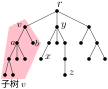

---

# 习题 [abc385_e](https://atcoder.jp/contests/abc385/tasks/abc385_e) 雪花树 

可通过下述过程生成的树称为雪花树：
1. 选择正整数 $x, y$。
2. 准备一个顶点。
3. 准备 $x$ 个顶点，每个都跟第 2 步的那个顶点相连。
4. 给第 3 步的 $x$ 个顶点每个加上 $y$ 个叶子。

右图是 $x=4$，$y=2$ 的雪花树。第 2，3，4 步加的节点分别以红，蓝，绿 三色表示。

给你一个有 $N$（$2 \le N \le 3\times 10^5$）个点的树 $T$。要从 $T$ 中删除一些点使得剩下的图是雪花树。最少要删多少个点？


---

# 解析

我们把上述第一个顶点称为雪花树的中心。雪花树在以中心为根时，根有 $x$ 个子节点，而根的每个子节点都有 $y$ 个子节点。

若在树 $T$ 里节点 $u$ 有 $x$ 个邻点度都不小于 $y+1$，则存在一个以 $u$ 为中心，有 $x(y+1)+1$ 个点的雪花树。于是想到把 $u$ 的邻点按度从大到小排序，以 $u$ 的第 $x$ 个邻点的度为 $y+1$。

---

# 代码

```cpp
int main() {
  int n; cin >> n;
  vector<vector<int>> g(n + 1);
  for (int i = 0; i < n - 1; i++) {
    int u, v; cin >> u >> v;
    g[u].push_back(v);
    g[v].push_back(u);
  }

  int ans = 0;
  for (int i = 1; i <= n; i++) {
    vector<int> deg;
    for (int j : g[i])
      if (g[j].size() > 1)
        deg.push_back(g[j].size());
    sort(deg.rbegin(), deg.rend());//从大到小排序
    for (int j = 0; j < deg.size(); j++)
      ans = max(ans, (j + 1) * deg[j] + 1);
  }
  cout << n - ans << '\n';
}
```

---

# 另一种写法

```cpp
int main() {
  int n; cin >> n;
  vector<vector<int>> g(n + 1);
  for (int i = 0; i < n - 1; i++) {
    int u, v; cin >> u >> v;
    g[u].push_back(v);
    g[v].push_back(u);
  }

  auto cmp = [&](int x, int y) { // lambda 表达式
    return g[x].size() > g[y].size();
  };

  int ans = 0;
  for (int i = 1; i <= n; i++) {
    sort(g[i].begin(), g[i].end(), cmp);
    for (int j = 0; j < g[i].size() && g[g[i][j]].size() > 1; j++)
      ans = max(ans, (j + 1) * (int) g[g[i][j]].size() + 1);
  }  
  cout << n - ans << '\n';
}
```

---

# 二分图

设 $r$ 是 $\ge 2$ 的整数，$G = (V,E)$ 是图。若能把 $V$ 划分成 $r$ 个子集使得每条边的两端点都在不同的子集里，则称 $G$ 是 **$r$-分图**或 **$r$-部图**。$2$-分图常写作<ruby>**二分图**<rt>bipartite graph</rt></ruby>。

若一个 $r$-分图里每一对来自不同子集的点都构成边，则称它是**完全的**。若一个完全 $r$-分图的顶点集被分成的 $r$ 个子集的大小是 $n_1, \dots, n_r$，我们记之为 $K_{n_1, \dots, n_r}$。形如 $K_{1,n}$ 的二分图称为<ruby>**星图**<rt>star</rt></ruby>或**菊花图**。


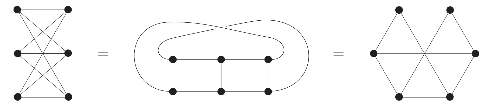
二分图 $K_{3,3}$ 的三种画法

---

# 二分图的性质

二分图不含有<ruby>**奇环**<rt>odd cycle</rt></ruby>（为什么？）。实际上，此性质完全刻画了二分图。

**命题** $\quad$ 一个图是二分图当且仅当它不含有奇环。

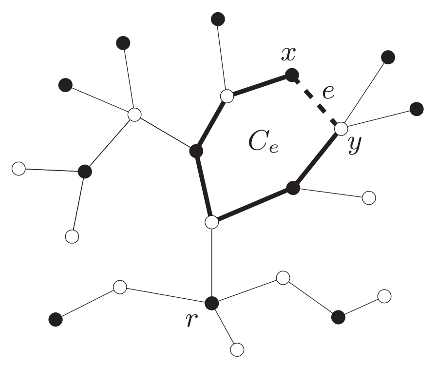

---

# [abc260_f](https://atcoder.jp/contests/abc260/tasks/abc260_f) Find 4-cycle

<div class=columns>
<div>

图 $G$ 有 $(S+T)$ 个点和 $M$ 条边。点和边都从 $1$ 开始编号。边 $i$ 连接点 $u_i$ 和点 $v_i$。

编号为 $1, 2, \dots, S$ 的点之间没有边，编号为 $S+1, S+2, \dots, S+T$ 的点之间也没有边。

若 $G$ 里含有四元环，任选一个，输出环上的四个点的编号（顺序任意）。若 $G$ 里不含有四元环，输出 -1。 
</div>

- $2 \leq S \leq 3 \times 10^5$
- $2 \leq T \leq 3000$
- $4 \leq M \leq \min(S \times T,3 \times 10^5)$
- $1 \leq u_i \leq S$
- $S + 1 \leq v_i \leq S + T$

</div>


---


# 分析

- 二分图里的四元环形如右图。
- 特殊之处：二分图左边点多（三十万）而右边点少（三千）。
- 对于右边的每一对点 $c, d$，我们寻求左边的两个点 $a, b$ 使得 $ac$，$ad$，$bc$，$bd$ 都构成边。为此用变量 $f[c][d]$ 来记录这样的 $a$。最初，$f[c][d] \gets 0$。
- 对于左边的每一个点 $a$，我们枚举与它相邻的每一对（右边的）点 $c,d$；若 $f[c][d] = 0$，则 $f[c][d] \gets a$；否则就找到了左边的两个点： $a$ 和 $f[c][d]$。
- 时间 $O(T^2)$。此解法应用了**鸽巢原理**。

---

# 代码

```cpp
vector<int> g[300005];
int f[3005][3005];

int main() {
  int S, T, M;
  cin >> S >> T >> M;
  while (M--) {
    int u, v;
    cin >> u >> v;
    g[u].push_back(v - S);
  }
  for (int a = 1; a <= S; a++) {
    for (int i = 0; i < g[a].size(); i++)
      for (int j = 0; j < i; j++) {
        int c = min(g[a][i], g[a][j]);
        int d = max(g[a][i], g[a][j]);
        if (f[c][d] == 0) {
          f[c][d] = a;
        } else {
          cout << f[c][d] << ' ' << a << ' ' << c + S << ' ' << d + S;
          return 0;
        }
      }
  }
  cout << -1;
}
```

---

# <ruby>柯尼斯堡<rt>Königsberg</rt></ruby>的七座桥

 →  → 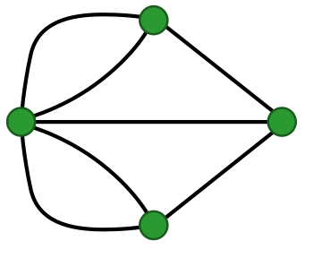

---

# 欧拉环游


如果图上的一个封闭途径走过每条边恰好一次，那么称之为一个<ruby>**欧拉环游**<rt>Euler tour</rt></ruby>或欧拉回路。若在一个图上可进行欧拉环游，则称之为<ruby>**欧拉的**<rt>Eulerian</rt></ruby>，也称这样的图为**欧拉图**。

**定理** 一个连通图是欧拉的当且仅当它的每个点的度都是偶数。


---

# 图的概念的扩展

- 有向图

- 重图

- 带权图

---


# 有向图


一个**有向图**是指资料 $G = (V, E, \mathrm{init}, \mathrm{ter})$，其中 $V$，$E$ 是两个不相交的集合，而 $\mathrm{init}: E\to V$，$\mathrm{ter}: E\to V$ 是两个映射。

$V$ 称为图 $G$ 的顶点集，$E$ 称为图 $G$ 的边集。

映射 $\mathrm{init}$ 和 $\mathrm{term}$ 为每条边 $e$ 指派**起点** $\mathrm{init}(e)$ 和**终点** $\mathrm{ter}(e)$。我们称边 $e$ 是**从** $\init(e)$ **到** $\ter(e)$ 的。

一个有向图上可能有多条从顶点 $x$ 到顶点 $y$ 的边，称这些边为<ruby>**重**<rt>chóng</rt></ruby>**边**。

若 $\init(e) = \ter(e)$，边 $e$ 称为**自环**。

---

# 关于有向图的术语

- 有向图的边也称<ruby>**弧**<rt>arc</rt></ruby>。
- 忽略一个有向图边的方向所得的无向图称为其**无向版本**。
- 以点 $v$ 为起点（或终点）的边是 $v$ 的**出边**（或**入边**），$v$ 的出边的数量是 $v$ 的<ruby>**出度**<rt>out-degree</rt></ruby>（或<ruby>**入度**<rt>in-degree</rt></ruby>）。
- 路径和环的定义与图类似，但要求边的方向一致。若图上有从点 $x$ 到点 $y$ 的路径，则称从 $x$ **可到达** $y$。若图上任意两点都相互可到达，则称图是<ruby>**强连通的**<rt>strongly connected</rt></ruby>。


---


# 有向图在程序里的表示

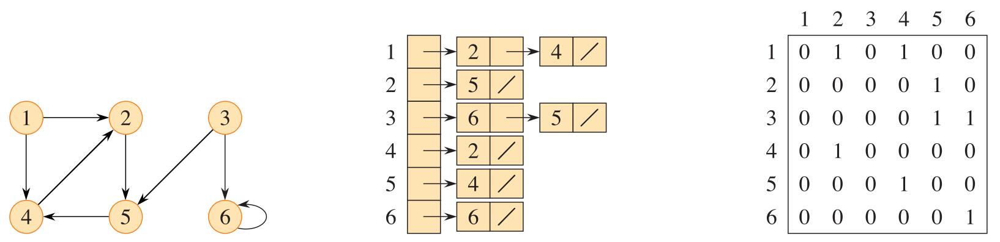

---

# 重图

容许图里有重边或自环就得到重图的概念。形式地说，一个<ruby>**重图**<rt>multigraph</rt></ruby>是指一对不相交的集合 $(V, E)$，连同一个映射 $E \to V \cup [V]^2$ 为每条边指派一个或两个顶点为**端点**。我们仍然以 $e = xy$ 表达 $x, y$ 是边 $e$ 的端点，不过这不能唯一确定 $e$。也不妨说重图是边的方向被“忘记”了的有向图。


图就是没有重边和自环的重图。前面介绍的适用于图的术语几乎都可以用于重图，不过也有些许差别：
- 重图上可能有长度是 $1$ 或 $2$ 的环。 
- 一个顶点处的自环对它的度的贡献是 $2$。

在 OI 里，我们不使用重图这个术语，而是把图和重图统称为<ruby>**无向图**<rt>undirected graph</rt></ruby>；为了强调一个无向图（或有向图）没有重边和自环，我们说它是<ruby>**简单**<rt>simple</rt></ruby>无向图（或有向图）。


---

# 带权图


一个有向图或无向图 $(V, E)$ 连同一个权值函数 $w: E \to \mathbb{R}$ 为每条边指定一个<ruby>**权值**<rt>weight</rt></ruby>，就成为<ruby>**带权图**<rt>weighted graph</rt></ruby>。

对于带权图，我们定义路径的权值是路径上边的权值之和。


---


# 基环树

每个顶点的出度（或入度）都是 $1$ 的有向图，称为**基环内向**（或**外向**）**森林**。若一个基环内向（或外向）森林的无向版本是连通的，则它是**基环内向**（或**外向**）**树**。

---

# 习题 [abc311_c](https://atcoder.jp/contests/abc311/tasks/abc311_c) Find it!

有一个有 $N$ 个点和 $N$ 条边的有向图。点从 $1$ 到 $N$ 编号。第 $i$ 条边从点 $i$ 连向点 $A_i$（$A_i \ne i$）。

找出一个有向环。

###### 限制

- $2 \le N \le 2 \times 10^5$

---

<div class=columns>

<div>

# 解析

每个点的出度都是 $1$，这图是基环内向森林。从任一点出发，在图上走，走过的点打上标记，当走到一个标记过的点 $v$ 时，就是在某个基环上。从 $v$ 出发在基环上绕一圈。
</div>

```cpp
int main() {
  int n; cin >> n;
  vector<int> a(n + 1);
  for (int i = 1; i <= n; i++)
    cin >> a[i];

  vector<bool> vis(n + 1);
  int v = 1;
  while (!vis[v]) {
    vis[v] = true;
    v = a[v];
  }

  vector<int> cycle;
  int u = v;
  do {
    cycle.push_back(u);
    u = a[u];
  } while (u != v);

  cout << cycle.size() << '\n';
  for (int x : cycle)
    cout << x << ' ';
  cout << '\n';
}
```


---

# 有向无环图，拓扑排序

不含环的有向图称为<ruby>**有向无环图**<rt>directed acyclic graph</rt></ruby>，简称 dag。

在 dag 的顶点集上有一个自然的偏序：$x \le y$ 若从 $x$ 可到达 $y$。

把顶点排列成符合此偏序的操作称为<ruby>**拓扑排序**<rt>topological sort</rt></ruby>。

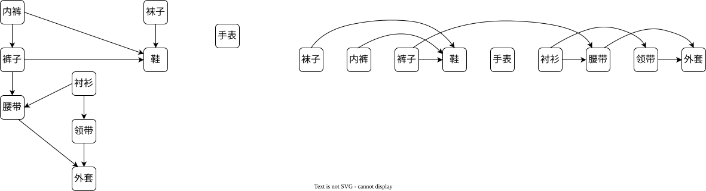

---

# 拓扑排序算法

对给定的 dag，重复下述过程：
- 找到一个入度为 $0$ 的顶点 $v$，输出 $v$，删除 $v$ 和 $v$ 的所有出边。


---

# 代码

```cpp
const int maxn = 1e5 + 5;
vector<int> g[maxn];

vector<int> toposort(int n) {
  vector<int> deg(n + 1);
  for (int i = 1; i <= n; i++)
    for (int j : g[i])
      deg[j]++;
  
  vector<int> p;
  for (int i = 1; i <= n; i++)
    if (deg[i] == 0)
      p.push_back(i);
  
  for (int i = 0; i < p.size(); i++)
    for (int j : g[p[i]])
      if (--deg[j] == 0)
        p.push_back(j);

  if (p.size() != n) //不是dag
    return {};

  return p;
}
```

---

# 习题 [P1347](https://www.luogu.com.cn/problem/P1347) 排序

有 $n$ 个变量，$2 \le n \le 26$，记作 A，B，C 等。给出 $m$ 个形如 A < B 的关系。判断这 $m$ 个关系是否矛盾。若不矛盾，判断这些关系能否确定 $n$ 个变量的顺序。若能，求出凭前多少个关系就能确定。

---

# 解析

每个关系相当于一条有向边。依次读入每个关系，往图里加一条边，做一次拓扑排序；若发现矛盾就结束，若拓扑序不唯一，即某时刻有不止一个点入度为零，就做个标记。

---

# 代码


<div class=col46>

```cpp
vector<int> g[26];
int n, m;

vector<int> toposort() {
  vector<int> indeg(n);
  for (int i = 0; i < n; i++)
    for (int j : g[i])
      indeg[j]++;

  vector<int> p;
  for (int i = 0; i < n; i++)
    if (indeg[i] == 0)
      p.push_back(i);

  bool ok = true;
  for (int i = 0; i < p.size(); i++) {
    if (p.size() != i + 1)
      ok = false;
    for (int j : g[p[i]])
      if (--indeg[j] == 0)
        p.push_back(j);
  }
  if (p.size() != n) //有环
      return {};
  if (!ok) //拓扑序不唯一
      p.push_back(-1);
  return p;
}
```

```cpp
int main() {
  cin >> n >> m;
  for (int i = 1; i <= m; i++) {
    char a, b, c;
    cin >> a >> c >> b;
    g[a - 'A'].push_back(b - 'A');

    vector<int> p = toposort();
    if (p.empty()) {
      cout << "Inconsistency found after " << i << " relations.\n";
      return 0;
    }

    if (p.back() != -1) {
      cout << "Sorted sequence determined after " << i << " relations: ";
      for (int i = 0; i < n; i++)
        cout << (char) (p[i] + 'A');
      cout << ".\n";
      return 0;
    }
  }
  cout << "Sorted sequence cannot be determined.\n";
}
```

---

# 习题 [tupc2023_c](https://atcoder.jp/contests/tupc2023/tasks/tupc2023_c) Topological Sort :star:

给你一个 $(1, 2, \dots, N)$ 的排列 $P=(P_1, P_2, \dots, P_N)$。

求满足下列条件的有向无环图的数量，模 $998244353$。
- 有 $N$ 个点，点从 $1$ 到 $N$ 编号，无重边。
- 字典序最小的拓扑序等于 $P$。

限制：$2 \le N \le 2\times 10^5$

###### 例子

<div class=col118>
<div>

输入
```
3
1 3 2
```
</div>
<div>

输出
```
4
```
</div>


----

# 解析


考虑递推。从序列 $(P_N)$ 开始，第一步看 $(P_{N-1}, P_N)$，第三步看 $(P_{N-2},P_{N-1}, P_{N})$。这样每次在开头加一项，维护**非自由边**的数量。

以 $P=(7,2,5, 1, 3, 6, 4)$ 为例。


---

# 代码

<div class=col46>

```cpp
const int mod = 998244353;
//快速幂
long long power(long long x, long long n) {
  int ans = 1;
  while (n) {
    if (n & 1)
      ans = ans * x % mod;
    x = x * x % mod;
    n >>= 1;
  }
  return ans;
}
```

```cpp
int main() {
  int n; cin >> n;
  vector<int> p(n);
  for (int i = 0; i < n; i++)
    cin >> p[i];
  vector<int> a;
  long long prod = 1;
  long long non_free = 0;
  for (int i = n - 1; i >= 0; i--) {
    while (!a.empty() && p[i] > p[a.back()]) {
      prod = prod * (power(2, a.back() - i) - 1) % mod;
      non_free += a.back() - i;
      a.pop_back();
    }
    a.push_back(i);
  }
  long long tot = (long long) n * (n - 1) / 2;
  prod = prod * power(2, tot - non_free) % mod;
  cout << prod << '\n';
}
```
