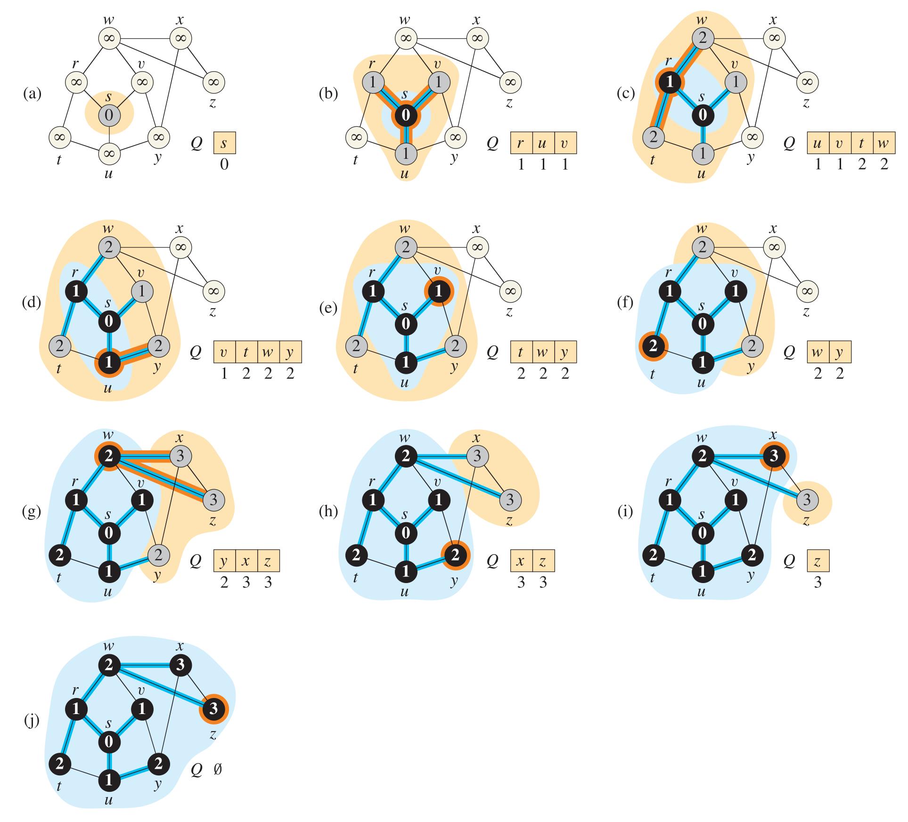
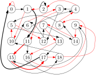
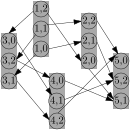
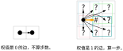

# 图论初步

## Part 2

- 图的表示
- 广度优先搜索

<div class=hidden>

$\DeclareMathOperator{\dfn}{dfn}$
$\DeclareMathOperator{\low}{low}$
$\DeclareMathOperator{\pre}{pre}$
$\DeclareMathOperator{\post}{post}$
$\DeclareMathOperator{\parent}{parent}$

</div>

---

# 图搜索

设 $G=(V,E)$ 是（有向或无向）图，按一定的顺序把 $G$ 的每个点都<ruby>**到过**<rt>visit</rt></ruby>或者说访问过，每条边都<ruby>**走过**<rt>traverse</rt></ruby>，称为**图搜索**或图遍历。

重要的图搜索算法有两个：<ruby>**广度优先搜索**<rt>breadth-first search, BFS</rt></ruby>和<ruby>**深度优先搜索**<rt>depth-first search, DFS</rt></ruby>。

---

# BFS


设 $G=(V, E)$ 为连通图， $s\in V$。以 $s$ 为起点对图 $G$ 进行的 BFS，像水波那样一层一层向外**扩展**，由近及远，把 $G$ 的每个顶点和每条边都“搜到”；同时把从 $s$ 到每个点的**距离**算出来。


---



- 白点：尚未<ruby>**被发现**<rt>discovered</rt></ruby>。
- 灰点：已被发现但从它发出的边还没走过。在队列里。
- 黑点：已被发现且从它发出的边都走过了。已出队。
- 蓝边：导向新发现的顶点。它们构成 $G$ 的生成树（称为 **BFS 树**）。

队列里的点到起点的距离相差不超过 $1$。

---

# BFS 的实现

<div class=columns>
<div>

写法一

```cpp
const int maxn = 1e5 + 5;
vector<int> g[maxn];
int d[maxn];
void init() {
    memset(d, -1, sizeof d);
}
void bfs(int s) {
    queue<int> q;
    q.push(s);
    d[s] = 0;
    while (!q.empty()) {
        int u = q.front();
        q.pop();
        for (int v : g[u])//扩展
            if (d[v] == -1) {
                d[v] = d[u] + 1;
                q.push(v);
            }
    }
}
```
</div>
<div>

写法二
```cpp
const int maxn = 1e5 + 5;
vector<int> g[maxn];
int d[maxn];
bool vis[maxn];
struct Path { int to, len; };

void bfs(int s) {
    queue<Path> q;
    q.push({s, 0});
    while (!q.empty()) {
        auto t = q.front();
        q.pop();
        if (vis[t.to]) continue;
        vis[t.to] = true;
        d[t.to] = t.len;
        for (int v : g[t.to])//扩展
            q.push({v, t.len + 1});
    }
}
```
</div>
</div>

---

# 习题 找倍数

给你正整数 $n$（$n \le 200$），求一个不超过 $200$ 位的正整数 $m$ 满足 $m$ 是 $n$ 的倍数并且 $m$ 写成十进制数只含有数字 $0$ 和 $1$。

保证有解。

---

# 解法

把只含有数字 $0$ 和 $1$ 的正整数按除以 $n$ 的余数分成 $n$ 类。

以 $n= 19$ 为例，若 $x \bmod 19 = 3$，那么在 $x$ 后面加上数字 $0$ 得到的数除以 $19$ 的余数是 $30\bmod 19 = 11$，在 $x$ 后面加上数字 $1$ 的到的数除以 $19$ 余 $31\bmod 19 = 12$.

考虑以下有向图


---

# 代码

```cpp
struct X {
    int r;
    string s;
};
void bfs(int n) {
    vector<bool> vis(n);
    queue<X> q;
    q.push({1 % n, "1"});
    while (!q.empty()) {
        X t = q.front(); q.pop();
        if (vis[t.r]) continue;
        vis[t.r] = true;
        if (t.r == 0) {
            cout << t.s << '\n';
            break;
        }
        for (int i : {0, 1})
            q.push({(t.r * 10 + i) % n, t.s + char('0' + i)});
    }
}
```


---


# 习题 [abc363_e](https://atcoder.jp/contests/abc363/tasks/abc363_e) 沉没的土地

有一个尺寸是 $H\times W$ 的矩形岛屿，四周都是海水。
岛被划成 $H$ 行 $W$ 列的网格，第 $i$ 行第 $j$ 列的格子现在海拔高度是 $A_{i,j}$。

从现在开始海平面每年上升 $1$。

跟海水或者已被淹没的格子相邻并且不高于海平面的格子会被淹没。

给定正整数 $Y$，对于每个 $i = 1, 2, \dots, Y$，求 $i$ 年之后尚未被淹没的格子的数量。

###### 限制

- $1 \le H, W \le 1000$
- $1 \le Y \le 10^5$
- $1 \le A_{i,j} \le 10^5$

---

# 例子

$3 \times 3$ 的网格，$Y = 5$：
```
10 2 10
3  1 4
10 5 10
```
一年后，没有格子被淹没，有 $9$ 个格子尚未被淹没。
两年后，有 $7$ 个格子尚未被淹没。
```
10 x 10
3  x 4
10 5 10
```
三年后，有 $6$ 个格子尚未被淹没。
```
10 x 10
x  x 4
10 5 10
```

---

四年以后，有 $5$ 个格子尚未被淹没。
```
10 x 10
x  x x
10 5 10
```

五年以后，有 $4$ 个格子尚未被淹没。

```
10 x 10
x  x x
10 x 10
```

---


# 思路

- 对于 $i=1, 2, \dots, Y$，计算有多少个格子到 $i$ 年后**才**被淹没。
- 找出那些跟 $i-1$年后已被淹没的格子相邻的海拔高度是 $i$ 的格子。

- 这些格子**首当其冲**，随后向内**传染**，使跟它们连通并且海拔高度不超过 $i$ 的格子被淹没。

---

# 代码

```cpp
const int maxa = 1e5+5;
struct GZ { int r, c; }; //格子
vector<GZ> g[maxa];
int a[1002][1002];
bool sink[1002][1002];
int main() {
    int H, W, Y; cin >> H >> W >> Y;
    for (int i = 1; i <= H; i++)
        for (int j = 1; j <= W; j++) {
            cin >> a[i][j];
            g[a[i][j]].push_back({i, j});
        }
    for (int i = 0; i <= H + 1; i++)
        for (int j = 0; j <= W + 1; j++)
            if (i == 0 || j == 0 || i == H + 1 || j == W + 1)
                sink[i][j] = true;
    
    int dir[4][2] = {1, 0, -1, 0, 0, 1, 0, -1};
    int ans = H * W;
    for (int i = 1; i <= Y; i++) {
        queue<GZ> q;
        for (GZ p: g[i])
            for (int j = 0; j < 4; j++)
                if (sink[p.r + dir[j][0]][p.c + dir[j][1]]) { q.push(p); break; }
        // BFS
        while (!q.empty()) {
            GZ p = q.front(); q.pop();
            if (sink[p.r][p.c]) continue;
            sink[p.r][p.c] = true; ans--;
            for (int j = 0; j < 4; j++)
                if (a[p.r + dir[j][0]][p.c + dir[j][1]] <= i)
                    q.push({p.r + dir[j][0], p.c + dir[j][1]});
        }
        cout << ans << '\n';
    }
}
```

---

# 习题  假期计划

给定有 $n$ 个点 $m$ 条边的图 $G$，点从 $1$ 到 $n$ 编号。对 $i = 2, \dots, n$，点 $i$ 有分数 $s_i$。今要从点 $2, \dots, n$ 中选择四个**相异**的点 $a, b, c, d$，使得序列 $1, a, b, c, d, 1$ 中每相邻两点在图 $G$ 上距离都不大于 $k+1$。

求 $a, b, c, d$ 四点的分数之和的最大值。

保证存在满足条件的四个点。

###### 限制

- $5 \le n \le 2500$
- $1 \le m \le 10000$
- $0 \le k \le 100$
- $1 \le s_i \le 10^{18}$


---

# 分析


- 观察右图，注意到行程的**对称性**。考虑枚举中间两点 $b, c$。
- 对每个点 $v$，在距离点 $v$ 和点 $1$ 都不超过 $k+1$ 的点中取分数最大的三个，成集合 $S_v$。
- $a$ 可从 $S_b$ 中选而 $d$ 可从 $S_c$ 中选。


----

# 代码

<div class=col46>

```cpp
const int maxn = 2500 + 5;
int n, m, k;
vector<int> g[maxn];
long long p[maxn];
vector<int> s[maxn];
int d[maxn][maxn];
const int INF = 1e9;

void bfs(int s) {
  for (int i = 1; i <= n; i++)
    dist[s][i] = INF;
  queue<int> q;
  q.push(s);
  d[s][s] = 0;
  while (!q.empty()) {
    int u = q.front();
    q.pop();
    for (int v : g[u])
    if (d[s][v] == INF) {
      d[s][v] = d[s][u] + 1;
      q.push(v);
    }
  }
}

bool cmp(int i, int j) {
  return p[i] > p[j];
}
```

```cpp
int main() {
  cin >> n >> m >> k;
  for (int i = 2; i <= n; i++) cin >> p[i];
  for (int i = 0; i < m; i++) {
    int u, v; cin >> u >> v;
    g[u].push_back(v); g[v].push_back(u);
  }
  for (int i = 1; i <= n; i++) bfs(i);

  vector<int> a;
  for (int i = 2; i <= n; i++)
    if (d[1][i] <= k + 1) a.push_back(i);
  sort(a.begin(), a.end(), cmp);
  
  for (int i = 2; i <= n; i++)
    for (int v : a)
      if (v != i && d[i][v] <= k + 1) {
        cand[i].push_back(v);
        if (cand[i].size() == 3) break;
      }

  long long ans = 0;

  for (int c = 2; c <= n; c++)
    for (int d = c + 1; d <= n; d++)
      if (d[c][d] <= k + 1)
        for (int b : cand[c])
          for (int e : cand[d])
            if (b != d && e != c && b != e)
              ans = max(ans, p[b] + p[c] + p[d] + p[e]);
  cout << ans << '\n';         
}
```


---

# [CSP-J 2023] 旅游巴士

<div class=col73>
<div>

某景区有 $n$ 个地点，地点 $1$ 为入口，地点 $n$ 为出口。从一天当中景区开门的时间（记为 0 时刻）起，每隔 $k$ 单位时间便有一辆巴士到达入口，同时有一辆巴士从出口驶离。

有 $m$ 条**单向道路**连接这些地点。走过一条道路需要一单位时间。每条道路有一个开放时间 $a_i$：游客只有不早于 $a_i$ 时刻才能通过道路 $i$。

小 Z 希望乘坐巴士到达入口，走到出口，再乘坐巴士离开，因此他到达和离开景区时间都必须是 **$k$ 的非负整数倍**。小 Z 在离开景区之前会一直移动而不在任何地点或道路上逗留。

求小 Z 可能离开景区的最早时间。

</div>

<div>

###### 限制

- $2 \le n \le 10^4$
- $1 \le m \le 2\times 10^4$
- $1 \le k \le 100$
- $0 \le a_i \le 10^6$

---

# 一个特殊情形

如果在所有道路都开放之后进入景区，那么问题化为在一个有 $nk$ 个点和 $mk$ 条边的有向图上求最短路。

样例：$n = 5, m = 5, k = 3$
<div class=col73>
<div>

   

如果在时刻 $3$ 以后进入景区，问题化为在右图上求 $(1,0)$ 到 $(5,0)$ 的最短路。若有解，答案不超过
$$
\begin{aligned}
\lceil \max(a_i) / k\rceil k + (n-1)k &< \max(a_i) + k + (n-1)k\\
&= \max(a_i) + nk \le 2\times 10^6.
\end{aligned}
$$

</div>

<div>



</div>
<div>

---

# 解法

从 $0$ 时刻开始，沿着时间轴一秒一秒推进（设一单位时间是一秒）。
对每个时刻 $t = 0, 1, \dots, \max a_i + nk-1$，令 $V_t$ 为可能在 $t$ 时刻到达的点的列表。

在上述有 $nk$ 个点和 $mk$ 条边的有向图上进行（特殊的）BFS，在 BFS 扩展的过程中填充诸列表 $V_t$。


---

# 代码

```cpp
struct E {int to, a;};
const int maxn = 1e4 + 5;
const int maxa = 1e6 + 5;
vector<E> g[maxn];
vector<int> V[2 * maxa + 100];
bool vis[maxn][100];
int n, m, k;

int bfs() {
  V[0].push_back(1);
  for (int t = 0; t < 2e6 + 100; t++)
    // 从t时刻能到的点向（时间上地）后扩展
    for (int u : V[t]) {
      if (vis[u][t % k]) continue;
      vis[u][t % k] = 1;
      if (u == n && t % k == 0)
        return t;
      for (E e : g[u])
        if (e.a <= t) V[t + 1].push_back(e.to);
        else {
          int nt = t + (e.a - t + k - 1) / k * k + 1;
          V[nt].push_back(e.to);
        }
    }
  return -1;
}
```

---

# 01-BFS 

BFS 常用来计算从一个状态到另一个状态最少需要走几**步**。在一些问题中有的走法算一步，有的走法不算步数。用图论的语言来描述：设 $G$ 是一个**带权**有向图。边的权值是 $0$ 或 $1$。给定起点 $s$ 和终点 $t$，求从 $s$ 到 $t$ 的最短路的长度。

上述问题也可以用 BFS 来解决：当顶点 $u$ 出队后，要从它向外扩展一条边 $uv$ 时
- 若 $uv$ 的权值是 $1$，则把点 $v$ 从末尾加入队列；
- 若 $uv$ 的权值是 $0$，则把点 $v$ 从开头加入队列。

为此我们要把普通 DFS 中使用的队列换为<ruby>**双端队列**<rt>double-ended queue</rt></ruby>：可以在开头或结尾添加或弹出元素的队列。

C++ 标准库里有现成的双端队列 std::deque。 

---

# std::deque

支持下列队列操作
- 从末尾添加元素 .push_back() 
- 从开头弹出元素 .pop_front()
- 从末尾弹出元素 .pop_back()
- 从开头添加元素 .push_front()

实际上，deque 和 vector 相似，是一种**通用的序列容器**，也支持用下标访问元素。不过 deque 的结构比 vector 复杂，常数也较大；所以通常我们只把它用作双端队列。


---

# 例题 [abc213_e](https://atcoder.jp/contests/abc213/tasks/abc213_e) Stronger Takahashi

<div class=col73>
<div>

有一个 $H$ 行 $W$ 列的网格。每个格子或者可通过，或者是障碍物。

高桥要从左上角的格子走到右下角的格子。每一步他可走到上下左右相邻且可通过的格子里去。他不能走出网格，也不能走到障碍物格子里去。不过，高桥力气很大，他打一拳能把一个 $2\times 2$ 方形区域里的障碍物全部清除，使这些格子可通过。

求高桥从左上角的格子走到右下角的格子至少要打几拳。

###### 限制

- $2 \le H \le W \le 500$
- 左上角和右下角的格子都可通过。
</div>

<div>

输入
```
5 5
..#..
#.#.#
##.##
#.#.#
..#..
```
输出：1
```
..#..
#.**#
##**#
#.#.#
..#..
```
</div>

---

# 分析

假设高桥已经确定了路线。他打拳的目标是消除路线上的障碍物。沿着既定的路线走，遇到障碍物时才考虑如何打一拳把它消除。



---

# 代码

<div class=columns>

```cpp
struct point {
  int r, c, d;
};
int dir[4][2] = {0,1,0,-1,1,0,-1,0};
bool vis[500][500];
//网格行列编号从0开始
char s[500][505];
int h, w;

int main() {
  int h, w;
  cin >> h >> w;
  for (int i = 0; i < h; i++)
    cin >> s[i];
  01_bfs();
  return 0;
}
```

```cpp
void 01_bfs() {
  deque<point> q;
  q.push_back({0, 0, 0});
  while (!q.empty()) {
    auto cur = q.front(); q.pop_front();
    if (vis[cur.r][cur.c]) continue;
    vis[cur.r][cur.c] = true;
    if (cur.r == h - 1 && cur.c == w - 1) {
      cout << cur.d; return;
    }
    vis[cur.r][cur.c] = true;
    for (int i = 0; i < 4; i++) {
      int r = cur.r + dir[i][0], c = cur.c + dir[i][1];
      if (0 <= r && r < h && 0 <= c && c < w) {
        if (s[r][c] == '.') {
          q.push_front({r, c, cur.d});
        } else {// s[r][c] == '#'
          for (int dr = -1; dr <= 1; dr++)
            for (int dc = -1; dc <= 1; dc++) {
              int nr = r + dr, nc = c + dc;
              if (0 <= nr && nr < h && 0 <= nc && nc < w)
                q.push_back({nr, nc, cur.d + 1});
            }
        }
      }
    }
  }
}
```


