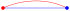
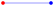
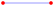
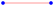
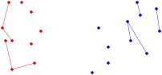
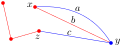

# 例题：红蓝生成树

给你一个有 $N$ 个点和 $M$ 条边的连通无向图。对于每个 $i=1,2,\ldots,M$，第 $i$ 条边连接点 $a_i$ 和 $b_i$。每条边被涂成红色或蓝色，边的颜色用字符串 $c$ 表示，$c_i$ 是 `R`（或 `B`）表示第 $i$ 条边是红色（或蓝色）。

判断是否存在 $G$ 的一个生成树满足下列条件，若存在，给出一个这样的生成树。

- 对于每个 $i=1,2,\ldots,N$，
    - 若 $s_i$ 是 `R`，至少有一条红边以点 $i$ 为端点。
    - 若 $s_i$ 是 `B`，至少有一条蓝边以点 $i$ 为端点。

###### 限制

- $2 \leq N \leq 2 \times 10^5$
- $N-1 \leq M \leq 2 \times 10^5$

---

# 思路

有解的必要条件：对每个点，都有一条跟它相连且与它同色的边。
但这不是充分条件，例如 。

这个例子启发我们，至少要有一条能满足两个点的边，也就是  或 。若不然，一条边最多满足一个点，满足 $N$ 个点至少要 $N$ 条边，就不可能是树。

---

# 把边分类

1. 能满足两个端点的边： 和 。
2. 只能满足一个端点的边： 和 。
3. 不能满足任何一个点的边： 和 。

---

# 思路

优先用 1 类边，但是不要成环。

这样就得到一些红点的连通块，一些蓝点的连通块。
我们把其中至少有两个点的连通块称为**大块**，把只有一个点的连通块称为**孤立点**。
大块里的点已被满足，而孤立点尚未被满足。

然后怎么办？如何使用 2 类边？

---

# 一个例子

优先使用 1 类边之后，对于 2 类边 $a, b, c$，不能先用边 $a$。

---

用从大块里的点发出的 2 类边把孤立点拉过来。