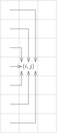
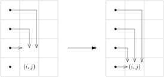
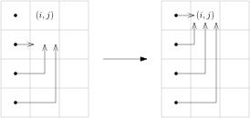
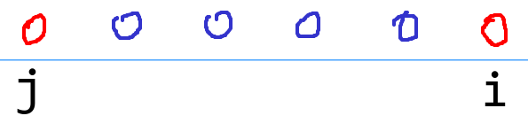
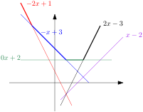

# 线性 DP

---

# 内容

- 线性 DP 的概念和典型的优化技巧
- DP speedup

---

# 线性 DP 的概念和典型的优化技巧

---

# 多阶段决策问题

问题的解是通过逐步决策得到的。

- 背包类型动态规划：每一步决定一个物品「选」或「不选」。

---

# 线性 DP

这一类问题常常可以用 DP 来解决。人们把这样的 DP 称为**线性 DP**。


- 每个点表示一个状态集。
- 每个箭头表示一次决策

这里说的“决策”和 DP 的术语“状态转移”可视作同义词。

---


每一步的决策依赖于（或针对）一个（或一些）资料。

- 背包类型动态规划：一个物品

这些资料以及一些附加的规则决定了当前的哪些状态可以转移到下一阶段的哪些状态。

---

# 线性 DP 的难点

- 如何划分阶段（识别出它是个线性 DP）
- 如何定义子问题（需要什么状态）
- 哪些状态转移是可行的或者说是需要考虑的
- 如何快速地进行状态转移
- 如何减少状态数
- ……

---

# 例题：过河

河上有一座独木桥，一只青蛙想沿着独木桥从河的一侧跳到另一侧。桥的长度 $L$ 和青蛙一次跳过的距离都是正整数，我们可以把独木桥上青蛙可能到达的点看成数轴上的一串整点：$0,1,\cdots,L$。坐标为 $0$ 的点表示桥的起点，坐标为 $L$ 的点表示桥的终点。

青蛙从桥的起点开始，不停的向终点方向跳跃。一次跳跃的距离是 $S$ 到 $T$ 之间的任意正整数（包括 $S,T$）。当青蛙跳到或跳过坐标为 $L$ 的点时，就算青蛙已经跳出了桥。

在桥上有 $M$ 个石子，第 $i$ 个石子的位置是 $X_i$。
青蛙很讨厌踩在这些石子上。青蛙要想过河，最少需要踩到多少个石子？


- $1\le L \le 10^9$
- $1\le S\le T\le 10$
- $1\le M \le 100$
- $1 \le X_1 < X_2 < \dots < X_M < L$

---

我们可以只考虑下列关键状态
- 在起点。
- 首次到达 $\ge X_1$ 的位置，即首次到达或超过第一个石子。
- 首次到达 $\ge X_2$ 的位置。
- ……
- 首次到达 $\ge X_M$ 的位置。

<div class=topic-box>

首次到达 $\ge X_i$ 的位置，有 $T$ 个可能的位置 $X_i, X_i + 1, \dots, X_i + T - 1$。

</div>

---


<div class=topic topic=状态>

$(i, j)$：首次到达 $\ge X_i$ 的位置是在 $X_i + j$。$0 \le j \le T-1$。

</div>


<div class=topic topic=子问题>

$f[i][j]$：到达状态 $(i, j)$ 最少要踩到**前 $i$ 个石子中的**多少个？

</div>

---

<div class=topic topic=状态转移>

$(i, j) \to (i + 1, k)$

情况 1：$X_i + j \ge X_{i+1}$，此时要有 $X_i + j = X_{i+1} + k$，即二者表示同一状态。

情况 2：$X_i + j < X_{i+1}$，此时考虑 $X_i + j \leadsto X_{i+1} - \ell \to X_{i+1} + k$。
- 这里 $X_i + j \le X_{i+1} - \ell < X_{i+1}$ 且 $S \le \ell + k \le T$。
- 我们需要判断 $X_i + j \leadsto X_{i+1} - \ell$ 是否可能。

</div>

---


# 例题：方格取数


有一个 $N \times M$ 的网格，第 $i$ 行第 $j$ 列的格子里有一个整数 $A_{i,j}$。

有一只小熊想从图的左上角走到右下角。每一步只能向上、向下或向右走一格，并且不能重复经过已经走过的方格，也不能出界。

小熊会取走经过的方格中的整数，求它能取到的整数之和的最大值。

###### 限制

- $1 \le N, M \le 10^3$
- $-10^4 \le A_{i,j} \le 10^4$

---

## 子问题

- $f[i][j]$：从 $(1, 1)$ 到 $(i, j)$ 的路径上的数字之和的最大值。
- 答案是 $f[N][M]$。
- 递推式？

---

## 错误的递推式


$$f[i][j] = A[i][j] + \max(f[i][j - 1], f[i - 1][j], f[i+1][j])$$

从 $(1,1)$ 到 $(i - 1, j)$ 或 $(i+1, j)$ 的最优路径可能经过 $(i, j)$。

---



## 状态转移

从第 $j - 1$ 行的某个格子 $(i', j - 1)$ 先向右一步走到 $(i', j)$ 再向上或向下走到 $(i, j)$。


---


## 分两步计算

把从 $(1, 1)$ 到 $(i, j)$ 的路径分成两类：
- 到 $(i, j)$ 之后可以继续向下走
- 到 $(i, j)$ 之后可以继续向上走


分两步计算一列格子的 DP 值：
1. 从上到下 

2. 从下到上 

---

# 例题：摆渡车

有 $n$ 个学生要乘摆渡车从车站前往学校。第 $i$ 个人在第 $t_i$ 分钟到车站等车。只有一辆摆渡车在工作，但摆渡车的容量可视为无限大。摆渡车从车站出发，把车上的人送到学校，再回到车站，这样往返一趟总共花费 $m$ 分钟（人上下车的时间忽略不计）。

如果可以任意安排摆渡车的出发时间，那么这些人的等车时间之和最少是多少？

- $1 \leq n \leq 500$
- $1 \leq m \leq 100$
- $0 \leq t_i \leq 4 \times 10^6$

一个人的等待时间 = 他乘的车的出发时刻 - 他到车站的时刻

---

一个最优解应该具有下述性质

- 假设某次摆渡车到站时已经有人在等车了。那么摆渡车要么立即出发，要么等到某个有人来的时刻出发。并且等待时间在 $0$ 到 $m-1$ 之间。

解释：如果摆渡车等了几分钟才出发，但是在等待期间没有新的学生来，那不如不等。如果等待了 $m$ 分钟，不如先把车上的人送过去，再回来。

---


我们还可以给最优解加一个限制

- 如果摆渡车到站后发现没人在等车，那它应该等到有人来再出发。

解释：空车跑和等 $m$ 分钟再出发效果是一样的。

---


不妨设 $t_1 \leq t_2 \leq \cdots \leq t_n$。我们有下述结论

- 第一趟车应该在 $[t_1, t_1 + m - 1]$ 中某个有人来的时刻出发。
- 以后的每一趟车，要么是上一趟到站后立即出发，要么是上一趟车到站后等一会儿，等到某个有人来的时刻出发。

---

# 解法
 考虑 DP。

<div class=topic topic=状态>

$i$: 某趟车在 $t_i$ 时刻出发。

</div>

<div class=topic topic=子问题>

$f[i]$: 某趟车在 $t_i$ 时刻出发，前 $i$ 个人的等车时间之和的最小值。

</div>

---

<div class=topic topic=状态转移>

摆渡车在状态 $i$ 之后有两种情况：

- 每次到站就立即出发，直到把所有人都送到学校。
- 连续运行几次之后，下一次等到时刻 $t_j$ 出发。这里 $t_j \geq t_i + m$。也就是从状态 $i$ 转移到状态 $j$。令 $r = (t_j - t_i) \bmod m$，那么，对于 $i < k \leq j$，

   - 若 $t_k > t_j - r$，则第 $k$ 个人是在 $t_j$ 时刻出发的，等待时间是 $t_j - t_k$。
   - 否则第 $k$ 个人的出发时刻是 $t_i + \lfloor (t_k - t_i)/m \rfloor \cdot m$。
</div>

为了使第一种情况也对应到一个状态，我们补充一个 $t_{n+1} := t_n + 2m$；这样，第一种情况就是从状态 $i$ 转移到状态 $n + 1$。这个问题的答案就是 $f[n + 1]$。

---

```cpp
int main() {
    int n, m; cin >> n >> m;
    vector<int> t(n);
    for (int i = 0; i < n; i++) cin >> t[i];
    sort(t.begin(), t.end());
    t.push_back(t.back() + 2 * m);

    vector<int> sum(n + 1);
    for (int i = 0; i < n; i++) sum[i + 1] = t[i] + sum[i];
    vector<int> dp(n + 1, INT_MAX);
    for (int i = 0; i < n; i++) {
        dp[i] = min(dp[i], i * t[i] - sum[i]); // 摆渡车第一次出发是在 t[i] 时刻
        int wait = 0; //乘坐连续运行的车的那些人的等待时间之和
        for (int j = i + 1, ptr = i + 1; j <= n; j++) { // 双指针
            if (t[j] >= t[i] + m) {//在t[i]时刻出发，连续运行若干次，下一次在 t[j] 时刻出发。
                int r = (t[j] - t[i]) % m;
                int last = t[j] - r - m; // 上一趟车的出发时刻
                while (t[ptr] <= last) {
                    int s = (t[ptr] - t[i]) % m;
                    if (s)
                        wait += m - s;
                    ptr++;
                }
                int wait_2 = t[j] * (j - ptr) - (sum[j] - sum[ptr]);
                dp[j] = min(dp[j], dp[i] + wait + wait_2);
            }
        }
    }
    cout << dp[n] << '\n';
}
```

---

# 例题：接龙

$N$ 个人玩接龙游戏，第 $i$ 个人有一个整数序列 $S_i$ 作为他的词库。

一个游戏有若干轮，每一轮规则如下：
- 选择某个人 $p$ 进行接龙。若这不是第一轮，那么这一轮进行接龙的人不能与上一轮相同，但可以与更早的轮相同。
- 人 $p$ 选择一个长度在 $[2, K]$ 的 $S_p$ 的子串 $A$ 作为这一轮的**接龙序列**，其中 $K$ 是给定的常数。若这是第一轮，那么 $A$ 必须以 $1$ 开头，否则 $A$ 必须以上一轮接龙序列的最后一个元素开头。

处理 $Q$ 个询问。第 $j$ 个询问给你两个整数 $R_j, C_j$，问能否进行 $R_j$ 轮接龙且最后一轮的接龙序列以 $C_j$ 结尾。

---

###### 限制

- $1 \le N \le 10^5$
- $2 \le K \le 2 \times 10^5$
- $1 \le Q \le 10^5$
- $1 \le S_{i, j} \le 2 \times 10^5$
- $1 \le |S_i| \le 10^5$
- $\sum |S_i| \le 2 \times 10^5$
- $1 \le R_j \le {\color{red} 10^2}$
- $1 \le C_j \le 2 \times 10^5$

---

接龙游戏是一个典型的多阶段决策过程。

如何找到恰当的子问题？

每一次决策需要哪些信息？

如何应对「这一轮接龙的人不能与上一轮相同」这个限制？

---

<div class=topic topic=状态>

$(i, j)$：接龙进行到第 $i$ 轮且第 $i$ 轮的接龙序列以整数 $j$ 结尾

</div>


<div class=topic topic=子问题>

$f[i][j]$：**能否**到达状态 $(i, j)$？
若能，最后一轮上场的人**是否唯一**？
若唯一，**是谁**？

</div>

---

$f[i][j]$ 的值
- $-1$ 表示不能到达状态 $(i, j)$。
- $0$ 表示能到达状态 $(i, j)$，且第 $i$ 轮上场的人不唯一。
- $p$（$1 \le p \le N$）表示能到达状态 $(i, j)$，并且最后一轮上场的人只能是 $p$。
    
如果我们能算出全部 $f[i][j]$（$1 \le i \le 100$，$1 \le j \le 2 \times 10^5$），就能在 $O(1)$ 时间回答一个询问。

下一步怎么办？

---

思路一：对每个 $f[i][j]$，考虑如何计算 $f[i][j]$，或者说 $f[i][j]$ 等于什么。

思路二：对每个 $f[i - 1][j]$，考虑 $f[i-1][j]$ 能转移到哪些 $f[i][j']$。


思路三：对每个人 $p$，考虑如果第 $i$ 轮派 $p$ 上场，哪些状态转移是可行的。

---


如果第 $i$ 轮派第 $p$ 个人上场，且选择 $S_p[l..r]$ 作为接龙序列，
那么考虑从状态 $(i-1, j),\  j \in S_p[l..r-1]$ 到状态 $(i, S_{p}[r])$ 的转移。

如果存在一个 $j \in S_p[l..r-1]$  使得
- $f[i-1][j] = 0$ 或 $f[i-1][j] > 0$ 且 $\ne p$，

那么状态 $(i, j)$ 是可达到的，并且最后一轮上场的人可以是 $p$。

---

## 滑动窗口

对于 $S_p$ 的每个长度为 $K$ 的子串（或长度小于 $K$ 的前缀）$S_p[l, l+K-1]$

- $S_p[l+K-1]$ 决定了要转移到的状态是 $(i, S_p[l+K-1])$
- $f[i-1][j]$（$j \in S_p[l, l+K-2]$）这些值决定了能不能转移过去。

---

# 例题：染色

有 $N$ 个球从左到右排成一行，编号 $1$ 到 $N$。
给你一个长为 $N$ 的正整数序列 $A = (A_1, \dots, A_N)$。
你要将每个球染成红色或蓝色，然后按如下方式计算每个球 $i$ 的得分 $C_i$：
- 如果球 $i$ 左侧没有与其同色的球，则 $C_i = 0$。
- 否则，记其左侧**与其最靠近的同色球**为球 $j$，若 $A_i = A_j$，则令 $C_i = A_i$，否则令 $C_i = 0$。

你的最终得分为 $\sum_{i=1}^N C_i$。求你的最终得分可能达到的最大值。
你需要解决 $T$ 组测试。


- $1\leq T\leq 10$
- $2\leq N\leq 2\times 10^5$
- $1\leq A_i\leq 10^6$。


---

<div class=remark>

一个球是什么颜色不重要，重要的是两个球的颜色是否相同。

</div>

考虑 DP。

<div class=topic topic=子问题>

$f[i]$：对前 $i$ 个球染色的最大得分。

</div>

边界条件：$f[1] = 0$。

---


   
对于 $i \ge 2$，考虑下列两种情况

- 球 $i$ 得分是 $0$。
   此时前 $i$ 个球的最大得分为 $f[i-1]$。

- 球 $i$ 得分是 $A_i$。
   设球 $i$ 左边第一个跟它同色的球是 $j$，那么 $A_j = A_i$。
   再细分为两种情况
   - $j = i - 1$，此时最大得分是 $f[i-1] + A_i$
   - $j < i - 1$，此时情形如右图。最大得分是下列三项之和
        - 对前 $j+1$ 个球染色，球 $j$ 和球 $j+1$ 异色，最大总得分。
        - 球 $j+2$ 到球 $i-1$ 的总得分。
        - $A_i$

---


<div class=topic topic=子问题>

 $g[i]$：对前 $i$ 个球染色，第 $i$ 个球和第 $i-1$ 个球异色，最大总分数。

 </div>

边界条件：$g[1] = 0$。

球 $j+2$ 到球 $i-1$ 的总得分可以表示为两个前缀和之差。

<div class=definition>

$S[x]$：$A_1, \dots, A_x$ 中满足 $A_{y} = A_{y-1}$ 的 $A_y$ 的和。

</div>

那么，球 $(j+2)$ 到球 $(i-1)$ 的总得分是 $S[i-1] - S[j + 1]$。

于是前 $i$ 个球的最大总得分可表为
$$
g[j+1] + (S[i-1] - S[j+1]) + A_i.
$$


---


我们要计算
$$
\max_{\substack{1 \le j \le i-2 \\ A_j = A_i}} g[j+1] - S[j+1].
$$
为此我们维护序列 $h[x]$（$x = 1, \dots, 10^6$）
$$
h[x] := \max_{\substack{1 \le j \le i-2 \\ A_j = x}} g[j+1] - S[j+1].
$$
随着 $i$ 的增大，我们更新序列 $h$。

---


# DP speedup

（比朴素的方法）更快地计算 DP。

---

# 例题：最长上升子序列

---


# 例题：Yet Another Knapsack Problem

有 $N$ 种物品。第 $i$ 种物品有 $C_i$ 个，重量是 $i$，价值是 $v_i$。

我们要从一共 $\Sigma_{i=1}^{N} C_i$ 个物品中选一些，所选物品的总重量不超过 $N$。

对每个 $k = 1, \dots, N$，求选 $k$ 个物品，总价值可能达到的最大值。
在本题的限制条件下，对每个 $k = 1, \dots, N$，一定能选出 $k$ 个物品，总重量不超过 $N$.

###### 限制

- $1 \le N \le 2500$
- $1 \le C_i \le N$
- $C_1 = N$
- $-10^9 \le v_i \le 10^9$


----

# 朴素的 DP

## 子问题

$f[i][j][k]$：从前 $i$ 种物品中选 $j$ 个，总重不超过 $k$，所选物品的总价值的最大值。

## 递推式

$$
\begin{aligned} 
f[0][j][k] &= 
\begin{cases} 
0 & \text{if }  j = 0 \\
-\infty & \text{otherwise} 
\end{cases}, \\

f[i][j][k] &= \max_{0 \le p \le C_i} f[i - 1][j - p][k - i\cdot p] + p\cdot v_i \quad (1 \le i \le N)

\end{aligned}
$$

时间：$O(N^4)$。

---

用前面提到的维护滑动窗口最大值的套路，能够把时间降到 $O(N^3)$

但是这还不够。

能不能更快？


---


问题在于有 $C_1 = N$ 这个条件在，大部分子问题 $f[i][j][k]$ 都是需要计算的。

具体地说就是
- $1 \le i \le N$
- $1 \le j \le N$
- $j \le k \le N$

这已经有 $\Theta(N^3)$ 个子问题了。

就算用滚动数组的技巧，也只是把 $j \le k \le N$ 变成 $\max(i, j) \le k \le N$，仍然有 $\Theta(N^3)$ 个子问题。 

---

我们还有一条路可走：重新定义子问题。


---

# 优先考虑重的物品

## 子问题

$g[i][j][k]$：从第 $i$ 到第 $N$ 种物品中选 $j$ 个物品，总重量不超过 $k$，所选物品的最大总价值。

## 递推式

$$
\begin{aligned}
g[N+1][j][k] &= \begin{cases} 
0 & \text{if }j  = 0 \\
-\infty & \text{otherwise} 
 \end{cases}, \\
 g[i][j][k] &= \max_{0 \le p \le C_i} g[i + 1][j - p][k - i \cdot p] + p\cdot v_i \quad(1 \le i \le N).
 \end{aligned}
$$

这样做有什么好处？


---

# 需要考虑的状态变少了

从第 $i$ 到第 $N$ 种物品中选 $j$ 个，所选物品的总重量至少是 $i\cdot j$。

因此只考虑满足 $0 \le j \le \lfloor N/ i\rfloor$ 的  $j$ 就够了。

状态数被削减到 $\sum_{i=1}^{N} (\lfloor N/i \rfloor + 1) \cdot N = \Theta(N^2\log N)$。

至于转移，仍可以用滑动窗口最大值的套路，在均摊 $O(1)$ 的时间内转移。


---

<!-- # [abc373_f](https://atcoder.jp/contests/abc373/tasks/abc373_f) Knapsack with Diminishing Values -->

# 例题：价值衰减的背包问题


有 $N$ 种物品。第 $i$ 种物品的重量是 $w_i$ 价值是 $v_i$。每种物品有 $10^{10}$ 个。

高桥要选一些物品放进一个容量是 $W$ 的背包。他想让所选物品的价值之和最大又不想选太多个同种物品。于是他定义选 $k_i$ 个第 $i$ 种物品的满意度是 $k_i v_i - k_i^2$。

高桥想要选一些物品放进背包使得所有种类的总满意度最大而总重量不超过 $W$。求可以达到的最大总满意度。

###### 限制

- $1 \le N \le 3000$
- $1 \le W \le 3000$
- $1 \le w_i \le W$
- $1 \le v_i \le 10^9$

---


# 子问题

$f[i][j]$：从前 $i$ 种物品中选一些，所选物品的总重量不超过 $j$，总满意度的最大值。

最多能选 $\lfloor j/w_i \rfloor$ 个第 $i$ 种物品。有递推式

$$
f[i][j] = \max_{0 \le k \le \lfloor j/w_i \rfloor} f[i-1][j-kw_i] + kv_i - k^2.
$$

---

# 改写递推式

$$
f[i][j] = \max_{0 \le k \le \lfloor j/w_i \rfloor} f[i-1][j-kw_i] + kv_i - k^2
$$

令 $C = \lfloor j/w_i \rfloor$，$R  = j \bmod w_i$，那么 $j = R + C w_i$，把上式改写成
$$
f[i][R+Cw_i] = \max_{0 \le k\le C} f[i-1][R+kw_i] + (C - k) v_i - (C-k)^2
$$
整理成
$$
f[i][R+Cw_i] = \max_{0 \le k \le C} (f[i-1][R+kw_i] - kv_i - k^2) + 2Ck + (Cv_i - C^2)
$$
把 $f[i-1][R+kw_i] - kv_i - k^2$ 记作 $g_k$，求 $f[i][R+Cw_i]$ 归结为求
$$
\max_{0 \le k \le C} g_k + 2Ck.
$$


---

# 一些一次函数的最大值

对 $\max_{0 \le k \le C} g_k + 2Ck$，我们这样看：
- 有 $C+1$ 个一次函数，第 $k$ 个（$0 \le k \le C$）是 $f_k(x) = kx + g_k$。
求 $\max_{0 \le k \le C} f_k(2C)$。

求一些一次函数（直线）在某一点处的函数值的最大值。

例子：
<div class=columns>



- 有些直线始终取不到最大值。
- 可能取到最大值的直线，在其上取到最大值的 $x$ 值是一个区间。直线的斜率越大，这个区间越靠右。
</div>

---

# 为什么是这样

考虑两个一次函数 $f_1(x) = k_1x + b_1$，$f_2(x) = k_2x + b_2$，$k_1 < k_2$。

存在 $x_0$ 使得
- 当 $x < x_0$ 时，$f_1(x) > f_2(x)$
- 当 $x > x_0$ 时，$f_2(x) > f_1(x)$


---

# 概要

- 求 $f[i][R+C w_i]$ 归结为求 $\max_{0 \le k \le C} g_k + 2 C k$。
- 把 $g_k + 2Ck$ 看作一次函数 $f_k(x) = g_k + kx$ 在 $2C$ 处的值。
- 把问题归结为求函数 $\max_{0 \le k \le C}f_k(x)$ 在 $2C$ 处的值。
- 用函数图像来研究函数 $\max_{0 \le k \le C}f_k(x)$。

---

# 比较

- 求 $f[i][R + C w_i]$ 归结为求 $\max_{0 \le k \le C} f_k(2C)$。

- 求 $f[i][R + (C-1) w_i]$ 归结为求 $\max_{0 \le k \le C-1} f_k(2C-2)$。

考虑按 $C = 0, 1, 2, \dots$ 的顺序计算每个 $\max_{0\le k\le C} f_k(2C)$。

$\max_{0 \le k \le C} f_k(2C)$ 和 $\max_{0 \le k \le C-1} f_k(2C-2)$ 相比

- 多了一条直线 $f_{C}(x) = g_C + Cx$。它的斜率比 $f_0, \dots, f_{C-1}$ 都更大。
- 求值点右移。（从 $2C - 2$ 变成 $2C$）


---

# 维护一列直线

假设我们维护了一列对求值点 $x \ge 2(C-2)$ 有用的直线，按斜率从小到大排列。
那么 $x=2(C-2)$ 处函数值的最大值就是在这个序列中的第一个排列上取到的。

现在直线 $f_C$ 来了，此后的求值点 $x$ 满足 $x \ge 2C$。

## 关键性质

设 $0 \le k_1 < k_2 \le C$。若 $f_{k_1}(2C) \le f_{k_2}(2C)$，此后的最大值可以不在 $f_{k_1}$ 上取到。因此我们可以把 $f_{k_1}$ 扔掉。


---


```cpp
struct convex_hull_trick { // 每次加入的直线的斜率严格递增
    struct line {
        long long k, b;
    };
    vector<line> lines; // 直线序列
    vector<long long> r; // 交点序列
    void add(long long k, long long b) {
        while (!lines.empty()) {
            // 计算直线 (k, b) 和直线 lines.back() 的交点
            auto [k2, b2] = lines.back();
            assert(k2 < k);
            // k * x + b >= k2 * x + b2  ==>  x >= (b2 - b) / (k - k2)
            long long x = (b2 - b) / (k - k2);
            if (x * k + b < x * k2 + b2)
                x++;
            if (r.size() && x <= r.back()) {
                r.pop_back();
                lines.pop_back();
            } else {
                r.push_back(x);
                break;
            }
        }
        lines.push_back({k, b});
    }
    long long query(long long x) {
        assert(!lines.empty());
        auto pos = upper_bound(r.begin(), r.end(), x) - r.begin();
        return x * lines[pos].k + lines[pos].b;
    }
};
```
