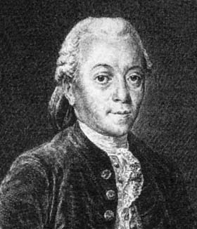

# 第 2 讲 数学基础（二）

## Part 1

- 算术入门

<div class=hidden>

$\newcommand{\Z}{\mathbb{Z}}$
$\newcommand{\R}{\mathbb{R}}$
$\DeclareMathOperator{\lcm}{lcm}$
$\DeclareMathOperator{\extgcd}{extgcd}$
$\newcommand{\Div}{\mathrel{\Vert}}$
$\DeclarePairedDelimiter\ceil{\lceil}{\rceil}$
$\DeclarePairedDelimiter\floor{\lfloor}{\rfloor}$

</div>

---

# 算术入门

---

# 整除

对任意 $x \in \Z$ 定义 $x\Z := \set{xd : d\in\Z}$，它由 $x$ 的所有倍数构成。对于 $x, y\in \Z$，如果 $y \in x\Z$ 则称 $x$ **整除** $y$ 记为 $x \mid y$，否则记为 $x\not\mid y$。当 $x\mid y$ 时，我们称 $x$ 为 $y$ 的**因数**（divisor）或**因子**。

---

# 因数的乘积

> 设 $n$ 是正整数，考虑 $n$ 的正因数的集合 $D(n):= \set{d\in\Z_{\ge 1} : d\mid n}$，我们有 $\prod_{d\in D(n)} d = \sqrt{n}^{|D(n)|}$。

**证明** $\quad$ 若 $d\in D(n)$ 且 $d\ne \sqrt{n}$，那么 $n/d\in D(n)$ 且 $d\ne n/d$，而 $d\cdot(n/d) = (\sqrt{n})^{2}$。


---

# 例题 校庆

给定正整数 $n$，求 $n$ 在几进制下的写法末尾的 0 最多。

输出两个数 $b$，$c$，表示 $n$ 在 $b$ 进制下末尾的 0 最多，有 $c$ 个；若有多个 $b$ 满足条件，输出最大的那个。

###### 限制

- $2 \le n \le 2^{63} - 1$。

---

# 分析

- $n$ 在 $n$ 进制下写成 10，末尾有一个 0。
- 我们试图找一个 $b$ 使得 $n$ 在 $b$ 进制下末尾至少有两个 $0$，也就是 $b^2 \mid n$。
- 我们可以枚举 $b$，从 $2$ 到 $\sqrt{n}$；可是 $n$ 太大，这样会超时。
- 我们枚举 $b$，从 $2$ 到 $n^{1/3}$。对于大于 $n^{1/3}$ 的 $b$，注意到 $n/b^2 < n^{1/3}$，我们可以通过枚举 $n/b^2$ 来找到 $b$。


---

# 代码

```cpp
void solve(long long n) {
  int C = 1;
  long long B = n;
  for (long long b = 2; b * b * b <= n; b++) {
    if (n % (b * b) == 0) {
      long long t = n / (b * b);
      int cnt = 2;
      while (t % b == 0) {
        t /= b;
        cnt++;
      }
      if (cnt >= C) {
        C = cnt;
        B = b;
      }
    }
  }
  if (C <= 2)
    for (int k = 1; k * k * k < n; k++)
      if (n % k == 0) {
        long long t = sqrt(n / k);
        if (t * t == n / k) {
          C = 2;
          B = t;
          break;
        }
      }
  cout << B << ' ' << C << '\n';
}
```


---

# 整数的带余除法

对于任意整数 $a, d \in \Z$，若 $d\ne 0$，则存在唯一的 $q, r\in\Z$ 使得 $0\le r < |d|$ 而 $a = dq + r$。

**证明** $\quad$ 不妨假定 $d > 0$。考虑集合
$$
R := \set{a - dq : q\in\Z} \cap \Z_{\ge 0}.
$$
这是 $\Z_{\ge 0}$ 的非空子集，故有极小元，记为 $r$；相应地 $a = dq + r$。必然有 $r < d$，否则 $a = d(q+1) + (r - d)$ 将给出 $r - d \in R$ 使得 $0 \le r - d < r$，与 $r$ 的极小性质矛盾。这就说明 $q, r$ 的存在性。

至于唯一性，设 $dq + r = dq' + r'$，其中 $q, q' \in \Z$ 而 $0 \le r \le r' < d$。因为 $r' - r = d(q - q')$ 既被 $d$ 整除，又有 $0 \le r'-r \le r' < d$，易证唯一的可能是 $r'=r$，从而由 $d \ne 0$ 推得 $q = q'$。

根据上述命题中的唯一性，带余除法中的余数 $r = 0$ 当且仅当 $d\mid a$。

---

# 练习

设 $a, b \in\Z_{\ge 1}$，$a \ge b$，$r$ 是 $a$ 除以 $b$ 的余数。证明 $r < a/2$。

**证明** $\quad$ 若 $b \le a/2$，那么根据余数的定义有 $r < b$。若 $b > a/2$，那么 $r = a - b < a/2$。


---

# 练习

取 $s\in \Z_{\ge 2}$。证明所有 $n\in \Z_{\ge 0}$ 都有唯一的 $s$ 进制展开
$$
n = a_0 + a_1 s + a_2 s^2 + \cdots, \quad a_k \in \set{0, 1, \dots, s- 1}, 
$$

其中至多仅有有限个 $a_k$ 非零。

---

# $a \bmod b$

对于整数 $a, b$，$b\ne 0$，$a$ 除以 $b$ 的余数也称为 $a$ 模 $b$，记作 $a \bmod b$。求 $a$ 除以 $b$ 的余数的操作称为**取模**或模运算，称 $b$ 为**模数**。


---

# C++ 的 / 和 % 运算符


C++ 里有整数的除法运算符 `/` 和模运算符 `%`。二者的运算规则，择要叙述如下：
设 `a`，`b` 是两个 `int` 类型值且 `b != 0`，那么
- `a / b` 的值仍是 `int` 类型，并且等于 `a` 除以 `b` 的真实值**向零取整**的结果。
- 保证有 `a == (a / b) * b + a % b`。

举例明之，
- `5 / 2` 和 `-5 / -2` 的值都是 `2`，
- `5 / -2` 是 `-5 / 2` 的值都是 `-2`，
- `5 % 2` 的值是 `1`，`-5 % -2` 的值是 `-1`。
- `5 % -2` 的值是 `1`，`-5 % 2` 的值是 `-1`。


---

# a % b 的运算规则

设 `a`，`b` 是两个 `int` 类型值，`b != 0`，
- 如果 `b` 整除 `a`，那么 `a % b == 0`；
- 否则 `a % b != 0`，此时 `a % b` 的符号跟 `a` 相同，
    - 当 `a > 0` 时，`a % b` 的值大于 $0$，并且正是带余除法所规定的 `a` 除以 `b` 的余数；
    - 当 `a < 0` 时，`a % b` 的值小于 $0$，`a % b + abs(b)` 才是带余除法所规定的 `a` 除以 `b` 的余数；
- 无论如何都有 `abs(a % b) < abs(b)`。

今后我们遇到的取模运算，模数 $b$ 几乎总是正整数。

注意：`INT_MIN / -1` 的真实值不能被 `int` 类型表示。实际上，`INT_MIN / -1` 等于 `INT_MIN`，而 `INT_MIN % -1` 等于 `0`。


---

# 习题 [P11184](https://www.luogu.com.cn/problem/P11184) 带余除法

设 $n, d$ 是正整数，$q, r \in\Z_{\ge 0}$ 分别是 $n$ 除以 $d$ 的商和余数。
已知 $n, q$，求可能的余数 $r$ 的数量。

###### 限制

- $1 \le n \le 10^{14}$
- $0 \le q \le 10^{14}$

**解法：**
- 若 $q = 0$，则余数 $r = n$。答案是 $1$。
- 若 $q \ge 1$，则根据 $qd \le n < (q + 1)d$，可确定 $d$ 的取值范围
    $$n/(q+1) < d \le n/q.$$
    每个除数 $d$ 都唯一对应一个余数 $r$。答案是 $\floor{n/q} - \floor{n/(q+1)}$。

---

# 代码

```cpp
#include <bits/stdc++.h>
using namespace std;

int main() {
    int T;
    cin >> T;
    while (T--) {
        long long n, q;
        cin >> n >> q;
        if (q == 0)
            cout << 1 << '\n';
        else
            cout << n / q - n / (q + 1) << '\n';
    }
}
```

---


# 习题 [P5682](https://www.luogu.com.cn/problem/P5682) 次大值

给定正整数 $a_1, \dots, a_n$。考虑集合
$$
R := \set{a_i\bmod a_j : 1 \le i, j\le n,\ i\ne j},
$$

求 $R$ 中的次大值。若 $|R| < 2$，输出 $-1$。

###### 限制

- $3 \le n \le 2\times 10^5$
- $1 \le a_i \le 10^9$

---

# 解法

- 若所有 $a_i$ 都相同，则 $R = \set{0}$。

- 否则存在 $a_i < a_j$，此时有 $a_i \bmod a_j = a_i$ 而 $a_j \bmod a_i < a_i$，因此可以去掉 $a_1, \dots, a_n$ 中重复的元素。设剩下的元素从小到大排列是 $b_1 < \dots < b_m$，这里 $m \ge 2$。

- 显然，最大值是 $b_{m-1} \bmod b_m = b_{m-1}$。

- 若 $m = 2$，次大值是 $b_2 \bmod b_1$。

- 若 $m \ge 3$，则次大值不小于 $b_{m-2} \bmod b_m = b_{m-2}$。若次大值大于 $b_{m-2}$，那么它只能是 $b_m \bmod b_{m-1}$。


---

# 代码

```cpp
int main() {
    int n;
    cin >> n;
    vector<int> a(n);
    for (int i = 0; i < n; i++)
        cin >> a[i];
    sort(a.rbegin(), a.rend()); //从大到小排序
    auto c = unique(a.begin(), a.end()) - a.begin(); //去重
    int ans;
    if (c == 1)
        ans = -1;
    else if (c == 2)
        ans = a[0] % a[1];
    else
        ans = max(a[0] % a[1], a[2]);
    cout << ans << "\n";
}
```

---

# 习题 [P7521](https://www.luogu.com.cn/problem/P7521) 取模

给定正整数 $a_1, \dots, a_n$，求
$$
\max\set{(a_i + a_j) \bmod a_k : 1 \le i, j, k \le n\ 且\  i, j, k\ 相异 }.
$$

###### 限制
- $3 \le n \le 2\times 10^5$
- $1 \le a_i \le 10^8$

:warning: 此题较难。

---

# 暴力解法（一）

枚举 $k$，枚举 $i, j$。时间 $O(n^3)$

# 暴力解法（二）

- 枚举 $k$。把 $a_1, \dots a_n$ 扣掉 $a_k$ 剩下的 $n-1$ 个数各自除以 $a_k$ 余数从小到大排列，记作 $r_1 \le r_2 \le  \dots \le r_{n-1}$。

- $(a_i + a_j) \bmod a_k$ 的最大值有两种情形：
    - $\max\set{r_x + r_y : 1 \le x < y \le n-1,\ r_x + r_y < a_k}$，这可以用**双指针**法求解。
    - $r_{n-2} + r_{n-1} - a_k$。

时间 $O(n^2\log n)$。


---

# 暴力解法（三）

- 把 $a_1, \dots, a_n$ 从大到小排序。以下假设 $a_1 \ge \dots \ge a_n$。

- 按 $k = 1, \dots, n$ 的顺序枚举 $a_k$，然后做暴力解法（二）里描述的过程，注意以下两点：
    - 若 $a_k = a_{k-1}$，就跳过 $a_k$。
    - 若当前的最大余数 $\ge a_k - 1$，就结束。

我们将证明此算法的运行时间是 $O(\log a_1 n \log n)$，注意
- $a_1$ 是 $a_1, \dots, a_n$ 的最大值，
- $\log a_1 n \log n$ 应当理解为 $(\log a_1) \times (n) \times (\log n)$。

---

设 $a_1, \dots, a_n$ 去重（chóng）以后是 $b_1, \dots, b_m$。设问题的答案，即 $(a_i + a_j) \bmod a_k$ 的最大值，是 $r$，并且设
$$
b_1 > b_2 > \dots > b_x > r \ge b_{i+1} > \dots > b_m,
$$
则 $b_1, \dots, b_x$ 就是会作为 $a_k$ 的那些数。下面我们试图说明 $x$ 不会很大。

对于 $1 \le i \le x-2$，我们有
$$
 b_i > b_{i+1} > b_{i+2} > r \quad 和 \quad (b_{i+1} + b_{i+2}) \bmod b_{i} \le r,
$$
这足以说明
$$
(b_{i + 1} + b_{i+2}) \bmod b_i =  b_{i + 1} + b_{i+2} - b_i.
$$
以此代入 $(b_{i + 1} + b_{i+2}) \bmod b_i\le r$，得
$$
b_{i+1} + b_{i+2} - b_i \le r,
$$
改写成
$$
(b_{i+1} - r) + (b_{i+2} - r) \le (b_i - r).
$$

---

考虑数列 $(c_i := b_{i} - r)_{i=1}^{x}$，它满足 $c_i > c_{i+1}$ 和 $c_i \ge c_{i+1} + c_{i+2}$，于是有
$$
c_{i+2} < c_i / 2,
$$
换言之，数列 $(c_1, \dots, c_x)$，从 $c_1$ 开始，每过两项剩下不到一半：
$$
c_3 < c_1/2,\quad c_5 < c_3/2,\quad c_7 < c_5/2, \quad\dots
$$
又每个 $c_i$ 都是正整数，所以
$$x < 1 + 2\log_2 c_1 = 1 + 2\log_2(a_1 - r).$$

---

# 代码

<div class=columns>

```cpp
const int max_n = 2e5 + 5;
int a[max_n], b[max_n];
int n;

int solve(int k) {
  for (int i = 0, j = 0; i < n; i++)
    if (i != k)
      b[j++] = a[i] % a[k];
  sort(b, b + n - 1);
  int ans = 0;
  for (int l = 0, r = n - 2; l < r; r--) {
    while (l < r and b[l] + b[r] < a[k])
      l++;
    if (l - 1 >= 0)
      ans = max(ans, b[l - 1] + b[r]);
  }
  return max(ans, b[n - 2] + b[n - 3] - a[k]);
}
```

```cpp
int main() {
  cin >> n;
  for (int i = 0; i < n; i++)
    cin >> a[i];
  sort(a, a + n);
  int ans = 0;
  for (int k = n - 1; k >= 0; k--) {
    if (k < n - 1 and a[k] == a[k + 1])
      continue;
    if (ans >= a[k] - 1)
      break;
    ans = max(ans, solve(k));
  }
  cout << ans << "\n";
}
```


---

# 最小公倍数、最大公因数、互素

以下选定 $n \in \Z_{\ge 1}$，并考虑一族整数 $x_1, \dots, x_n \in\Z$。

- 记这族整数的<ruby>**最小公倍数**<rt>least common multiple</rt></ruby>为
    $$\lcm(x_1, \dots, x_n) := \begin{aligned}
        \begin{cases}
        \min\set{m \in\Z_{\ge 1} : \forall 1\le i \le n,\ x_i\mid m}, & \forall i,\  x_i \ne 0, \\
        0, & \exists i,\ x_i = 0.
        \end{cases}
    \end{aligned}
    $$

- 记这族整数的<ruby>**最大公因数**<rt>greatest common divisor</rt></ruby>为
    $$\gcd(x_1, \dots, x_n) := \begin{aligned}
        \begin{cases}
        \max\set{d \in\Z_{\ge 1} : \forall 1\le i \le n,\ d \mid x_i}, & \exists i,\  x_i \ne 0, \\
        0, & \forall i,\ x_i = 0.
        \end{cases}
    \end{aligned}
    $$

- 若 $\gcd(x_1, \dots, x_n) = 1$，则称 $x_1, \dots, x_n$ **互素**，这也相当于说 $x_1, \dots, x_n$ 没有 $\pm 1$ 以外的公因子。

---

# 辗转相除法

设 $a, b$ 是正整数，$a \ge b$。我们求 $a, b$ 的最大公因数。

设 $a$ 用带余除法表作 $a = bq + r$，其中 $0 \le r < b$。若 $d$ 是 $a, b$ 的公因数，则 $d$ 整除 $a - qb=r$；反之，若 $d$ 是 $b,r$ 的公因数则 $d$ 整除 $bq + r = a$。即 $a, b$ 和 $b, r$ 有同一群公因数，自然有
$$
\gcd(a, b) = \gcd(b, r).
$$
这引出如下递归算法：
$$
\gcd(a, b) = \gcd(b, r) \quad \begin{cases}
= b, \quad &若 r = 0, \\
继续作带余除法, \quad &若 r \ne 0.
\end{cases}
$$
一言以蔽之，从 $a, b$ 开始反复作带余除法，直到余数为零。

此算法称为**辗转相除法**，也称<ruby>**欧几里得算法**<rt>Euclid's algorithm</rt></ruby>。

---


# 例子：用辗转相除法算 $\gcd(544, 119)$

过程可以用如下序列表示
$$
544, 119, 68, 51, 17, 0.
$$
从第三项开始，每一项都是前两项相除的余数；这样反复做带余除法，直到余数为 $0$。

前一次的除数是下一次的被除数，而余数（可视为被除数的“残留”）是一下次的除数；被除数与除数前后角色翻转，此即“辗转”之义。


---

# 辗转相除法的代码

```cpp
int gcd(int a, int b) {//要求 a, b 都非负。
    return b == 0 ? a : gcd(b, a % b);
}
```
注意：只有 $a$, $b$ 都非负时，`gcd(a, b)` 返回的才是 $a, b$ 的最大公因数。若 $a$ 或 $b$ 是负数，`gcd(a, b)` 可能返回 $-\gcd(a, b)$。


---

# 辗转相除法的时间复杂度

:question: 设 $a \ge b \ge 1$。辗转相除计算 $\gcd(a, b)$ 最多可能做多少次除法？

设算 $\gcd(a, b)$ 做了 $n-2$ 次除法。仿照上面的例子，把过程表为序列
$$x_1, x_2, \dots, x_{n-1}, x_n,$$
其中 $x_1 = a$，$x_2 = b$，$x_{n-1} = \gcd(a, b)$，$x_{n} = 0$；并且
$$
x_{i} = x_{i-1} \bmod {x_{i-2}}\qquad \text{for}\  i \ge 3.
$$
根据带余除法的定义，有
$$
x_1 \ge x_2 > \dots > x_{n-1} > x_n,
$$
又前已证明，对于 $x \ge y \ge 1$ 有 $x \bmod y < x/2$，因此
$$
x_{i} > 2 x_{i+2} \qquad \text{for}\ 1 \le i \le n - 2.
$$
分别看 $x_1, x_3, \dots$ 和 $x_2, x_4, \dots$，有

---

$$
\begin{aligned}
a &= x_1 > 2 x_3 > 4 x_5 > \dots, \\
b &= x_2 > 2 x_4 > 4 x_6 > \dots
\end{aligned}
$$
设 $n$ 为奇数。一方面
$$a = x_1 \ge  2^{(n-3)/2} x_{n-2} \ge 2^{(n-3)/2},$$
得 $n -2 \le 1 + 2 \log_2 a$；另一方面
$$
b = x_2 \ge 2^{(n-3)/2}x_{n-1} \ge 2^{(n-3)/2},
$$
得 $n-2 \le 1 + 2 \log_2 b$；总之，做除法的次数
$$
n - 2 \le  1 + 2 \log_2 b.
$$
再设 $n$ 为偶数。此时 $n \ge 4$ 且 $a > b \ge 2$。重复上述推导，可得
$$
n - 2 \le 2 \log_2 b.
$$
一般地，**不**假设 $a \ge b$，用辗转相除法计算 $\gcd(a, b)$，做除法的次数不超过
$$
2 + 2 \log_2 \min(a, b).
$$

---

<!-- Note：趁热打铁 -->
# 观察

用辗转相除法算 $\gcd(544,119)$ 的过程可表为序列
$$
544, 119, 68, 51, 17, 0.
$$
其中每一项都可写成 $544x + 119y$ 的形式（$x,y\in\Z$），列表说明如下
$$
\begin{matrix}
\hline
商 & 余数   &  x & y  \\ \hline
 &  544  & 1 & 0 & \\ \hline
4 & 119 & 0 & 1 \\ \hline
1 & 68 & 1 & -4 \\ \hline
1 & 51 & -1 & 5 \\ \hline
3 & 17 & 2 & -9 \\ \hline
& 0 & -7 & 32\\ \hline
\end{matrix}
$$
诸 $x$ 和诸 $y$ 的计算是彼此独立的。

---

# 扩展欧几里得算法

从辗转相除法的计算过程我们发现
- 对任意整数 $a, b$，存在整数 $x, y$ 使得 $\gcd(a, b) = ax + by$。

而在用辗转相除法算 $\gcd(a, b)$ 时顺便就能算出这样的 $x, y$，此即<ruby>**扩展欧几里得算法**<rt>extended euclidean algorithm</rt></ruby>。

---

# 扩展欧几里得算法的递推实现

前面的观察启发我们写出如下程序

<div class=columns>

```cpp
// 要求 a >= 0，b >= 0
pair<int, int> extgcd(int a, int b) {
    int x = 1, y = 0;
    int x2 = 0, y2 = 1;
    while (b != 0) {
        int q = a / b;
        x -= q * x2;
        y -= q * y2;
        a -= q * b;
        swap(a, b);
        swap(x, x2);
        swap(y, y2);
    }
    return {x, y};
}
```

$$
\begin{matrix}
\hline
商 & 余数   &  x & y  \\ \hline
 &  544  & 1 & 0 & \\ \hline
4 & 119 & 0 & 1 \\ \hline
1 & 68 & 1 & -4 \\ \hline
1 & 51 & -1 & 5 \\ \hline
3 & 17 & 2 & -9 \\ \hline
& 0 & -7 & 32\\ \hline
\end{matrix}
$$

---

# 扩展欧几里得算法的递归定义

:dart: 给定 $a, b\in\Z_{\ge 0}$。我们求整数 $x,y$ 使得 $ax + by = \gcd(a, b)$。 

若 $b = 0$，则有
$$
a \times 1 + b\times 0 = a = \gcd(a, b).
$$
取 $x = 1$，$y = 0$。

若 $b \ge 1$，假设已经求得整数 $x', y'$ 使得
$$
bx' + (a\bmod b) y' = \gcd(a, b),
$$
再将 $a \bmod b = a - \floor{a/b}\times b$ 代入上式就得到
$$
ay' + b(x'-\floor{a/b}\times y') = \gcd(a, b).
$$
取 $x = y'$，$y = x'-\floor{a/b}\times y'$。

---

将上述数学语言转化成代码后，就得到如下程序
```cpp
int extgcd(int a, int b, int& x, int& y) {//要求 a, b 非负
    int d = a;
    if (b != 0) {
        d = extgcd(b, a % b, y, x); //此时y是上述x',x是上述y'。
        y -= (a / b) * x;
    } else {
        x = 1;
        y = 0;
    }
    return d; //返回值是gcd(a,b)
}
```


---

# ax + by = gcd(a, b) 的解的大小

`extgcd(a, b, x, y)` 算出的 $x, y$ 的大小如何？
> 若 $ab \ne 0$，则 $|x| \le b$ 且 $|y| \le a$。

**证明** $\quad$ 在 $b = 0$ 的前一步，即 $a \bmod b = 0$ 时有 $x = 0$ 且 $y = 1$，结论成立。假设调用 $\extgcd(b, a \bmod b, y', x')$ 后有 $|x'| \le b$ 且 $|y'| \le a \bmod b$。在 $\extgcd(a, b, x, y)$ 中 $x = x'$，$y = y' - \floor{a/b}x'$，所以有如下不等式成立
$$
\begin{aligned}
|x| &= |x'| \le b, \\
|y| &= |y'-\floor{a/b}x'| \\
    &\le |y'| + \floor{a/b} \cdot |x'| \\
    &\le a\bmod b + \floor{a/b} \cdot b = a.
\end{aligned}
$$

---



# 裴蜀定理


<ruby>**裴蜀定理**<rt>Bézout's lemma</rt></ruby>简单表述是
> 给定整数 $a, b$，存在整数 $x, y$ 使得 $\gcd(a, b) = ax + by$。

先前的辗转相除法可作为这个命题的构造性证明。

下面我们讲另一种表述的裴蜀定理，为此先讲一个引理并引入一个记号。


---

# 引理

设 $I$ 为 $\Z$ 的非空子集，满足以下性质
$$
\begin{aligned}
x,y\in I &\implies  x+y\in I, \\
a\in \Z, x\in I &\implies ax\in I.
\end{aligned}
$$ 
<!-- 这样对齐会导致 \implies 左边的空格较小，不是正确的对齐方式。 -->
此时存在唯一的 $g\in\Z_{\ge 0}$ 使得 $I = g\Z$。

上述两个性质是说 $I$ 中任意两整数相加仍然在 $I$ 中，$I$ 中任意整数的倍数仍然在 $I$ 中。

**证明** $\quad$ 先讨论 $g$ 的存在性。不妨设 $I \ne \set{0}$，否则唯一的取法是 $g = 0$。注意到 $g\in I \iff -g\in I$。取 $g$ 为 $I$ 中的最小正整数。包含关系 $I \supseteq g\Z$ 自明。至于 $I\subseteq g\Z$，设 $m\in I$，用带余除法表为 $m= gq + r$，其中 $0 \le r < g$。不难验证 $m - gq$ 属于 $I$，于是 $r = m - gq$ 必为 $0$，否则将给出 $I$ 中比 $g$ 更小的正整数，矛盾。

至于 $g$ 的唯一性，若正整数 $g, g'$ 满足 $g\Z = g'\Z$，则它们相互整除，故唯一的可能是 $g = g'$。
 
---

# 定义

对给定的 $x_1, \dots, x_n \in \Z$，定义 $\Z$ 的子集
$$
\begin{aligned}
\sum_{i=1}^{n} \Z x_i &= \Z x_1 + \dots + \Z x_n\\
&:= \left\{\sum_{i=1}^{n} a_i x_i \in \Z : a_1,  \dots, a_n \in\Z\right\};
\end{aligned}
$$
按照惯例，极端情形 $n = 0$（即“空和”）按 $\sum_{i=1}^{0}\Z x_i := \set{0}$ 来解释。

**练习** $\quad$ 验证集合 $\Z x_1 + \dots + \Z x_n$ 满足上面引理的两个性质。


---

# 裴蜀定理

设 $x_1, \dots, x_n$ 为整数，则
$$
\Z x_1 + \dots + \Z x_n = \gcd(x_1, \dots, x_n) \Z.
$$
作为推论，$x_1, \dots, x_n$ 互素的充要条件是存在 $a_1, \dots, a_n\in\Z$ 使得 $a_1 x_1 + \dots + a_n x_n = 1$。

**证明** 不妨设 $x_1, \dots, x_n$ 不全为 $0$，否则等式两边按定义同等于 $\set{0}$。据上述引理取 $g\in \Z_{\ge 1}$，使得 $\Z x_1 + \dots + \Z x_n = g\Z$。不难验证对于任意正整数 $d$，我们有
$$
(\forall 1\le i \le n,\ d\mid x_i) \iff (\forall x \in \Z x_1 + \dots + \Z x_n,\ d\mid x) \iff d \mid g.
$$
这就足以表明 $g = \gcd(x_1, \dots, x_n)$。

基于上述结果，$\gcd(x_1, \dots, x_n) = 1$ 蕴含 $1$ 可以表为 $a_1 x_1 + \dots + a_n x_n$ 的形式；反之，若存在 $a_1, \dots, a_n$ 使得 $1 = a_1 x_1 + \dots + a_n x_n$，则 $x_1, \dots, x_n$ 当然互素。

---

# 素数

设 $p\in \Z\setminus \set{0, \pm 1}$。如果 $p$ 除了 $\pm 1$ 和 $\pm p$ 之外没有别的因数，则称 $p$ 是**素元**。正的素元称为<ruby>**素数**<rt>prime number</rt></ruby>。

---

# 欧几里得引理


> 设 $p$ 为素元，若 $a, b\in\Z$ 使得 $p\mid ab$，则必有 $p\mid a$ 或 $p\mid b$。

**证明** $\quad$ 不妨设 $p\not\mid a$，因为 $p$ 是素元，此时 $a$ 和 $p$ 必无 $\pm 1$ 以外的公因子，亦即互素。裴蜀定理蕴含存在 $x, y\in \Z$ 使得 $1 = px + ay$。于是 $p \mid ab \implies p \mid pxb + aby = (px + ay)b = b$.

---

# 练习

用证明欧几里得引理的手法证明以下命题
> 若 $a, b, c\in \Z$ 使得 $a \mid bc$ 且 $\gcd(a, b) = 1$，则 $a \mid c$。

**证明** 由于 $\gcd(a, b) = 1$，裴蜀定理蕴含存在 $x,y\in\Z$ 使得 $1 = ax + by$。于是 $a \mid bc \implies a \mid axc+ bcy = (ax+ by)c = c$.


---

# 算术基本定理

任何非零整数 $n$ 都有素因子分解
$$
n = \pm p_1^{a_1} \dots p_r^{a_r},
$$
其中 $r \in\Z_{\ge 0}$（当 $r = 0$ 时右式规定为 $1$），$p_1, \dots, p_r$ 是相异素数，$a_1,\dots, a_r\in \Z_{\ge 1}$，而且此分解不论顺序是唯一的。

**证明** $\quad$ 关于分解的存在性，处理 $n \ge 1$ 的情形即可。我们寻求形如 $n = p_1^{a_1}\dots p_r^{a_r}$ 的分解。如果 $n$ 既非 $1$ 又非素数，则分解为 $n = ab$，其中 $1< a, b < n$。继续对 $a, b$ 递归地操作，最终可表 $n$ 为若干个素数的乘积，容许重复。

---

唯一性仍可简化到 $n \ge 1$ 的情形。设 $p_1^{a_1}\dots p_r^{a_r} = q_1^{b_1}\dots q_s^{b_s}$，其中 $p_1, \dots, p_r$ 是相异素数，$q_1, \dots, q_s$ 也是相异素数，而 $a_i, b_j \in\Z_{\ge 1}$。注意到 $r = 0$ 当且仅当 $s = 0$，此时两边都是 $1$。故以下不妨设 $r, s \ge 1$。

由于 $p_1 \mid q_1^{b_1} \dots q_s^{b_s}$，反复应用欧几里得引理可知存在 $1\le j \le s$ 使得 $p_1 \mid q_j$；这进一步蕴含 $p_1 = q_j$。重排下标后不妨假设 $p_1 = q_1$，必要时等号两边互换，不妨假设 $a_1 \le b_1$。于是
$$
p_2^{a_2} \dots p_r^{a_r} = p_1^{b_1-a_1} q_2^{b_2}\dots q_s^{b_s}
$$
再次应用欧几里得引理可见 $p_1$ 不整除左式，故 $b_1 = a_1$。按此递归地论证，即得分解的唯一性。

---

# 算术基本定理的推论

- 对于任何素数 $p$ 和非零整数 $n$，我们有 $p\mid n$ 当且仅当 $p$ 在 $n$ 的素因子分解中出现，相应的指数 $a\in\Z_{\ge 1}$ 由以下性质唯一确定：$p^{a} \mid n$ 而 $p^{a+1}\not\mid n$，数论中的标准记法如下
    - 设 $p$ 为素数，我们以符号 $p^a \Div n$ 表达 $p^a \mid n$ 而 $p^{a+1} \not\mid n$。

- 考虑正整数 $n = \prod_{i=1}^{r} p_i^{a_i}$ 和 $m = \prod_{i=1}^{r} p_i^{b_i}$，其中 $p_1, \dots, p_r$ 是相异素数而 $a_i, b_i \in \Z_{\ge 0}$，则

    - $m \mid n \iff \forall i\in\set{1, \dots, r},\ b_i \le a_i.$

    - $\gcd(n, m) = \prod_{i=1}^{r} p_i^{\min\set{a_i, b_i}}, \qquad \lcm(n, m) = \prod_{i=1}^{r} p_i^{\max\set{a_i, b_i}}.$
    
        对于任意多个正整数的 $\gcd$ 和 $\lcm$ 也有类似结果。


---

# 练习

证明对所有正整数 $n,m$ 皆有
$$nm = \gcd(n, m) \cdot \lcm(n, m).$$

---

# $n$ 的正因数的个数

设正整数 $n$ 的素因子分解是
$$
n = p_1^{a_1} \dots p_r^{a_r},
$$
则 $n$ 的正因数的个数是
$$
(a_1 + 1) \dots (a_r + 1).
$$

例如 $12 = 2^{2}\times 3^{1}$，有 $(2 + 1) \times (1 + 1) = 6$ 个正因数，即 $1, 2, 3, 4, 6, 12$。


**练习** $\quad$ 证明上述结果。

---


# 有无穷多个素数

素数列 $2, 3, 5, 7, 11, \ldots$ 是数论关切的基本对象；这方面最古老也是最基础的结果是

> 存在无穷多个素数。

**证明** $\quad$ 对任意一列素数 $p_1 < \cdots < p_n$，考虑
$$m := p_1 \cdots p_n + 1,$$
则 $m > 1$，而且它不被 $p_1,\dots, p_n$ 中任一个素数整除。因此 $m$ 的素因子分解中必有不同于 $p_1, \dots, p_n$ 的素数。

---

# 习题 [P8255](https://www.luogu.com.cn/problem/P8255) 数学游戏

$x, y, z$ 是正整数且满足 $z = x\cdot y \cdot \gcd(x,y)$。已知 $x$ 和 $z$，求 $y$。

若不存在满足条件的 $y$，输出 $-1$。

有 $T$ 组测试数据。

###### 限制

- $1 \le T \le 5\times 10^5$
- $1 \le x \le 10^9$
- $1 \le z < 2^{63}$

:warning: 此题颇难。

---

# 分析

设 $\gcd(x, y) = d$，$x = dx', y = dy'$，则 $\gcd(x', y') = 1$。注意到
$$
z/x = y \cdot \gcd(x, y) = dy'\cdot d = d^2y',
$$
而
$$
x^2 = (dx')^2 = d^2 x'^2,
$$
又
$$\gcd(x', y') = 1 \implies \gcd(x'^2, y') = 1,$$
所以
$$
d^2 = \gcd(d^2x'^2, d^2 y') = \gcd(x^2, z/x).
$$

---

# 解法

从上面的分析，我们得到如下解法：
- 若 $x$ 不整除 $z$，无解。
- 计算 $\gcd(x^2, z/x)$，看它是不是平方数。若不是则无解，否则对它开平方，算出 $\gcd(x, y)$，从而算出 $y$。

注意：由 $1 \le x \le 10^9$ 和 $1 \le z < 2^{63}$ 可以估算出
$$ \gcd(x^2, z/x) \le \min(x^2, z/x) < 10^{14}.$$
可以用 `std::sqrt()` 对 $\gcd(x^2, z/x)$ 开平方。

---

# 代码

```cpp
long long gcd(long long a, long long b) {
  return b == 0 ? a : gcd(b, a % b);
}

int main() {
  ios::sync_with_stdio(0);
  cin.tie(0);
  int t; cin >> t;
  while (t--) {
    long long x, z; cin >> x >> z;
    if (z % x) {
      cout << "-1\n"; continue;
    }
    long long d2 = gcd(z / x, x * x);
    long long d = sqrt(d2);
    if (d * d != d2) { // d2不是完全平方数。
      cout << "-1\n"; continue;
    }
    cout << z / x / d << '\n';
  }
}
```
