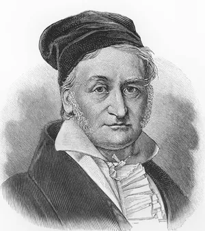
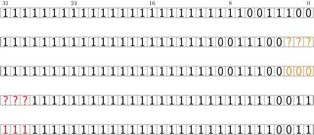

# 模算术

<div class=hidden>

$\newcommand{\Z}{\mathbb{Z}}$
$\newcommand{\R}{\mathbb{R}}$
$\DeclareMathOperator{\lcm}{lcm}$
$\DeclareMathOperator{\extgcd}{extgcd}$
$\newcommand{\Div}{\mathrel{\Vert}}$
$\DeclarePairedDelimiter\ceil{\lceil}{\rceil}$
$\DeclarePairedDelimiter\floor{\lfloor}{\rfloor}$

</div>

---


# 同余式

设 $N\in \Z$。称 $a,b\in\Z$ 是 <ruby>mod<rt>模</rt></ruby> $N$ **同余**的，如果 $N\mid a - b$；此关系也写作
$$a\equiv b \pmod{N}.$$
易见 mod $N$ 同余是 $\Z$ 上的等价关系：诚然
- $a\equiv a\pmod{N}$（因为 $N\mid 0$，或者说 $0\in N\Z$）；
- $a\equiv b\pmod{N}$ 等价于 $b\equiv a\pmod{N}$（因为 $N\mid x$ 等价于 $N\mid -x$，或者说 $N\Z$ 对运算 $x\mapsto -x$ 封闭）；
- $a\equiv b\pmod{N}$ 和 $b\equiv c\pmod{N}$ 蕴含 $a\equiv c\pmod{N}$（因为 $N\Z$ 对加法封闭）。



---

# 同余类

> 选定 $N\in\Z$，记 $\Z$ 对等价关系 mod $N$ 同余的商集为 $\Z/N\Z$ 或简记为 $\Z/N$; 其中的等价类也称为 mod $N$ **同余类**。

给定 $x\in \Z$，包含 $x$ 的同余类可以具体地被描述为 $\Z$ 的子集
$$
x + N\Z := \set{x + Nd : d\in \Z}。
$$

以后我们也会使用更简短的符号如 $[x]$ 或 $[x]_N$ 等来标记含有 $x\in\Z$ 的 mod $N$ 同余类。

<!-- 注意：我们常用 $x \bmod N$ 表示 $x$ 除以 $N$ 的余数。有的书上也用 $x\bmod N$ 表示含有 $x$ 的 mod $N$ 同余类。不难看出，二者是一回事。 -->


在 $N\ge 1$ 的前提下运用带余除法，对每个 $a\in\Z$ 取其除以 $N$ 的余数，记为 $a \bmod N$，则有
$$
a\equiv a'\pmod{N} \iff a\bmod N = a' \bmod N,
$$
此即“同余”之义。于是 mod $N$ 的同余类和 $\set{0, \dots, N-1}$ 的元素一一对应，这就将 $\Z$ 划分为 $N$ 个 mod $N$ 同余类，以 $0, \dots, N-1$ 为具体的代表元。


---

# 练习

证明若 $x\equiv x'\pmod{N}$，$y\equiv y' \pmod{N}$，则有
$$x +y \equiv x'+y'\pmod{N},\quad xy\equiv x'y'\pmod{N}.$$

---

# 练习

<!-- Note: 操练同余式。 -->
设 $a,b$ 是整数，满足 $ab\equiv 1 \pmod{N}$。证明对任意整数 $x, y$，$ax\equiv ay \pmod{N}$ 蕴含 $x\equiv y\pmod {N}$。 

**证明**：对同余式 $ax\equiv ay \pmod{N}$ 两边同乘 $b$ 得 $abx \equiv aby \pmod{N}$。
对 $ab \equiv 1 \pmod{N}$ 两边同乘 $x$，得 $abx \equiv x \pmod{N}$；同理，$aby \equiv y \pmod{N}$。根据同余关系的传递性，遂有 $x\equiv y\pmod{N}$。


我们说 $a$ 对乘法满足**消去律**。

---

# 同余式 $xy \equiv 1 \pmod{N}$

作为同余式的初步例子，我们将介绍称为**费马小定理**的著名结果。作为准备，我们来研究同余式 $xy\equiv 1\pmod{N}$ 对哪些 $x\in\Z$ 有解；当然，答案仅依赖于 $x$ 所属的 mod $N$ 同余类。

> 设 $N\in\Z_{\ge 1}$。对于任意 $x\in\Z$，我们有
> $$
(\exists y\in \Z,\ xy\equiv 1 \pmod{N}) \iff \gcd(N,x) = 1.
$$

**证明** $\quad$ 左式有解相当于说存在 $y,z\in\Z$ 使得 $xy-Nz = 1$，亦即 $x\Z + N\Z \ni 1$。将此代入裴蜀定理。


---


# 费马小定理

设 $p$ 为素数，则对于所有 $x\in\Z$ 都有
$$
\gcd(p, x) = 1 \implies x^{p-1} \equiv 1 \pmod{p}.
$$
作为推论，所有 $x\in \Z$ 都满足 $x^{p} \equiv x \pmod{p}$。


---

**证明** $\quad$ 设 $p\not\mid x$。则 $\gcd(p, x) = 1$，存在 $y\in\Z$ 使得 $xy\equiv 1\pmod{p}$。现在考虑 $x$ 的所有倍数。如果 $k_1x \equiv k_2 x \pmod{p}$，对两边同乘以 $y$，可得 $k_1 \equiv k_2 \pmod{p}$。另一方面，素数的性质确保 $p\not\mid k$ 时，$kx\not\equiv 0 \pmod{p}$。这一切表明
$$
kx, \quad k = 1, 2, \dots, p - 1
$$
两两互不同余，而且都不 $\equiv 0\pmod{p}$，所以它们的同余类和 $1, 2, \dots, p-1$ 的同余类仅差一个重排。于是有
$$
x^{p-1}(p-1)! = \underbracket{x (2x) \cdots ((p-1)x)}_{p-1项} \equiv \underbracket{1 \cdot 2 \cdots (p-1)}_{p-1项} = (p-1)! \pmod{p}
$$
因为 $p\not\mid (p-1)!$，仿照之前办法可从同余式两边消去 $(p-1)!$，这就证明了第一部分。

对于一般的 $x\in\Z$，或者 $\gcd(p,x) = 1$，从而对 $x^{p-1} \equiv 1 \pmod{p}$ 两边同乘以 $x$ 给出 $x^{p} \equiv x \pmod{p}$；或者 $p\mid x$，从而 $x^{p} \equiv x \pmod{p}$ 平凡地成立（两边皆同余 $0$），这就证明了第二部分。

---

# 费马小定理的逆命题不成立

对所有 $x\in\Z$ 都有 $\gcd(p, x) = 1 \implies x^{p-1} \equiv 1 \pmod{p}$ 但不是素数的正整数 $p$ 称为 Carmichael 数，有无穷多个；前五个 Carmichael 数是 $561, 1105, 1729, 2465, 2821$。尽管存在这些反例，上述性质仍然在一些概率素性检测中扮演要角。


---

# 欧拉函数

选定 $n\in\Z_{\ge 1}$。回忆到一个整数与 $n$ 互素与否仅依赖于它的 mod $n$ 同余类。细观上面两个命题的证明，可以发现与 $n$ 互素的同余类在 $\Z/n\Z$ 中占有特别的地位。


> 设 $n \in \Z_{\ge 1}$，定义 $\varphi(n)$ 为不超过 $n$ 而与 $n$ 互素的正整数的个数。

由于 $\Z/n\Z$ 可以通过代表元等同于 $\set{1, \dots, n}$，欧拉函数 $\varphi(n)$ 正是与 $n$ 互素的 mod $n$ 同余类个数。注意到 $\varphi(1) = 1$。

不难看出，
- $\varphi(n) = n - 1$ 当且仅当 $n$ 是素数。 
- 设 $p$ 是素数，$k\in\Z_{\ge 1}$，则 $\varphi(p^k) = p^{k} - p^{k-1}$。


---

# 模算术

有些问题的答案可能非常大，以至于无法用编程语言内置的整数类型来表示，此时往往要求我们计算答案除以给定正整数 $N$ 的余数。

对于这样的问题，我们在做整数的加减乘除运算时，只关心每次运算的结果除以 $N$ 的余数。这样的算术系统称为<ruby>**模算术**<rt>modular arithmetic</rt></ruby>。

在模 $N$ 的算术系统里，不区别模 $N$ 同余的数。我们可以当作其中只有 $0, 1, 2, \dots, N-1$ 这 $N$ 个不同的数。

---

# 模 $5$ 的算术系统的加减乘法表

<div class=columns3>


| 加   | 0    | 1    | 2    | 3    | 4    |
| ---- | ---- | ---- | ---- | ---- | ---- |
| **0**    | 0    | 1    | 2    | 3    | 4    |
| **1**    | 1    | 2    | 3    | 4    | 0    |
| **2**    | 2    | 3    | 4    | 0    | 1    |
| **3**    | 3    | 4    | 0    | 1    | 2    |
| **4**    | 4    | 0    | 1    | 2    | 3    |


| 减   | 0    | 1    | 2    | 3    | 4    |
| ---- | ---- | ---- | ---- | ---- | ---- |
| **0**    | 0    | 4    | 3    | 2    | 1    |
| **1**    | 1    | 0    | 4    | 3    | 2    |
| **2**    | 2    | 1    | 0    | 4    | 3    |
| **3**    | 3    | 2    | 1    | 0    | 4    |
| **4**    | 4    | 3    | 2    | 1    | 0    |


| 乘   | 0    | 1    | 2    | 3    | 4    |
| ---- | ---- | ---- | ---- | ---- | ---- |
| **0**    | 0    | 0    | 0    | 0    | 0    |
| **1**    | 0    | 1    | 2    | 3    | 4    |
| **2**    | 0    | 2    | 4    | 1    | 3    |
| **3**    | 0    | 3    | 1    | 4    | 2    |
| **4**    | 0    | 4    | 3    | 2    | 1    |

</div>

---

# 例题 [P7909](https://www.luogu.com.cn/problem/P7909) 分糖果


给定三个正整数 $n, L, R$。
整数 $k$ 满足 $L \le k \le R$。
求 $k$ 除以 $n$ 的余数的最大值。

数据范围：
- $2 \le n \le L \le R \le 10^9$

解法：
  - 我们把 $k$ 除以 $n$ 的余数记作 $k \bmod n$.
  - 答案是 $\min(L \bmod n + R - L, n - 1)$.

---


# 模算术的实例

模算术有实际的例子，比如，手表的分秒读数是模 $60$ 的算术系统，但是只有加 $1$ 操作；更重要的例子是计算机里的有符号整数。

C++里的 `int` 类型是模 $2^{32}$ 的算术系统：
- 一个 `int` 被表示为一个长度为 $32$ 的比特串，把一个比特的状态对应到数字 $0$ 和 $1$，比特串就成为 $32$ 位二进制数，数的范围是 $0$ 到 $2^{32} - 1$。
- 把 $0$ 到 $2^{31} - 1$ 对应到 $0$ 到 $2^{31} - 1$，把 $2^{31}$ 到 $2^{32} - 1$ 对应到 $-2^{31}$ 到 $-1$。 
    $$
    \begin{matrix}
    0 & 1 & 2 & \cdots & 2^{31}-1 & 2^{31} & 2^{31}+1 & \cdots & 2^{32} - 2 & 2^{32}-1 \\
    0 & 1 & 2 & \cdots & 2^{31}-1 & -2^{31} & -2^{31}+1 & \cdots &-2 & -1
    \end{matrix}
    $$

我们说 $-1$ 的**编码**是 $\underbracket{\mathsf{1 \dots 1}}_{32个\mathsf{1}}$。这种编码方法称为**补码**。
    


---

# 练习

$N$ 位有符号整数能表示的整数的范围是 $-2^{N-1}, \dots, 0, \dots, 2^{N-1} - 1$。

设整数 $x$ 满足 $1 \le x \le 2^{N-1} - 1$，把 $x$ 的编码的每一位取反，然后加一，就得到 $-x$ 的编码。


说明这种方法为何正确。

提示：$-x$ 对应的 $N$ 位二进制数是 $-x + 2^N = ((2^N - 1) - x) + 1$。

---

# 实例研究：有符号整数的移位运算


- `-100 << 3` 的值是 $-800$。
- `-100 >> 3` 的值是 $-13$。

---

# 规则

- 左移 $k$ 位，结果的后 $k$ 位用零填充。
- 右移 $k$ 位，结果的前 $k$ 位用原来的最高位填充。




---

# 性质

设 $\mathtt{x}$ 是 $N$ 位有符号整数（对于 `short`，$N = 16$，对于 `int`，$N= 32$，对于 `long long`，$N = 64$），而整数 $\mathtt{k}$ 满足 $0 \le \mathtt{k} < N$。按照前述规则，对左移位运算，易见
$$\mathtt{x << k} \equiv \mathtt{x} \cdot 2^\mathtt{k} \pmod{2^{N}}.$$

对于右移位运算，若 $\mathtt{x} \ge 0$，$\mathtt{x}$ 的最高位是 $0$，有
$$
\mathtt{x >> k} = \floor*{\frac{\mathtt{x}}{2^\mathtt{k}}};
$$
若 $\mathtt{x} < 0$，则有
$$
\begin{aligned}
\mathtt{x >> k} = \floor*{\frac{(\mathtt{x} + 2^{N}) + (2^{\mathtt{k}} - 1)\cdot 2^{N}}{2^{\mathtt{k}}}} - 2^N &=\floor*{\frac{x}{2^\mathtt{k}} + 2^{N}} - 2^N \\ &= \floor*{\frac{\mathtt{x}}{2^\mathtt{k}}}
\end{aligned}
.
$$

---

# 模算术与除法

考虑如下场景：设 $a,b$ 是整数，$b\ne 0$ 且 $b\mid a$。我们要计算 $\frac{a}{b}$ 除以 $N$ 的余数，但是 $a$ 或 $b$ 太大，先算出 $a$，$b$ 再做除法是不能承受的。

若 $b,N$ 互素，我们可以用下述方法解决此问题。

由于 $b, N$ 互素，存在整数 $c$ 使得 $1 \equiv bc \pmod{N}$。设 $x = \frac{a}{b}$，于是有
$$
x \equiv \frac{a}{b} \pmod{N}
$$
左边乘 $1$，右边乘 $bc$，给出
$$
x \equiv ac \pmod{N}.
$$
也就是说可以把算 $a/b$ 变成算 $ac$。我们称 $c$ 为 $b$ 在模 $N$ 下的**乘法逆元**。

$b$ 在模 $N$ 下的乘法逆元不唯一，但是根据前面证明的消去律，它们都 mod $N$ 同余。换言之，在 mod $N$ 意义下，乘法逆元唯一。

---


# 例子：模 $9$ 下的乘法逆元


|      | 0    | 1    | 2    | 3    | 4    | 5    | 6    | 7    |  8   |
| ---- | ---- | ---- | ---- | ---- | ---- | ---- | ---- | ---- | --- |
| **乘法逆元** |      | $\color{red}{1}$ | $\color{red}{5}$ |  | $\color{red}{7}$ | $\color{red}{2}$ |  | $\color{red}{4}$ |$\color{red}{8}$|


---

# 模 $N$ 意义下的 $\frac{a}{b}$

即便 $a/b$ 不是整数，若 $b, N$ 互素，则存在无穷多个整数 $c$ 使得 $bc \equiv a \pmod N$，并且这样的 $c$ 模 $N$ 都同余，我们写
$$
a/b \equiv  c \pmod{N}.
$$
在模 $N$ 的意义下，我们可把整数 $c$ 等同于分数 $\frac{a}{b}$。

---

# 求模 $p$ 逆元的方法

设 $p$ 为素数，$x\in\set{1, \dots, p-1}$，我们求 $x$ 在模 $p$ 下的逆元，记作 $x^{-1}$。


**法一** $\quad$ 根据费马小定理，有
$$
x^{p-1} = (x^{p-2})x \equiv 1 \pmod{p},
$$
取 $x^{-1} = x^{p-2} \bmod p$ 即可。用**快速幂**算法计算 $x^{p-2} \bmod p$，时间是 $O(\log p)$。 

```cpp
int inverse(int x, int p) {
    int ans = 1;
    int n = p - 2;
    while (n > 0) {
        if (n & 1) ans = (long long) ans * x % p;
        x = (long long) x * x % p;
        n >>= 1;
    }
    return ans;
}
```

---

**法二** $\quad$ $1$ 的逆元是 $1$。对 $2 \le x \le p - 1$，用带余除法把 $p$ 表为 $p = qx + r$，其中 $1 \le r < x$。注意到
$$
r = p-qx \equiv -qx \pmod{p},
$$
两边取逆元，得
$$
r^{-1} \equiv  -q^{-1}x^{-1} \pmod{p},
$$
两边乘以 $-q$ 给出
$$-qr^{-1} \equiv x^{-1} \pmod{p}.$$
据此我们得到一个求 $x^{-1}$ 的递归算法：

```cpp
int inverse(int x, int p) {
    if (x == 1) return 1;
    return p - (long long) (p / x) * inverse(p % x) % p;
}
```

---

# 法二的时间复杂度

```cpp
int inverse(int x, int p) {
    if (x == 1) return 1;
    return p - (long long) (p / x) * inverse(p % x) % p;
}
```

此算法的运行时间不易分析，[已知](https://mathoverflow.net/q/164129/303233)是 $O(p^{1/3})$，若不需要算很多次乘法逆元，可用它。若用它算很多次乘法逆元，可能超时，例如 [B3717 组合数问题](https://www.luogu.com.cn/problem/B3717)，这份[代码](https://www.luogu.com.cn/paste/mlx35m3z)就超时了。

我们建议**优先使用法一**。


---


上面我们得到**递推式**
$$x^{-1} \equiv -\floor{p/x}(p\bmod x)^{-1} \pmod{p}.$$
虽然用它计算单个数的逆元，时间不易分析，却可以用它计算每个 $x = 1, \dots, p-1$ 在模 $p$ 下的逆元：
```cpp
int inverse_table(int p) {
    vector<int> inverse(p);
    inverse[1] = 1;
    for (int x = 2; x < p; x++)
        inverse[x] = p - (long long) (p / x) * inverse[p % x] % p;
}
```

---

# 用扩展欧几里得算法求逆元

一般来说，模数未必是素数。

回忆到对于整数 $a, n$，扩展欧几里得算法给出整数 $x, y$ 使得 $ax + ny = \gcd(a,n)$。若 $\gcd(a, n) = 1$，此 $x$ 恰是 $a$ 在模 $n$ 下的乘法逆元。

```cpp
int inverse(int a, int n) { //计算a在模n下的逆元。要求a,n非负。
    int x, y;
    int d = extgcd(a, n, x, y); // d是gcd(a,n)
    assert(d == 1); // 确保 a，n 互素
    return x;
}
```


---


<div class=columns>
<div>

# 求逆元的非递归写法

```cpp
// 求a在模n下的乘法逆元
int inverse(int a, int n) {
    int u = 0, v = 1;
    while (a != 0) {
        int q = n / a;
        n -= q * a;
        u -= q * v;
        swap(n, a);
        swap(u, v);
    }
    assert(n == 1);
    return u; // u可能为负数
}
```
</div>

<div>

用辗转相除法求 $\gcd(11, 8)$ 的过程可表为序列
$$
11, 8, 3, 2, 1, 0 
$$
其中每一项都可写成 $8x + 11y$ 的形式，
$$
\begin{matrix}
 & x & y \\
11 & 0 & 1 \\
8 & 1 & 0 \\
3 & -1 & 1 \\
2 & 3 & -2 \\
1 & \color{red}-4 & 3 \\
0 & 11 & -8
\end{matrix}
$$
$-4$ 便是 $8$ 在模 $11$ 下的乘法逆元。

</div>

</div>

---

# 习题 [P3811](https://www.luogu.com.cn/problem/P3811) 模意义下的乘法逆元

给定正整数 $n$ 和素数 $p$，求每个$x = 1, 2, \dots, n$ 在模 $p$ 下的乘法逆元。

###### 限制

- $1 \le n \le 3 \times 10^6$
- $n < p < 20000528$

---


```cpp
int main() {
    int n, p;
    cin >> n >> p;
    vector<int> inv(n + 1);
    inv[1] = 1;
    for (int i = 2; i <= n; i++)
        inv[i] = p - (long long) (p / i) * inv[p % i] % p;
    for (int i = 1; i <= n; i++)
        cout << inv[i] << '\n';
}
```

---

# 习题 [P5431](https://www.luogu.com.cn/problem/P5431) 模意义下的乘法逆元 2

给定正整数 $a_1, \dots, a_n$，正整数 $k$ 和素数 $p$，求 $\sum_{i=1}^{n} {k^i/a_i}$，模 $p$。

###### 限制
- $1 \le n \le 5\times 10^6$
- $2 \le k < p \le 10^9$
- $1 \le a_i < p$
- :timer_clock: 550 ms


---

# 解法

这题的时限只有 550 ms，不能对每个 $a_i$ 都求逆元。考虑通分，把 $k^{i}/a_i$ 写成
$$
\frac{a_1 \cdots a_{i-1} k^i a_{i+1} \cdots a_n}{a_1 \cdots a_n}
$$
于是
$$
\sum_{i=1}^{n} {k^i/a_i} = {1\over a_1 \cdots a_n} \sum_{i=1}^{n} a_1 \cdots a_{i-1} k^i a_{i+1} \cdots a_n.
$$
不难想到下述解法：
- 先计算 $a_1, \dots, a_n$ 的后缀积，然后就能在 $O(n)$ 时间求出 $\sum_{i=1}^{n} a_1 \dots a_{i-1} k^i a_{i+1} \dots a_n$。
- 求 $a_1 \cdots a_n$ 的逆元。

---

# 代码


```cpp
int inverse(int x, int p) {
    if (x == 1) return 1;
    return p - (long long)(p / x) * inverse(p % x, p) % p;
}

int main() {
    ios::sync_with_stdio(0); cin.tie(0);

    int n, p, k; cin >> n >> p >> k;
    vector<int> a(n);
    for (int i = 0; i < n; i++) cin >> a[i];

    vector<int> b(n); //后缀积
    b[n - 1] = 1;
    for (int i = n - 1; i >= 1; i--) b[i - 1] = (long long)b[i] * a[i] % p;

    long long sum = 0, t = 1, prod = 1;

    for (int i = 0; i < n; i++) {
        prod = prod * k % p;
        sum += t * prod % p * b[i] % p;
        t = t * a[i] % p;
    }
    cout << sum % p * inverse((int)t, p) % p << '\n';
}
```

---

# 常数优化

考虑用递推法计算
$$
\sum_{i=1}^{n} a_1 \cdots a_{i-1} k^i a_{i+1} \cdots a_n.
$$
对于 $m = 1, \dots, n$，令
$$
s_m = \sum_{i = 1}^{m} a_1 \cdots a_{i-1} k^i a_{i+1} \cdots a_m,
$$
所求正是 $s_n$。有递推式
$$
s_m = a_m \cdot s_{m-1}  + a_1 \cdots a_{m-1} k^m.
$$
这样就无需求序列 $a$ 的后缀积了。

---

# 代码

```cpp
int main() {
    ios::sync_with_stdio(0);
    cin.tie(0);

    int n, p, k;
    cin >> n >> p >> k;

    long long sum = 0, t = 1, prod = 1;

    for (int i = 0; i < n; i++) {
        int a;
        cin >> a;
        prod = prod * k % p;
        sum = (sum * a + t * prod) % p;
        t = t * a % p;
    }
    cout << sum * inverse((int)t, p) % p << '\n';
}
```


---

# 继续常数优化

上面的程序之所以慢，主要是输入量太大，其次是其中有许多模运算，而模运算较慢。我们来介绍一种快速取模的方法。

> **引理** $\quad$ 设 $m, n\in \Z_{\ge 1}$。若 $x\in\Z_{\ge 0}$ 满足 $x\le n$，则
> $$\floor{x/m} \le \floor{x\ceil{n/m}/n} \le \floor{x/m} + 1.$$

**证明**：用带余除法把 $x$ 表为 $x = qm + r$，其中 $0 \le r \le m - 1$。而 $\ceil{n/m}$ 可表为 $\ceil{n/m} = n/m+ \epsilon$，其中 $0 \le \epsilon < 1$。代入 $\floor{x\ceil{n/m}/n}$，可得
$$
\begin{aligned}
\floor{x\ceil{n/m}/n} = \floor{x(n/m+\epsilon)/n} &= \floor{x/m + x\epsilon/n} \\
&= \floor{q + r/m + x\epsilon/n} \\
&= q + \floor{r/m + x\epsilon/n}.
\end{aligned}
$$
易见
$$
0 \le r/m + x\epsilon/n < 2.
$$
注意，右半边只有在 $r > 0$ 时才可能取等号。

---

回到原问题。以 $n = 2^{64}$，$m = p$ 代入上面的引理，对于 $0 \le x < 2^{64}$，有
$$
\floor{x/p} \le \floor{x\ceil{2^{64}/p} /2^{64}} \le \floor{x/p} + 1.
$$
令 $r = x - p \cdot \floor{x\ceil{2^{64}/p} /2^{64}}$，显然 $r \equiv x\pmod{p}$，我们还有
$$
-p < r < p,
$$
所以 $r$ 或 $r + p$ 就是 $x$ 除以 $p$ 的余数。

模数 $p$ 固定，$\ceil{2^{64}/p}$ 也固定。除以 $2^{64}$ 向下取整可以用向右移位运算实现。这样，无需做除法就能算出 $x$ 除以 $p$ 的余数。

```cpp
int p;
unsigned long long q; // q = -1ull / p + 1; 

int mod(long long x) {
    int r = x - ((__int128) x * q >> 64) * p; 
    if (r < 0) r += p;
    return r;
}
```

---


```cpp
int p;
unsigned long long q;
int mod(long long x) {
    int r = x - ((__int128) x * q >> 64) * p; 
    if (r < 0) r += p;
    return r;
}

int main() {
    ios::sync_with_stdio(0);
    cin.tie(0);

    int n, k; cin >> n >> p >> k;
    q = -1ull / p + 1; // -1ull是2的64次方减1

    long long sum = 0, t = 1, prod = 1;

    for (int i = 0; i < n; i++) {
        int a; cin >> a;
        prod = mod(prod * k);
        sum = mod(sum * a + t * prod);
        t = t * a % p;
    }
    
    cout << sum * inverse((int)t, p) % p << '\n';
}
```


