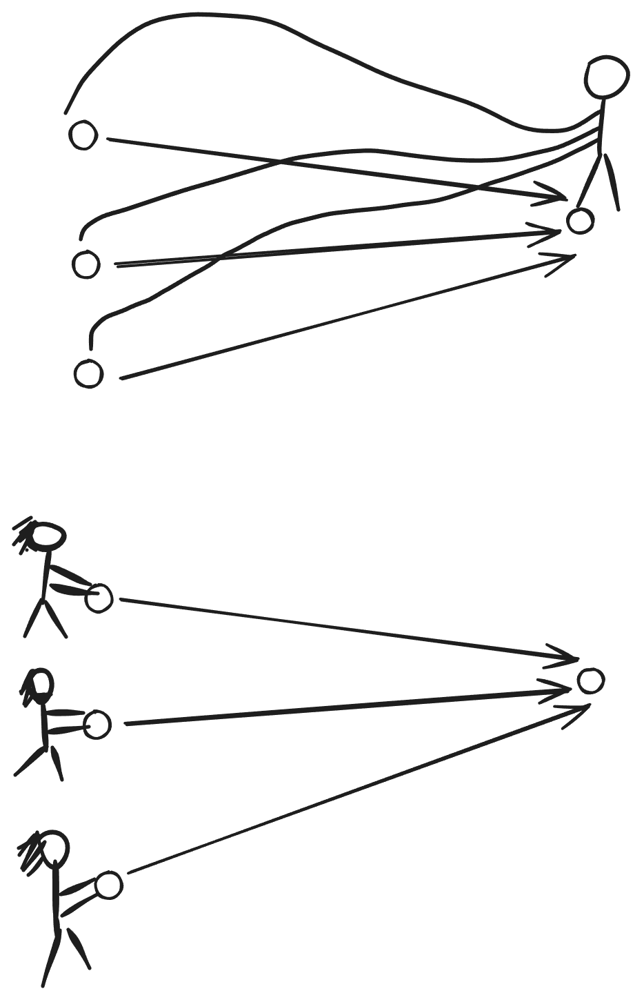
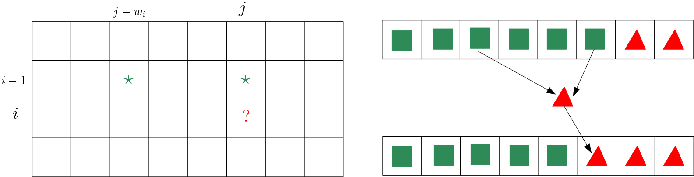
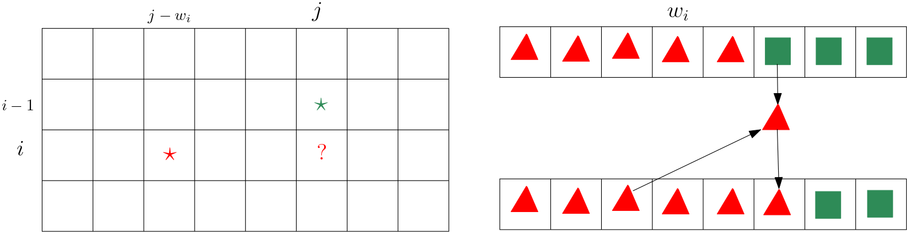

# 动态规划

<div class=hidden>

$\DeclareMathOperator{\lca}{lca}$
$\DeclareMathOperator{\size}{size}$

</div>

---

# 目录

- 动态规划是什么
- 背包类型动态规划


---

# 动态规划（dynamic programming，DP）

一种解题技术和算法设计方法。

- 狭义：用**子问题递推**的方法解决组合最优化问题。
- 广义：和递推法是同义词。


---

递推法常常用来解决
- 计数问题
- 组合最优化问题


---


# 递推三要素

- 子问题（状态）
- 递推式（状态转移）
- 边界条件（边界状态）

---


有 $N$ 个东西排成一行，要从中选一些，可以一个也不选。相邻的两个东西不能都选。有多少种方法？

---

# 解法：递推

<div class=topic topic=子问题>

从前 $i$ 个东西里选一些，相邻两个不能都选，有多少种方法？
这里，$i = 0, 1, 2, \dots, N$。
把答案记作 $f[i]$。

</div>


目标：$f[N]$。

边界条件：$f[0] = 1$，$f[1] = 2$。

递推式：$f[i] = f[i-1] + f[i-2]$，$i \ge 2$。


---

# 例题：构造序列

给你一个长为 $N$ 的整数序列 $T=(T_1, \dots, T_N)$。序列 $S$ 初始为空，我们要通过下列两种操作把 $S$ 变成 $T$。

-   批量添加：选定任意非负整数 $k,x$，在 $S$ 末尾添加 $k$ 个 $x$，花费 $A$ 个金币。
-   连续添加：选定任意非负整数 $k,x$，在 $S$ 末尾添加 $k$ 个从 $x$ 开始的连续整数，（即 $x, x + 1, \dots, x+k-1$），花费 $B$ 个金币。
    
求把 $S$ 变成 $T$ 最少要花多少个金币。

###### 限制

- $1 \leq N \leq 10^6$
- $1 \leq A, B ,T_i \leq 10^9$。


---


<div class="topic" topic=子问题>

把 $S$ 变成 $(T_1, \dots, T_i)$ 最少要花多少金币。
这里 $i = 0, 1, \dots, N$。把答案记作 $f[i]$。

</div>

目标：$f[N]$

边界条件：$f[0] = 0$

怎么找递推式？

---

## 递推式

考虑把 $S$ 变成 $(T_1, \dots, T_i)$ 的**最后一步**。
有「批量添加」和「连续添加」两个选择，但是添加多少项却有 $i$ 个选择。
注意到
- 操作的费用和添加的项数无关
- $f[j] \le f[j + 1]$（$0 \le j < N$）

所以添加的项数越大越好。

---

# 阿弥陀签

又称鬼脚图、爬梯游戏，是一种游戏，也是一种简易决策方法，常被拿作抽签或决定分配组合。

先画几条平行的竖线，再画一些横线，每条横线连接相邻两条竖线。两条横线不能相交。

玩法：
1. 把画的横线盖住，选一条竖线。
2. 揭开盖子，从所选竖线的上端往下走，遇到横线就走过去，直到走到某条竖线的下端。

.png)

---

# 例题：阿弥陀签的数量

有 $W$ 条长度是 $H + 1$ 厘米的竖线，要画一些横线做成一个阿弥陀签。每条横线的两端点到竖线上端的距离必须是 $1$，$2$，……，或 $H$ 厘米。有多少种画法满足：
- 从第一条竖线的上端出发最后会走到第 $K$ 条竖线的下端。

输出答案模 $10^9+7$。

<div class=col37>
<div>

###### 限制

- $1 \le H \le 100$
- $1 \le W \le 8$
- $1 \le K \le W$

</div>
<div>

###### 样例


</div>


---

# 位置，一步


用一对整数 $(i, j)$ 表示**位置**：在第 $j$ 条竖线上，距离竖线的上端 $i$ 厘米。
$0 \le i \le H$，$1 \le j \le W$。

初始位置 $(0, 1)$，目标位置 $(H, K)$。

设当前位置是 $(i, j)$，称下述动作为**一步**
- 向下移动 1 厘米，到 $(i + 1, j)$。若 $(i+1,j)$ 处有横线，就沿着横线走过去。


---

# 递推

各行相互**独立**。从上到下考虑每一行。

<div class=topic topic=子问题>

$f[i][j]$：对前 $i$ 行，有多少种画法使得
- 从 $(0, 1)$ 经过 $i$ **步**到达 $(i, j)$。

</div>

边界条件：$f[0][1] = 1$。

转移：


---

<!-- header: "" -->



# DP 的两种实现方式


- 后向DP（填表法，pull DP）
- 前向DP（刷表法，push DP）

---

# 在各种结构上使用动态规划

- 序列
- 网格
- 树
- ……

---

# 序列上的动态规划

序列有两种子结构，前缀（用一个参数描述）和区间（用两个参数描述）。

- 用前缀定义子问题
- 用区间定义子问题

---

# 背包类型动态规划


---

# 01背包问题

有 $N$ 个物品，从 $1$ 到 $N$ 编号。物品 $i$ 的重量是 $w_i$ 克，价值是 $v_i$ 元。
有一个容量（即承重量）是 $M$ 克的背包。
今要从 $N$ 个物品中选一些放进背包，所选物品的重量之和不能超过背包的容量。
求所选物品的总价值可能达到的最大值。

- $1 \le N \le 100$
- $1 \le M \le 10^5$
- $1 \le w_i \le M$
- $1 \le v_i \le 10^9$
- $M, w_i, v_i$ 都是整数。

---

# 贪心

- 优先拿价值高的物品
```
3 3
3 3
1 2
1 2
```
- 优先拿单位重量的价值高的物品

```
3 8
7 15
4 8
4 8
```
---

# 动态规划解法


把 $N$ 个物品按编号从小到大的顺序排成一行。从物品 $1$ 开始，决定每个物品选不选。


<div class=topic topic=子问题>

$f[i][j]$：从前 $i$ 个物品中选一些，所选物品的总重**不超过** $j$，所选物品的总价值可能达到的最大值。

</div>

问题的答案就是 $f[N][M]$。

---

## 递推式

若 $j < w_i$ 则不能选物品 $i$，有
$$f[i][j] = f[i-1][j]$$

若 $j \ge w_i$ 则能选物品 $i$。考虑选物品 $i$ 和不选物品 $i$ 这两种情况，有
$$f[i][j] = \max(f[i-1][j], f[i-1][j-w_i] + v_i)$$


## 边界条件

$f[0][j] = 0$，$0 \le j \le M$

---


```cpp
long long f[101][100001];
int main() {
    int N, M;
    cin >> N >> M;
    for (int i = 1; i <= N; i++) {
        int w, v;
        cin >> w >> v;
        for (int j = 0; j < w; j++)
            f[i][j] = f[i - 1][j];
        for (int j = w; j <= M; j++)
            f[i][j] = max(f[i - 1][j], f[i - 1][j - w] + v);
    }
    cout << f[N][M];
}
```

- 时间复杂度：$O(NM)$
- 空间复杂度：$O(NM)$

---

## 节省空间的写法

计算 $f$ 的第 $i$ 行（$f[i][\cdot]$）只需要 $f$ 的第 $i-1$ 行（$f[i-1][\cdot]$）。

```cpp
long long f[2][100001];
int main() {
    int N, M;
    cin >> N >> M;
    int x = 0, y = 1;
    for (int i = 1; i <= N; i++) {
        int w, v;
        cin >> w >> v;
        for (int j = 0; j < w; j++)
            f[y][j] = f[x][j];
        for (int j = w; j <= M; j++)
            f[y][j] = max(f[x][j], f[x][j - w] + v);
        swap(x, y);
    }
    cout << f[x][M];
}
```

---

## 更节省空间的写法

计算 $f[i][j]$ 需要 $f[i-1][j]$ 和 $f[i-1][j - w_i]$，这两项都在 $f[i][j]$ 的左侧。



如果按 $j$ 从大到小的顺序计算计算各个 $f[i][j]$，换言之，从右往左计算 $f$ 的第 $i$ 行，就可以用 $f[i][j]$ 覆盖 $f[i-1][j]$，因为算出 $f[i][j]$ 以后再也用不到 $f[i-1][j]$ 了。

---

```cpp
long long f[100005];
int main() {
  int N, M;
  cin >> N >> M;
  for (int i = 0; i < N; i++) {
    int w, v;
    cin >> w >> v; //来一个物品
    for (int j = M; j >= w; j--) //更新f数组
      f[j] = max(f[j], f[j - w] + v);
  }
  cout << f[M];
}
```

---

# 例题：背包 2

有 $N$ 个物品。编号 $1, 2,\dots, N$。第 $i$ 个物品的重量是 $w_i$，价值是 $v_i$。

太郎要从 $N$ 个物品中选一些放进背包带回家。背包的容量是 $W$，这意味着所选物品的重量之和不能超过 $W$。

求所选物品的价值之和的最大值。


- $1 \le N \le 100$
- $1 \le W \le 10^9$
- $1 \le w_i \le W$
- $1 \le v_i \le 10^3$
- $W, w_i, v_i$ 都是整数。


---


<div class=topic topic=子问题>

从前 $i$ 个物品中选一些，所选物品的总重量不超过 $j$，所选物品的总价值的最大值。

 </div>

这里，$0 \le i \le N$，$0 \le j \le W$，子问题有 $(N+1)(W + 1)$ 个，太多了。

---


注意到 $v_i \le 10^3$，$N \le 100$，这意味着全部物品的价值之和不超过 $10^5$。

<div class=topic topic=新的子问题>

从前 $i$ 个物品中选一些，所选物品的总价值等于 $j$，所选物品的**总重量的最小值**。

 </div>


这里，$0 \le i \le N$，$0 \le j \le 10^5$。

把这个问题的答案记作 $f[i][j]$，若无法做到，令 $f[i][j] = W + 1$。

边界条件：$f[0][0] = 0$，$f[0][j] = W + 1$，$j = 1, \dots, 10^5$。

递推式：对 $i = 1, \dots, N$，有
$$
f[i][j] = 
\begin{cases}
f[i - 1][j], & 0 \le j < v_i, \\
\min(f[i-1][j], f[i-1][j-v_i] + w_i), & v_i \le j \le 10^5.
\end{cases}
$$

---

# 例题：多边形 [CSP-J 2025]

有 $n$ 根木棍，第 $i$ 根木棍的长度是 $a_i$，要从中选择一些木棍拼成一个多边形，有多少种选法？

两种方案不同当且仅当选择的木棍的**下标集合不同**，即存在 $i$（$1 \le i \le n$），使得其中一种方案选择了第 $i$ 根木棍，但另一种方案未选择。

$m$ 根木棍，长度为 $l_1, l_2, \dots, l_m$，能拼成一个多边形当且仅当 $m \ge 3$ 且所有木棍的长度之和**大于**所有木棍的长度的最大值的两倍，即 $\sum_{i=1}^{m} l_i \ge 2 \times \max_{i=1}^{m} l_i$。

###### 限制

- $3 \le n \le 5000$
- $1 \le a_i \le 5000$


---


# 解法

所有木棍的长度之和大于所有木棍的长度的最大值的两倍，即
- 除了最长木棍之外的木棍的总长度大于最长木棍的长度。

把木棍按长度从小到大排序，以下假设有 $a_1 \le a_2 \le \dots \le a_n$。

设所选的编号最大的那一根木棍，也就是最长的那一根，的编号是 $i$，问题变成
- 从前 $i-1$ 根木棍中选一些，所选木棍的长度之和不小于 $a_{i} + 1$，有多少种选法。

---


<div class=topic topic=子问题>

$f[i][j]$：从前 $i$ 根木棍中选一些，所选木棍的长度之和不小于 $j$，有多少种选法。

$0 \le i \le n - 1$，$0 \le j \le 5001$

 </div>


边界条件
$f[0][j] = \begin{cases} 1, & j = 0; \\ 0, & 1 \le j \le 5001. \end{cases}$

递推式
$f[i][j] = \begin{cases} f[i-1][j] + f[i-1][0], & 0 \le j \le a_i -1; \\ f[i-1][j] + f[i-1][j - a_i], & a_i \le j \le 5001. \end{cases}$

最终答案
$\sum_{i=1}^{n} f[i-1][a_i + 1]$。

---

# 例题：贪吃

高桥为 Snuke 准备了 $N$ 道菜，从 $1$ 到 $N$ 编号。第 $i$ 道菜的甜度是 $A_i$，咸度是 $B_i$。

高桥可以把这些菜任意排列。Snuke 会按高桥排好的顺序吃这些菜，吃完道菜之后，如果 Snuke 吃过的菜的甜度之和**大于** $X$ 或者咸度之和**大于** $Y$，Snuke 就不能再吃了。


高桥想让 Snuke 吃的菜的数量尽可能多。求 Snuke 最多能吃掉多少道菜。

- $1 \leq N \leq 80$
- $1 \leq A_i, B_i \leq 10000$
- $1 \leq X, Y \leq 10000$

---

# 分析

Snuke 至少吃一道菜。
在吃最后一道菜之前，他吃过的菜的甜度之和不超过 $X$，咸度之和不超过 $Y$。

假设在吃的菜的甜度之和不超过 $X$，咸度之和不超过 $Y$ 的前提下 Snuke 最多能吃 $C$ 道菜，那么实际上他最多能吃 $\min(N, C + 1)$ 个道菜。

我们可以用背包类型的动态规划来求 $C$。

<div class=topic topic=子问题>

$f[i][j][k]$：从前 $i$ 道菜中选 $j$ 道吃掉，所吃和菜的甜度之和不超过 $k$，所吃的菜的咸度之和的最小值。
</div>

$C$ 就是满足 $f[N][j][X] \le Y$ 的最大的整数 $j$。

---

# 能量石

Duda 收集了 $N$ 颗能量石作为午饭。他的嘴不大，一次只能吃一颗能量石。Duda 吃完第 $i$ 颗石头需要 $S_i$ 秒。

能量石的能量会衰减。第 $i$ 颗石头最初含有 $E_i$ 单位能量，每秒钟损失 $L_i$ 单位能量。当石头的能量衰减到零时就不再衰减。当 Duda 开始吃一块石头时，就立即获得这块石头的全部能量，不论他吃完这块石头需要多长时间。

Duda 通过吃能量石最多能获得多少能量？

有 $T$ 组测试数据。

- $1 \le T, N, S_i \le 100$
- $1 \le E_i \le 10^5$
- $0 \le L_i \le 10^5$

---

$L_i = 0$ 的石头最后吃。

加一个限制：不吃能量衰减到零的石头。也就是说，吃每个石头时它的能量都 $\ge 1$。

---

考虑一个最优解里相邻两块石头 $i, j$，先吃石头 $i$ 后吃石头 $j$。如果改为先吃 $j$ 后吃 $i$，那么石头 $j$ 的能量少损失 $L_j S_i$ 单位，而石头 $i$ 的能量多损失**至多** $L_iS_j$ 单位。于是我们得到

- 如果 $L_jS_i > L_iS_j$，那么交换 $i, j$ 更好。

也就是说，

- 在最优解里不存在两块相邻的石头 $i$ 和 $j$，$i$ 在 $j$ 之前，满足 $L_j S_i > L_i S_j$。

注意到 $L_jS_i > L_i S_j$ 也就是 $L_i/S_i < L_j/S_j$。进一步，我们得到

- 在最优解里不存在两块石头 $i$ 和 $j$，$i$ 在 $j$ 之前，满足 $L_i/S_i < L_j/S_j$。

如果两个石头具有不同的 $L/S$ 值，那么 $L/S$ 值大的石头要先吃。

但是那些具有相同的 $L/S$ 值的石头如何排列呢？
- 在**最优解**中，$L/S$ 相同的石头是连续排列的，把这些石头任意重排，结果仍然是最优解。

---

# 例题：Goodstuff Deck Builder(Hard) 

[yukicoder 3077](https://yukicoder.me/problems/no/3077)

你在玩一个卡牌游戏。一开始，你有 $N$ 张卡牌，编号 $1$ 到 $N$，你可以用这些卡牌来攻击敌人。你还有 $M$ 点能量用来打出卡牌。

卡牌 $i$ 的初始费用是 $C_i$。打出卡牌 $i$ 消耗的能量等于它的费用，会对敌人造成 $D_i$ 点伤害。每打出一张牌后，剩下的牌的费用乘以 $2$。

一张牌只能用一次。不能让能量变成负数。

在以上规则下，你可以从手牌中任意选择若干张，按任意顺序使用。
计算你能造成的最大总伤害。

- $1 \le N \le 10^4$，$0 \le M \le 10^7$，$0 \le NM \le 2 \times 10^8$
- $0 \le C_i \le M$
- $1 \le D_i \le 10^9$


---


<div class=question>

如果已经选定了要打出的牌，按什么顺序出牌消耗的能量最少？

</div>

按初始费用从高到低的顺序出牌。


把卡牌按初始费用从大到小排序。

<div class=topic topic=子问题>

$f[i][j][k]$：从前 $i$ 张牌中选 $j$ 张打出，消耗的能量不超过 $k$，最多能造成多少伤害？ 

$0 \le i \le N$，$0 \le j \le i$，$0 \le k \le M$。
</div>


状态太多。

---

# 优化

“每打出一张牌后，剩下的牌的费用乘以 $2$”，相当于“每打出一张牌后，剩下的牌的费用不变，玩家的能量减半”。

<div class=topic topic=新的子问题>

$f[i][j]$：从前 $i$ 张牌中选一些打出，剩余的能量是 $j$，最多能造成多少伤害？

</div>


---

<!-- # [abc375_e](https://atcoder.jp/contests/abc375/tasks/abc375_e) 3 Team Division -->

# 例题：分成三队

有 $N$ 个人分成了三队。人编号 $1, 2, \dots, N$，队编号 $1, 2, 3$。现在，人 $i$ 属于队 $A_i$。

每人有一个强度值，人 $i$ 的强度是 $B_i$。一个队的强度定义为其成员的强度之和。判断能否通过改变某些人所属的队使得三个队的强度相同。若可能，输出最少要几个人换队。否则输出 $-1$。

- $3 \le N \le 100$
- $A_i \in \set{1, 2, 3}$
- $1 \le B_i$
- $\sum_{i=1}^{N} B_i \le 1500$


---

# 分析

必要条件 1：$3$ 整除 $\sum_{i=1}^{N} B_i$。

令 $M = (\sum_{i=1}^{N} B_i) / 3$。注意到 $M \le 500$。

必要条件 2：$\max_{i=1}^{N} B_i \le M$。


---

<div class=topic topic=子问题>

$f[i][j][k]$：把前 $i$ 个人分到三个队，1 队的强度是 $j$，2 队的强度是 $k$，最少有几个人换队？

$0 \le i \le N$，$0 \le j , k \le M$。
若无法做到，令 $f[i][j][k] = N + 1$。
</div>


目标：$f[N][M][M]$。

边界条件：$f[0][0][0] = 0$，$f[0][i][j] = N + 1$，$i \ne 0$ 或 $j\ne 0$。

递推式：
$$
f[i][j][k] = \min\begin{cases}
f[i - 1][j - B_i][k] + [A_i \ne 1],\quad B_i \le j \\
f[i - 1][j][k - B_i] + [A_i \ne 2],\quad B_i \le k \\
f[i - 1][j][k] + [A_i \ne 3]
\end{cases}
$$


---

# 完全背包问题

有一个容量（即承重量）是 $M$ 克的背包。有 $N$ **种**物品，从 $1$ 到 $N$ 编号。一个第 $i$ 种物品 $i$ 的重量是 $w_i$ 克，价值是 $v_i$ 元。每种物品的数量**足够多**。

今要选一些物品放进背包，所选物品的重量之和不能超过背包的容量。
求所选物品的总价值可能达到的最大值。


- $1 \le N \le 100$
- $1 \le M \le 10^5$
- $1 \le w_i \le M$
- $1 \le v_i \le 10^9$
- $M, w_i, v_i$ 都是整数。


---

## “足够多”的含义

一种物品的数量“足够多”是相对于背包的容量来说的，即背包能装多少就有多少。

第 $i$ 种物品的数量不少于 $\lfloor M/w_i\rfloor$ 就算足够多。

---

<div class=topic topic=子问题>

$f[i][j]$：为从前 $i$ 种物品里选一些物品放进背包，所选物品的总重量不超过 $j$，所选物品的总价值可能达到的最大值。

</div>

起初的问题的答案就是 $f[N][M]$。

---

## 递推式

若 $j < w_i$，第 $i$ 种物品一件拿不成，有
$$f[i][j] = f[i-1][j]$$

若 $j \ge w_i$，考虑选不选第 $i$ 种物品。

- 不选第 $i$ 种物品，化为子问题 $f[i-1][j]$。
- 选第 $i$ 种物品。换言之，第 $i$ 种物品至少选一件，化为子问题 $f[i][j-w_i]$

此时有
$$
f[i][j] = \max(f[i-1][j], f[i][j-w_i] + v_i)
$$

## 边界条件

$f[0][j] = 0$，$j = 0, 1, \dots, M$。

---

## 节省空间的写法

算出 $f[i][j]$ 以后就再也用不到 $f[i-1][j]$ 了，所以可以用 $f[i][j]$ 覆盖 $f[i-1][j]$。



---

```cpp
long long f[100005];
int main() {
  int N, M;
  cin >> N >> M;
  for (int i = 0; i < N; i++) {
    int w, v;
    cin >> w >> v; //来一种物品
    for (int j = w; j <= M; j++) //更新f数组
      f[j] = max(f[j], f[j - w] + v);
  }
  cout << f[M];
}
```

---

# 例题：纪念品

已知未来 $T$ 天 $N$ 种纪念品每天的价格，第 $i$ 天第 $j$ 种纪念品的价格是 $P_{i,j}$。
每天，小明可以进行以下两种交易任意多次：
- 以当日价格买一个纪念品；
- 以当日价格卖出持有的一个纪念品。

每天卖出纪念品换回的金币可以立即用于购买纪念品。

小明会在第 $T$ 天卖出所有纪念品，他现在有 $M$ 枚金币，$T$ 天之后他最多有几枚金币？

- $T, N \leq 100$
- $1 \le P_{i,j} \le 10^4$
- $M \leq 10^3$
- 任意时刻，小明手上的金币数不超过$10^4$。

---

# 思路

「第一天买一个纪念品，第三天卖」相当于
「第一天买，第二天卖，第二天买，第三天卖」。

所有可能的操作都可变换为
- 第一天：买一些纪念品。
- 第二天：把第一天买的纪念品全卖出，再买一些纪念品。
- 第三天：把第二天买的纪念品全卖出，再买一些纪念品。
- ……
- 第 $T$ 天：把第 $T-1$ 天买的纪念品全卖出。

第一天买纪念品的目标应是让所买的纪念品在第二天卖出后收益最大。
- 解 $T-1$ 个**完全背包**问题。

---

# 多重背包问题

有一个容量（即承重量）是 $M$ 克的背包。有 $N$ **种**物品，从 $1$ 到 $N$ 编号，第 $i$ 种物品有 $a_i$ 个。一个第 $i$ 种物品 $i$ 的重量是 $w_i$ 克，价值是 $v_i$ 元。

今要选一些物品放进背包，所选物品的重量之和不能超过背包的容量。
求所选物品的总价值可能达到的最大值。


- $1 \le N \le 100$
- $1 \le M \le 10^5$
- $1 \le w_i \le M$
- $1 \le v_i \le 10^5$
- $1 \le a_i \le 10^4$
- $M, w_i, v_i, a_i$ 都是整数。

---

# 思路一：转化成01背包问题

有 $a_1 + a_2 + \dots + a_N$ 个物品的 01背包问题。

时间复杂度 $O(M\sum a_i)$，太慢。


---

# 思路二：转化成01背包，减少物品数量

把每种物品分为若干组，选物品时只能一组一组选，而不是一个一个选。

例如，某种物品共有10个，可以把他们分成四组，每一组包含的物品数量分别是 $1, 2, 3, 4$。这样划分满足一个良好的性质：$1, 2, \dots, 10$ 中的每个数目都可以用若干组凑出来。

- $5 = 1 + 4$
- $6 = 2 + 4$
- $7 = 3 + 4$
- $8 = 1 + 3 + 4$
- $9 = 2 + 3 + 4$


照此思路，对于每个 $i=1, \dots, N$，我们希望能够
- 把 $a_i$ 个第 $i$ 种物品分成较少的几组，使得 $1, 2, \dots, a_i$ 里的每个数量都能被其中的一些组**凑**出来。

---

# 二进制划分

二进制划分是一种整数拆分方法，例子如下
<div class="col46">
<div>

- $1 = 1$
- $2 = 1 + 1$
- $3 = 1 + 2$
- $4 = 1 + 2 + 1$
- $5 = 1 + 2 + 2$
- $6 = 1 + 2 + 3$
- $7 = 1 + 2 + 4$
- $8 = 1 + 2 + 4 + 1$
- $9 = 1 + 2 + 4 + 2$


</div>

<div>

- $10 = 1 + 2 + 4 + 3$
- $11 = 1 + 2 + 4 + 4$
- $15 = 1 + 2 + 4 + 8$
- $16 = 1 + 2 + 4 + 8 + 1$
- $20 = 1 + 2 + 4 + 8 + 5$
- $40 = 1 + 2 + 4 + 8 + 16 + 9$
- $70 = 1 + 2 + 4 + 8 + 16 + 32 + 7$
- $100 = 1 + 2 + 4 + 8 + 16 + 32 + 37$
- $200 = 1 + 2 + 4 + 8 + 16 + 32 + 64 + 73$ 

</div>
</div>


---

<div class=proposition>

设二进制划分把正整数 $n$ 分成 $K$ 个数 $p_1, \dots, p_K$。那么 $K = \lceil\log_2(n + 1)\rceil$。

</div>

<div class=proof>

根据定义可知，$K$ 是使得 $1 + 2 + 2^2 + \dots + 2^{m-1} \ge n$，即 $2^m \ge n + 1$，的最小的正整数 $m$。

</div>

---


<div class=proposition>

设二进制划分把正整数 $n$ 分成 $K$ 个数 $p_1, \dots, p_K$。那么，每个 $a = 1, 2, \dots, n$ 都可表为 $p_1, \dots, p_K$ 中的几项之和。

</div>

<div class=proof>

根据二进位拆分的定义，有
$$ n = 1 + 2 + 2^2 + \dots + 2^{K-2} + t $$
其中 $1 \le t \le 2^{K-1}$。


设 $x$ 是正整数，$1 \le x \le n$。若 $x \le 2^{K-1} - 1$，用 $1, 2, 2^2, \dots, 2^{K-2}$ 可以凑出 $x$。若 $2^{K-1} \le x \le n$，那么可以用 $1, 2, 2^2, \dots, 2^{K-2}$ 凑出 $x - t$。

</div>

---

# 多重背包 $\xrightarrow{二进制分组}$ 01背包


令 $A = \max(a_1, \dots, a_N)$。

物品数不超过 $N\lceil\log (A+1)\rceil$。

时间：$O(NM \log A)$

---

# 代码

```cpp
int N, M;
long long f[100005];
//来一个重量是w，价值是v的物品，更新f数组
void item(int w, int v) {
    for (int j = M; j >= w; j--)
        f[j] = max(f[j], f[j - w] + v);
}

void items(int a, int w, int v) {
    for (int i = 1; i < a; i *= 2) {
        item(i * w, i * v);
        a -= i;
    }
    item(a * w, a * v);
}

int main() {
  cin >> N >> M;
  for (int i = 0; i < N; i++) {
    int a, w, v;
    cin >> a >> w >> v;
    items(a, w, v);
  }
  cout << f[M];
}
```

---

# 思路三

令 $f[i][j]$ 为从前 $i$ 种物品里选一些物品放进背包，所选物品的总重量不超过 $j$，所选物品的总价值可能达到的最大值。

起初的问题的答案就是 $f[N][M]$。

---

# $f[i][j]$ 的递推式

枚举第 $i$ 种物品拿了几个。
$$
f[i][j] = \max_{0 \le l \le \min(\lfloor j/w_i \rfloor, a_i)} (f[i-1][j - l w_i] + l v_i)
$$

注意到 $f[i][j]$ 依赖的那些项 $f[i-1][\cdot]$ 的第二个下标两两的差都是 $w_i$ 的倍数，换言之，这些下标模 $w_i$ **同余**。

---

# 分批计算 $f$ 数组的第 $i$ 行的项


把 $j = 0, 1, 2, \dots, M$ 按除以 $w_i$ 的余数分类。
- 第 $0$ 类：$0, w_i, 2w_i, \dots$
- 第 $1$ 类：$1, w_i + 1, 2w_i + 1, \dots$
- ……

对于一个确定的余数 $r$，把 $r, w_i + r, 2w_i + r, \dots$ 记为 $j_0, j_1, j_2, \dots, j_{\lfloor M/w_i \rfloor}$。这样，递推式写成

$$
f(i, j_k) = \max_{0 \le l \le \min(k, a_i)} f(i-1, j_{k-l}) + l v_i
$$

---

# 下标变换

$$
f[i][j_k] = \max_{0 \le l \le \min(k, a_i)} f[i-1][j_{k-l}] + l v_i
$$

令 $t = k - l$，把上式改写成

$$
\begin{aligned}
f[i][j_k] &= \max_{\max(0, k-a_i) \le t \le k} f[i-1][j_t] + (k-t) v_i \\
&= k v_i + \max_{\max(0, k-a_i) \le t \le k} (f[i-1][j_t] - t v_i)
\end{aligned}
$$

---

# 滑动窗口最大值

$$ f[i][j_k] =  k v_i + \max_{\max(0, k-a_i) \le t \le k} (f[i-1][j_t] - t v_i) $$

令 $g_t = f[i-1][j_t] - t v_i$，算 $f[i][j_k]$ 化为算

$$
\max_{\max(0, k-a_i) \le t \le k} g_t
$$

算 $f[i][j_{k+1}]$ 化为算
$$
\max_{\max(0, k+1-a_i) \le t \le k+1} g_t
$$

两相对比可见，多了一项 $g_{k+1}$，可能会少一项 $g_{k-a_i}$。

---


$M = 16$，$w_i = 3$，$a_i = 3$


---

# 代码

```cpp
int main() {
  int n, m;
  cin >> n >> m;
  vector<long long> f(m + 1);// f[i-1][.]
  for (int i = 1; i <= n; i++) {
    int v, w, a;
    cin >> v >> w >> a;
    for (int r = 0; r < w; r++) {   // r：j除以w的余数
      deque<pair<int, long long>> q;//(t, g(t))
      for (int k = 0, j = r; j <= m; j += w, k++) {
        // 计算 f[i][j] 之前要把 (k, g(k)) 放进队列
        long long g = f[j] - k * v;
        while (!q.empty() && g >= q.back().second)
          q.pop_back();
        q.push_back({k, g});
        if (q[0].first < k - a)
          q.pop_front();
        f[j] = q[0].second + (long long) k * v;
      }
    }
  }
  cout << f[m];
}
```


---

# 例题：硬币问题


有 $N$ 种硬币，第 $i$ 种硬币有 $i$ 个，单个的价值也为 $i$。

从这些硬币中选出一些使得选中硬币的总价值**恰好**为 $N$，求有多少个不同方案。
答案模 $998244353$。

如果对于任意一种硬币，两个方案选中的数量不同，那么算作两种不同方案。

###### 限制

- $1\leq N \leq 10^5$


---

# 例题：Diversity

<div class="col73"><div>

商店里有 $N$ 个商品在售，第 $i$ 个商品的价格是 $P_i$ 元，效用是 $U_i$，颜色是 $C_i$。

你要从这些商品中买一些（可以一个都不买）。所买物品的价格之和不得超过 $X$ 元。

你的满意度是 $S+T\times K$，其中 $S$ 是所买物品的效用之和，$T$ 是所买物品的不同颜色的数量，$K$ 是给定的常数。

求最大满意度。


</div><div>

###### 限制

- $1 \le N \le 500$
- $1 \le X \le 50000$
- $1 \le K \le 10^9$
- $1 \le P_i \le X$
- $1 \le U_i \le 10^9$
- $1 \le C_i \le N$
- 上述值都是整数。
</div></div>

<!-- footer: https://atcoder.jp/contests/abc383/tasks/abc383_f  -->

---

<!-- footer: "" -->

# 思路一

把 $N$ 个商品按颜色排列，颜色相同的排一起。

<div class=labeled-box><span class=box-label>子问题</span>

$f[i][j]$：从前 $i$ 个商品里选一些，所选商品的总价格不超过 $j$，满意度的最大值。
</div>


考虑两种情况：
1. 不买商品 $i$，归结为 $f[i - 1][j]$。
2. 买商品 $i$。设商品 $i$ 的颜色是 $c$。分两种情况：
    1. 商品 $i$ 是买的第一个颜色为 $c$ 的商品。设上一种颜色的最后一个商品是第 $i'$ 个，归结为 $f[i'][j - P_i] + U_i + K$。
    2. 商品 $i$ 不是买的第一个颜色为 $c$ 的商品。归结为 $f[i - 1][j - P_i] + U_i$。

---


# 思路二

把物品按颜色分组。一次处理一批同色的物品。


<div class=labeled-box><span class=box-label>子问题</span>

从颜色是 $1, 2, \dots, i$ 的物品中选一些，所选物品的总价不超过 $j$，满意度的最大值？

把答案记作 $f[i][j]$。这里，$0 \le i \le N$，$0 \le j \le X$。
</div>


目标：$f[N][X]$。

边界条件：$f[0][j] = 0$，$0 \le j \le X$。

递推式：
对每种颜色 $i = 1, \dots, N$，
1. 置 $f[i][j] = f[i - 1][j]$，$0 \le j \le X$。
2. 对每个颜色是 $i$ 的物品 $(P, U)$，按 $j = X, X - 1, \dots, P$ 的顺序，置
$$
f[i][j] = \max(f[i][j], f[i - 1][j - P] + U + K, f[i][j - P] + U)
$$

---


# 例题：分组

给你 $N$ 个整数 $T_1, \dots, T_N$。要把它们分成若干组，每一组的极差之和不超过 $X$。求分组方法数，模 $10^9+7$。

一组整数的极差是最大值减最小值。

<div class=columns><div>

###### 限制

- $1 \le N \le 100$
- $0 \le X \le 5000$
- $0 \le T_i \le 100$

</div><div>

###### 样例

<div class=columns><div>

```
3 2
2 5 3
```

```
3
```

</div><div>

分组方法：
- (2), (3), (5)
- (2, 3), (5)
- (2), (3, 5)

</div></div>

</div></div>

---

把 $N$ 个数从大到小排序。

<div class=labeled-box><span class=box-label>子问题</span>

$f[i][j][k]$：对前 $i$ 个数分组，尚未分好的组（最小值尚未出现）有 $j$ 个，且满足
- 已分好的组的极差之和 + 未分好的组的最大值之和 ≤ $k$ 

有多少种方法？
</div>


注意到
- $0 \le i \le N$
- $0 \le j \le \lfloor N/2\rfloor \le 50$
- $0 \le k \le X + \lfloor N/2\rfloor \times \max(T_1, \dots, T_N) \le 10000$

目标：$f[N][0][X]$。

边界条件：$f[0][0][k] = 1$（$0 \le k \le X$），$f[0][j][\cdot] = 0$（$j \ne 0$）。

---


# 状态转移


---

# 例题：两场考试

$N$ 个人，从 $1$ 到 $N$ 编号，参加了国家队选拔考试。
考试有两场。第 $i$ 个人第一场考试的排名是 $P_i$，第二场考试的排名是 $Q_i$。每场考试都没有同分的，$P, Q$ 都是 $1, 2, \dots, N$ 的排列。

要选 $K$ 个人组国家队，选人规则是：
- 不能有两人 $(x, y)$ 满足 $P_x > P_y$ 且 $Q_x > Q_y$，$x$ 入选了而 $y$ 没入选。

求选人方案数，模 $998244353$。

###### 限制

- $1 \le K \le N \le 300$

---

# 思路

把 $N$ 个人按照第一场考试的排名从小到大（或者说从高到低）排序，按这个顺序写出每个人第二场考试的排名，把这个序列称为 $A$。不难看出 $A$ 是 $1, \dots, N$ 的一个排列。

例如，$P = (2, 4, 3, 1)$，$Q =(2, 1, 4, 3)$ 那么 $A = (3, 2, 4, 1)$。

问题变成
- 从序列 $A$ 中选 $K$ 项，满足：若选了 $A_i$ 那么 $A_i$ 左边比 $A_i$ 小的项都选了。或者说若没选 $A_i$ 那么 $A_i$ 右边比 $A_i$ 大的项都没有选。有多少种选法？

---

考虑 DP。

<div class=labeled-box><span class=box-label>子问题</span>

$f[i][j][k]$：从 $A_1, \dots, A_i$ 中选 $j$ 个数，没选数的数中最小的是 $k$，有多少种选法。
</div>


从 $f[i][j][k]$ 往后转移：
- 若 $A_{i+1} > k$，那么 $A_{i+1}$ 不能选，转移到 $f[i+1][j][k]$。
- 若 $A_{i+1} < k$，那么 $A_{i+1}$ 可选可不选。若选 $A_{i+1}$，转移到 $f[i+1][j + 1][k]$，否则转移到 $f[i+1][j][A_{i+1}]$。

---

# 例题：Candy

给定整数序列 $a= (a_1, a_2, \dots, a_{N})$，整数 $F$ 和整数 $T$。我们称交换 $a$ 里相邻的两项为一次**操作**。

要使 $a$ 的前 $F$ 项之和不小于 $T$，至少要进行多少次操作？

## 限制

- $1 \le N \le 100$
- $1 \le F \le N$
- $0 \le T \le 10^{11}$
- $0 \le a_i \le 10^9$（$1 \le i \le N$）

---

# 思路

设想我们已经选定了要放到前 $F$ 个位置的那 $F$ 个数，它们，在最初的序列 $a$ 里，是 $a_{i_1}, a_{i_2}, \dots, a_{i_F}$（$1 \le i_1 < i_2 < \dots < i_F \le N$）。

要把 $a_{i_1}, a_{i_2}, \dots, a_{i_F}$ 这 $F$ 个数移到前 $F$ 个位置，最少要操作多少次？

应该把 $a_{i_1}$ 移动到第 $1$ 位，把 $a_{i_2}$ 移动到第 $2$ 位，……，把 $a_{i_F}$ 移动到第 $F$ 位。
一共要操作 $(i_1 - 1) + (i_2 - 2) + \dots + (i_F - F)$ 次。


---

<div class=labeled-box><span class=box-label>子问题</span>

$f[i][j][k]$：从 $a_1, \dots, a_i$ 中选 $j$ 个数，把它们移动到前 $j$ 位需要操作 $k$ 次，所选的数之和的最大值。
</div>

$0 \le i \le N$，$0 \le j \le \min(i, F)$，$0 \le k \le (i - j)\cdot j$。


答案：满足 $f[N][F][k] \ge T$ 的最小的 $k$。

边界条件：
$f[i][0][0] = 0$
$f[i][0][k] = -\infty$（$k > 0$）
$f[0][j][k] = -\infty$（$j > 0$ 或 $k > 0$）

递推式：
$$
f[i][j][k] = 
\begin{cases}
f[i - 1][j][k], \quad & k < (i - j), \\
\max(f[i - 1][j][k], f[i - 1][j - 1][k - (i - j)] + a_i), \quad & k \ge (i - j).
\end{cases}
$$


---

# 例题：Emiya 家今天的饭 :star:

<!-- （CSP-S 2019 D2T1） -->

Emiya 掌握 $N$ 种**烹饪方法**，且会使用 $M$ 种**主要食材**做菜。

Emiya 做的每道菜都将使用**恰好一种**烹饪方法与**恰好一种**主要食材。Emiya 会做 $A_{i,j}$ 道不同的使用烹饪方法 $i$ 和主要食材 $j$ 的菜（$1 \leq i \leq N$、$1 \leq j \leq M$）。

Emiya 今天要做 $k$ 道菜，要满足下列条件
-  $k \geq 1$
- 每道菜的**烹饪方法互不相同**
- 每种**主要食材**至多在至多在**一半**的菜（即 $\lfloor \frac{k}{2} \rfloor$ 道菜）中被使用

求做菜方案数，模 $998244353$。

$1 \leq N \leq 100$
$1 \leq M \leq 2000$
$0 \leq A_{i,j} \lt 998244353$


---

# 思路

- 令 $S_i = A_{i,1} + A_{i,2} + \dots + A_{i,m}$。
- 满足条件一、二的做菜方案的数量为 $\left(\prod_{i=1}^{N} (S_i + 1)\right) - 1$。
- 考虑满足条件一、二但不满足条件三的做菜方案的数量。
    - 有主要食材在超过一半的菜中被使用。
    - 在超过一半的菜中被使用的主要食材只能有一种。

---

对于每一种主要食材 $x$（$1 \le x \le M$），计算 $x$ 使用次数超过一半的做菜方案。

<div class=labeled-box> <span class=box-label>子问题</span>

$f(i,j)$：从前 $i$ 个烹饪方法中选一些来做菜，主要食材是 $x$ 的菜与主要食材不是 $x$ 的菜数量之差是 $j$ 的做菜方案的数量。
</div>

$0 \le i \le N$，$-i \le j \le i$。

递推式
$$f(i,j) = f(i-1,j) + f(i-1,j-1) \times  a_{i,x} + f(i-1,j+1) \times (S_i - A_{i,x})$$

边界条件
$f(0,0) = 1$，$f(0,j) = 0$（$j \ne 0$）

---

<!-- # [abc288_e](https://atcoder.jp/contests/abc288/tasks/abc288_e) Wish List -->

# 例题：愿望清单

商店里有 $N$ 个商品，从 $1$ 到 $N$ 编号。商品 $i$ 的价格是 $A_i$ 元。
高桥想要 $M$ 个商品：商品 $X_1$，商品 $X_2$，…，商品 $X_M$。

他重复下述操作直到买齐他想要的商品。

> 令 $r$ 为当前尚未卖出去的商品的数量。选择一个整数 $j$ 满足 $1 \le j \le r$，买剩余物品中编号第 $j$ 小的那个物品，花的钱是那个物品的价格再加上 $C_j$ 元。

求高桥最少要花多少钱。

高桥也可以买他不想要的物品。

###### 限制

- $1 \le M \le N \le 5000$
- $1 \le A_i, C_i \le 10^9$
- $1 \le X_1 < X_2 < \dots < X_M \le N$

---

# 关键性质

- 编号大于 $X_M$ 的商品不影响高桥想买的物品的编号的排位，不用考虑。
不妨置 $N = X_M$。
- 何时买商品 $i$ 不影响对前 $i-1$ 个商品中任何一个的购买。
- 设最终在前 $i - 1$ 个商品中买了 $j$ 个，如果也买了商品 $i$，那么买它时，它的编号排名可以是 $i-j, i-j+1, \dots, i$ 中的任何一个。所以买商品 $i$ 的花费是 $A_{i} + \min_{i-j \le k \le i} C_k$。


---

<div class=labeled-box> <span class=box-label>子问题</span>

$f[i][j]$：在前 $i$ 个商品中买 $j$ 个，想要的商品的都买了，最少要花多少钱？
</div>


这里，$0 \le i \le N$，$0 \le j \le N$。
状态 $(i, j)$ 要满足
$$(前i个物品中必买的物品的数量) \le j \le i$$
才合理。
若状态 $(i,j)$ 不合理，令 $f[i][j] = \infty$。

目标：$\max_{M \le j \le N} f[N][j]$。

边界条件：$f[i][0] = 0$（$0 \le i < X_1$）

递推式：对 $1 \le i \le N$，$1 \le j \le N$
$$
f[i][j] = \begin{cases}
f[i - 1][j - 1] + A_{i} + \min_{i - (j-1) \le k \le i} C_k, \quad &商品 i 必买,\\
\min(f[i - 1][j], f[i-1][j-1] + A_{i} + \min_{i - (j-1) \le k \le i} C_k),\quad &商品 i 不必买.
\end{cases}
$$


---

# 例题：翻转卡片 2

有 $N$ 张卡片，编号 $1$ 到 $N$。
第 $i$ 张卡片正面写着整数 $A_i$，背面写着整数 $B_i$。这里，$\sum_{i=1}^N (A_i + B_i) = M$。

对于每个 $k=0,1,2,...,M$，解决下述问题。

> $N$ 张卡片正面向上放在桌面上。你可以把一些（可以是零张）卡片翻转（反转过后，卡片背面向上）。
> 为了让所有卡片向上那一面上的数字之和等于 $k$，最少要翻转多少张卡片？
> 如果无法通过翻转卡片让所有卡片向上那一面上的数字之和等于 $k$，输出 $-1$。


###### 限制

- $1 \leq N \leq 2 \times 10^5$
- $0 \leq M \leq 2 \times 10^5$
- $0 \leq A_i, B_i \leq M$

---

# 例题：多重集合平均数

给定整数 $N$，$K$，$M$，对于每个整数 $x = 1, 2, \dots, N$，解决下述问题。

- 求满足下列条件的**非空多重集合** $S$ 的个数除以 $M$ 的余数：
    - $S$ 由 $1, 2, \dots, N$ 构成，每种数不超过 $K$ 个（可以是 $0$ 个）。
    - $S$ 里的数平均数是 $x$。


###### 限制

- $1 \leq N, K \leq 100$
- $10^8 \leq M \leq 10^9 + 9$
- $M$ 是素数。


