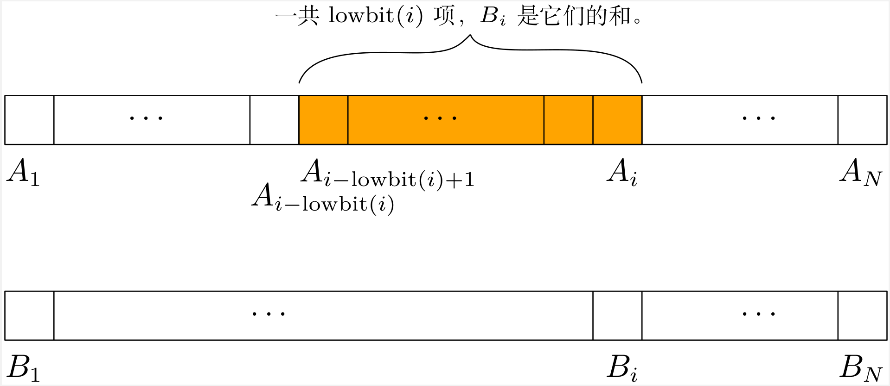

# 树状数组

## binary indexed tree（aka Fenwick tree）

### 一种简单而优美的数据结构

<div class=hidden>

$\DeclarePairedDelimiter\ceil{\lceil}{\rceil}$
$\DeclarePairedDelimiter\floor{\lfloor}{\rfloor}$
$\DeclareMathOperator{\lowbit}{lowbit}$

</div>


---

# 目录

- 从 lowbit 说起
- 用树状数组解决动态前缀和问题
- 树状数组和树
- 树状数组的应用
- 树状数组的一般化

---

# lowbit

- 正整数 $x$ 的二进制写法里最右边（也说最后）那个 $1$ 称为 $x$ 的 lowbit。

- 函数 $\lowbit(x)$：$x$ 的二进制写法里最后那个 $1$ 所在的数位的权值。例如：
    - $20$ 写成二进制是 $10100$，最后那个 $1$ 在第 $2$ 位（从右往左数，从 $0$ 开始数），所在数位的权值是 $2^2$，所以 $\lowbit(20) = 2^2 = 4$。
    - $10$ 写成二进制是 $1010$，所以 $\lowbit(10) = 2$；
    - $5$ 写成二进制是 $101$，所以 $\lowbit(5) = 1$。
    
- $\lowbit(x)$ 是能整除 $x$ 的 $2$ 的最高次方。

---

# 计算 lowbit(x)

- 方法一：拿 $2$ 试除。
- 方法二：lowbit(x) 等于 x & -x

    ```cpp
    int lowbit(int x) {
        return x & -x;
    }
    ```

---

# x 和 -x 的编码


对正整数 $x$，$-x$ 的编码是把 $x$ 的编码（即 $x$ 的二进制写法）的每一位都取反再加一。

例：
- int 类型的值 $20$ 的编码是 $\underbrace{00\dots00}_{\text{27个0}}10100$，
- 取反以后变成 $\underbrace{11\dots11}_{\text{27个1}}01011$，
- 再加一又变成 $\underbrace{11\dots11}_{\text{27个1}}01100$，这就是 $-20$ 的编码。

---

# lowbit(x) 等于 x & -x 的原理

对比 $20$ 和 $-20$ 的编码
$$
\begin{aligned}
&00\dots0010100\\
&11\dots1101100
\end{aligned}
$$

在 $20$ 的 lowbit 以下，包括 lowbit，$-20$ 和 $20$ 的编码相同，在 lowbit 以上，$-20$ 和 $20$ 的编码相反。

---

# 动态前缀和问题（Point Add Prefix Sum）

给你一个长为 $N$ 的整数序列 $A = (A_1, \dots, A_N)$。处理 $Q$ 个操作，操作有两种。
- 给你一个下标 $i$，求 $A_1 + A_2 + \dots + A_i$。
- 给你一个整数 $x$ 和下标 $i$，给 $A_i$ 加上 $x$。


---


考虑一个跟序列 $A$ 一样长的序列 $B = (B_1, \dots, B_N)$。

对于每个 $i = 1, \dots, N$，
$$ B_i = A_i + A_{i-1} + \dots + A_{i-\lowbit(i) + 1},$$

也就是说 $B_i$ 是从 $A_i$ 开始往左数 $\lowbit(i)$ 项之和。



我们把这个序列 $B$ 称为序列 $A$ 的**树状数组**。


---

# 用树状数组 $B$ 求序列 $A$ 的前缀和

只要在 $B$ 里从 $B_i$ 开始往左找需要的项，加起来。

```cpp
long long sum(int i) {
    long long ans = 0;
    while (i > 0) {
        ans += b[i];
        i -= lowbit(i); //或者写 i &= i - 1;
    }
    return ans;
}
```

- $i - \lowbit(i)$ 就是把 $i$ 的 lowbit 去掉（即变成 $0$）所得的数。
- 在函数 sum 里，ans += b[i] 运行的次数就是 $i$ 的二进制写法里 $1$ 的个数。
- sum(n) 的时间复杂度是 $O(\log n)$。

---

# 给 $A_i$ 加上 $x$

- 在 $B$ 里，凡是含有 $A_i$ 的项都给它加上 $x$。

在 $B$ 里（从左往右看）第一个含有 $A_i$ 的项就是 $B_i$，

在 $B_i$ 之后，还有哪些项含有 $A_i$？

---

#  lowbit 函数的一些性质

对于正整数 $i$ 有
- $\lowbit(i) \le i$，
- 如果 $1 \le j < \lowbit(i)$，那么 $\lowbit(i + j) = \lowbit(j)$，
- $\lowbit(i + \lowbit(i)) \ge 2 \lowbit(i)$。

> 证明都不困难。

---

# 在 $B_i$ 之后，还有哪些项含有 $A_i$？

- 在 $B_i$ 之后，从 $B_{i+1}$ 到 $B_{i+\lowbit(i) - 1}$ 都跟 $B_i$ 不相交，而 $B_{i+\lowbit(i)}$ 包含 $B_i$。

> 我们说 $B_i$ 和 $B_j$ 相交或者不相交，指的是 $B_i$ 和 $B_j$ 分别对应的序列 $A$ 的那一段相交或者不相交。

由此可以推得
- 在 $B_i$ 之后的每一项要么和 $B_i$ 不相交，要么包含 $B_i$。
- 在 $B_i$ 之后下一个包含 $B_i$ 的项是 $B_{i+\lowbit(i)}$。
- 在序列 $B$ 里，含有 $A_i$ 的那些项是
    - $B_i$，
    - $B_{i+\lowbit(i)}$，
    - $B_{i+\lowbit(i) + \lowbit(i+\lowbit(i))}$
    - ……

---

# 给 $A_i$ 加上 $x$

```cpp
int n; // n是序列A的长度
void add(int i, int x) {
    while(i <= n) {
        b[i] += x;
        i += lowbit(i); //或者写 i = (i | i - 1) + 1;
    }
}
```


- 从 $i$ 变成 $i + \lowbit(i)$，lowbit 至少左移一位，所以函数 add 的时间是 $O(\log N)$。

- 总之，树状数组可以在 $O(\log N)$ 的时间内处理动态前缀和问题里的两个操作。

---

# 用树状数组解动态区间和（Point Add Range Sum）


给你整数序列 $A = (A_1, \dots, A_N)$。处理 $Q$ 个操作，操作有两种。
- 给你两个下标 $l, r$，求 $A_l + A_{l+1} + \dots + A_r$。
- 给你一个整数 $x$ 和下标 $i$，给 $A_i$ 加上 $x$。

---

区间和可以表为两个前缀和的差，有
$$
A_l + \dots + A_r = (A_1 + \dots + A_r) - (A_1 + \dots + A_{l-1}).
$$


---

# 构建树状数组


如何从序列 $A$ 算出它的树状数组 $B$？

法一：根据定义，算出 $A$ 的前缀和序列，记作 $S$，那么 $B_i$ 就等于 $S_i - S_{i-\lowbit(i)}$。

法二：假想一开始 $A$ 的每一项都是 $0$，而把 $A_i$ 的初始值通过加操作加给 $A_i$。

---

# 树状数组和树

Q：为什么序列 $B$ 被叫做树状数组，它和树有什么关系？

A：因为序列 $B$ 隐含着树的结构。

---

# 树状数组其实是树

 $B_{i+\lowbit(i)}$ 是包含 $B_i$ 的“最小元素”，不妨把 $B_{i+\lowbit(i)}$ 看作 $B_i$ 的父节点。


- 一个矩形条表示一个 $B_i$ 对应的 $A$ 的那一段，箭头从一个 $B_i$ 指向它的父节点。
- 如果 $\lowbit(i) = 2^{k}$ 那么 $B_i$ 在从下往上数第 $k$ 层（从 $0$ 开始数）。

---


- 如果 $\lowbit(i) = 2^{k}$ 那么 $B_i$ 有 $k$ 个孩子，它们的下标是 $i - 2^{0}$，$i -  2^{1}$，$\dots$，$i- 2^{k-1}$。
- $B_i$ 的所有孩子合起来再加上 $A_i$ 恰好凑成 $B_i$。

---

# $O(N)$ 时间构建树状数组

依据上面两条性质，我们再给出两个构建树状数组的方法。

```cpp
// 方法一
void build_fenwick(int n) {
    for (int i = 1; i <= n; i++) {
        b[i] += a[i];
        if (i + lowbit(i) <= n)
            b[i + lowbit(i)] += b[i];
    }
}
// 方法二
void build_fenwick_2(int n) {
    for (int i = 1; i <= n; i++) {
        for (int j = lowbit(i) / 2; j > 0; j /= 2)
            b[i] += b[i - j];
        b[i] += a[i];
    }
}
```

---

# 树状数组和线段树


- 有人说，树状数组是线段树去掉所有右孩子。
- 树状数组能做的，线段树都能做。
- 但是树状数组胜在简单。

---

# 树状数组的应用

---

# 区间加（Range Add Point Get）

给你整数序列 $A = (A_1, \dots, A_N)$。处理 $Q$ 个操作，操作有两种。
- 给你两个下标 $l, r$ 和一个整数 $x$，给每个 $A_l, A_{l+1}, \dots, A_r$ 加上 $x$。
- 给你一个下标 $i$，求 $A_i$。

---

考虑序列 $A$ 的**差分序列** $D = (D_1, \dots, D_N)$，其中 $D_1 := A_1$，$D_i := A_{i} - A_{i-1}$（$2\le i\le N$）。不难看出，对于每个 $i =1, \dots, N$ 有
$$
A_i = D_1 + \dots + D_i
$$
也就是说，序列 $A$ 是它的差分序列 $D$ 的前缀和序列。给每个 $A_l, \dots, A_r$ 加上 $x$，在差分序列上的效果是给 $D_l$ 加上 $x$，给 $D_{r+1}$ 减去 $x$。

因此我们考虑维护差分序列 $D$ 的树状数组。

---


# 区间加-区间和（Range Add Range Sum）

<!-- P3347 -->
给你一个长为 $N$ 的整数序列 $A = (A_1, \dots, A_N)$。处理 $Q$ 个操作，操作有两种。
- 给你两个下标 $l, r$ 和一个整数 $x$，给每个 $A_l, A_{l+1}, \dots, A_r$ 加上 $x$。
- 给你两个下标 $l, r$，求 $A_l + A_{l+1} + \dots + A_r$。

---

令 $S = (S_1, \dots, S_N)$ 为序列 $A$ 的前缀和序列，即对每个 $i = 1, \dots, N$，
$$S_i := A_1 + \dots + A_i.$$

给每个 $A_l, \dots, A_r$ 加上 $x$，在前缀和序列 $S$ 上的效果是
- $S_1, \dots, S_{l-1}$ 不变；
- 对每个 $i = l, \dots, r$，给 $S_i$ 加上 $(i-l+1)x$；
- 对每个 $i = r+1, \dots, N$，给 $S_i$ 加上 $(r-l+1)x$。

把 $S_i$ 写成 $S_i = P_i i + Q_i$。给每个 $A_l, \dots, A_r$ 加上 $x$，在序列 $P$ 和 $Q$ 上的效果是
- 对每个 $i = 1, \dots, l-1$，$P_i$，$Q_i$ 不变；
- 对每个 $i = l, \dots, r$，给 $P_i$ 加上 $x$，给 $Q_i$ 加上 $(1-l)x$；
- 对每个 $i = r+1, \dots, N$，$P_i$ 不变，给 $Q_i$ 加上 $(r-l+1)x$。

解法：分别维护 $P$ 和 $Q$ 的差分序列的树状数组。


---

# 逆序数

<!-- 洛谷P1908 -->
对于一个长为 $N$ 的序列 $X = (X_1, \dots, N)$，若整数对 $(i, j)$ 满足 $1 \le i < j \le N$ 且 $X_i > X_j$ 则称 $(i, j)$ 是 $X$ 的一个**逆序**。$X$ 的全部逆序的数量称为 $X$ 的**逆序数**。

给你一个长为 $N$ 的整数序列 $A = (A_1, \dots, A_N)$。求 $A$ 的逆序数。

- $1 \le N \le 2\times 10^5$
- $1 \le A_i \le 10^9$

---

# 坐标压缩

- $(i,j)$ 是不是逆序，$A_i$ 和 $A_j$ 究竟是多少不重要，重要的是二者谁大谁小。
- 设 $A_1, \dots, A_N$ 中有 $M$ 个不同的值，我们把 $A_1, \dots, A_N$ 保序映射到 $\set{1, 2, \dots, M}$。例如把 $A = (3, 1, 4, 1, 5, 9)$ 变成 $A=(2, 1, 3, 1, 4, 5)$。这个处理称为**坐标压缩**。

经过坐标压缩，我们有 $1 \le A_i \le M$。

> 更多人把这个处理称为「离散化」，这不恰当。

---

# 用树状数组计算逆序数

- 对于每个 $j = 1, \dots, N$，我们计算有多少个 $i \in\set{1, \dots, j-1}$ 使得 $(i, j)$ 是 $A$ 的逆序，或者说满足 $A_i > A_j$。

- 我们可以用树状数组对每个 $j$ 算出有几个 $i\in\set{1,\dots,j-1}$ 满足 $A_i \le A_j$，
如果有 $k$ 个这样的 $i$，那么就有 $j - 1 - k$ 个 $i$ 使得 $(i,j)$ 是逆序。

---

# 一般树状数组

回想我们是如何定义一个整数序列 $A$ 的树状数组 $B$，然后利用 $B$ 求 $A$ 的前缀和的，要点是 
- 每个 $B_i$ 是 $A$ 的一段之和

$A$ 的前缀和 $A_1 + \dots + A_i$ 可以表为 $B$ 的若干项之和，是因为整数加法满足**结合律**。

于是我们想到，
- 序列 $A$ 的元素不必限定为整数，前缀和里的加法运算也不必是整数相加。

我们尝试把树状数组推广到一般序列上。

---


令 $X$ 是一个带有二元运算 $\star$ 的集合，$A=(A_1, \dots, A_N)$ 是 $X$ 上的一个序列。


- 若 $\star$ 运算满足结合律，就可以定义序列 $A$ 的树状数组 $B=(B_1, \dots, B_N)$，
    $$B_i := A_{i-\lowbit(i) + 1} \star A_{i-\lowbit(i) + 2}  \star \dots  \star A_{i-1}  \star  A_{i} $$

    利用 $B$ 求的 $A$ 的前缀和。
- 若 $\star$ 运算可逆，可以用 $B$ 求 $A$ 的区间和。
- 若 $\star$ 运算满足交换律，对于把 $A_i$ 修改为 $x\star A_i$（$x\in X$）的操作，可以用前面 add 函数的方法去维护 $B$ 。

---

# 习题

---

# 累积累积累积和

给你 $N$，$Q$ 和 $A=(A_1, \dots, A_N)$。处理 $Q$ 个询问，询问有两种：
- $1$ $x$ $v$：把 $A_x$ 改成 $v$。
- $2$ $x$：令 $B_i = \sum_{j=1}^{i} A_j$，$C_i = \sum_{j=1}^{i} B_j$，$D_i = \sum_{j=1}^{i} C_j$。输出 $D_x$ 模 $998244353$。

###### 限制

- $1 \le N, Q \le 2\times 10^5$
- $0 \le A_i, v \le 10^9$
- $1 \le x \le N$

---


# Rectangle Sum

二维平面上有 $N$ 个带权值的点。第 $i$ 个点的坐标是 $(x_i, y_i)$，权值是 $w_i$。处理 $Q$ 个询问。
- $l$ $r$ $d$ $u$：求满足 $l\le x < r$ 和 $d \le y < u$ 的点的权值之和。

###### 限制

- $1 \le N, Q \le 2000000$
- $0 \le x_i, y_i, w_i \le 10^9$
- $0 \le l_i < r_i \le 10^9$
- $0 \le u_i < d_i \le 10^9$


---

# 序列移位操作

有 $N$ 个格子排成一行。每一个格子里有一个整数。一开始，第 $i$ 个格子里的数是 $A_i$。处理 $Q$ 个询问
- 给你一个整数 $i$（$1 \le i \le N$），输出第 $i$ 个格子的整数。把第 $i$ 个格子里的整数拿出来，把第 $i + 1$ 到第 $N$ 个格子里的数移到前一个格子里。把原来在第 $i$ 个格子里的数放到第 $N$ 个格子里。

###### 限制

- $1 \le N, Q \times 3\times 10^5$
- $1 \le A_i \le 10^9$

---

# 列队

军训时，$n \times m$ 名学生站成一个 $n$ 行 $m$ 列的方阵。行列都从 $1$ 开始编号。
最初，第 $i$ 行第 $j$ 列 的学生的编号是 $(i-1)\times m + j$。

在一天中发生了 $q$ 次离队事件。每次有一个学生离队，方阵中出现一个空位；为了队伍的整齐，教官会依次下达两条指令：
1. 向左看齐。这时第一列保持不动，所有学生向左填补空缺。
2. 向前看齐。这时第一行保持不动，所有学生向前填补空缺。


教官规定不能有两个或更多学生同时离队。即在前一个离队的学生归队之后，下一个学生才能离队。因此在每一个离队的学生要归队时，队伍中有且仅有第 $n$ 行第 $m$ 列一个空位，这个学生会自然地填补到这个位置。


计算每一次离队事件中，离队的同学的编号是多少。

**注意**：学生的编号不会随着离队事件的发生而改变。

$1 \le n, m , q \le 3\times 10^5$


