# 线段树

## segment tree (segtree)


---

# 目录

- 区间查询和区间操作
- 序列的线段树
- 简单线段树
- lazy 线段树


---

# 序列

- 一些东西排成一行就成为一个<ruby>**序列**<rt>sequence</rt></ruby>。序列里的每个东西称为一个元素，序列的元素个数称为序列的长度。一个长为 $N$ 的序列 $A$ 通常写作 $A = (A_1, A_2, \dots, A_N)$ 或者 $A = (A_0, A_1, \dots, A_{N-1})$。
- 序列的一段称为一个<ruby>**区间**<rt>range</rt></ruby>。序列 $A$ 的一段 $(A_l, A_{l+1}, \dots, A_r)$ 通常记作 $A[l,r]$ 或者 $A[l, r+1)$。

---

# 区间查询和区间操作

OI 里有**许多**这类问题

- 静态 RMQ
- 单点加区间求和
- range chmin
- range sum range chmin
- ……

线段树是解决这类问题的一大利器。


---

## 静态 RMQ

<!-- [洛谷P3865](https://www.luogu.com.cn/problem/P3865) -->

给你一个序列 $A_1, A_2, \dots, A_N$。回答 $M$ 个询问。
- 给你 $l, r$，求 $A_l, A_{l+1}, \dots, A_r$ 的最小值。

---

## 单点加区间求和

给你一个序列 $A_1, \dots, A_N$。处理 $Q$ 个询问。询问有两种类型

- add $i$ $x$：$A_i \gets A_i + x$
- sum $l$ $r$：求 $A_l + A_{l+1} + \dots + A_r$

---

## range chmin

给你一个序列 $A_1, A_2, \dots, A_N$。进行 $M$ 个操作。
- $(l, r, x)$：对每个 $i = l, l + 1, \dots, r$，把 $A_i$ 改成 $\min(A_i, x)$。
输出最终的序列 $A$。

> chmin 里，ch 表示 change。

---

## range sum range chmin

给你一个序列 $A_1, A_2, \dots, A_N$。处理 $M$ 个询问。询问有两种类型

- $(l, r, x)$：对每个 $i = l, l + 1, \dots, r$，把 $A_i$ 改成 $\min(A_i, x)$。
- $(l, r)$：求 $A_l + A_{l+1} + \dots + A_r$。

---

# <ruby>二叉树<rt>binary tree</rt></ruby>

- 有根树
- 每个节点的孩子不超过两个
- 孩子有左右之分

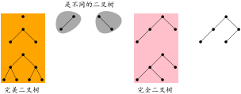

---


# <ruby>满二叉树<rt>full binary tree</rt></ruby>

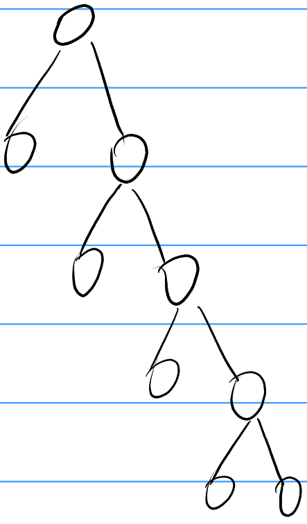
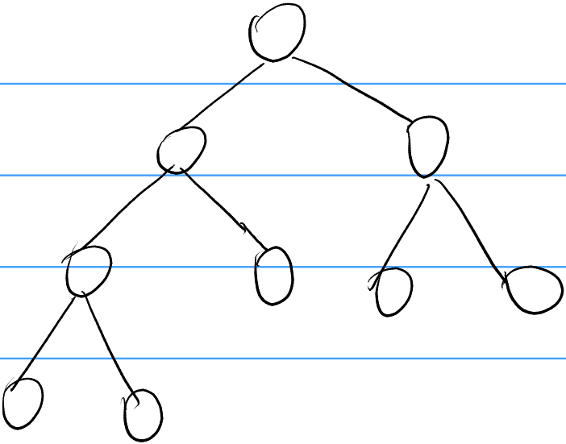

- 每个非叶子节点都有两个孩子。

- 性质：有 $n$ 个叶子的满二叉树一共有 $2n-1$ 个节点。


---

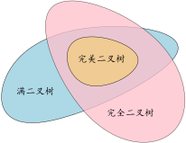


---


# 线段树

线段树是一种支持
- 查询序列的区间信息
- 处理对序列的区间操作

的数据结构。


---

# 序列的线段树


一个长为 $9$ 的序列 $A_1, A_2, \dots, A_9$ 的线段树：

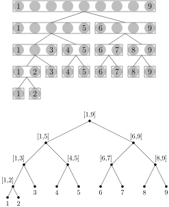

- 线段树的每个节点对应序列的一段；每个节点维护它所对应的那一段的某些信息。
    - 根对应整个序列；
    - 节点 $x$ 的左右孩子分别同与 $x$ 对应的那一段的左一半和右一半对应；不能均分时，让左一半多一项；
    - 每个叶子对应序列的一项。


- 节点 $x$ 上的信息由**合并** $x$ 的左右孩子上的信息得来。


---

# 线段树的结构


- 线段树是**高度平衡**的满二叉树：每个节点的左右孩子的高度相差不超过 $1$。

- 除了最后一层外，每一层都是满的。

- 一个序列的线段树的结构完全由序列长度决定。长度为 $N$ 的序列的线段树
    - 有 $N$ 个叶子，$2N-1$ 个节点。
    - 高度是 $\lceil\log_2 N\rceil$，有 $1 + \lceil\log_2 N\rceil$ 层。

---

# 线段树的代码实现

- 给线段树的节点**编号**。
- 用数组存储线段树节点的信息。

## 编号方案

- level-order
- preorder
- inorder


---

# level-order 编号


- 根的编号是 $1$；若节点 $x$ 的编号是 $i$，则 $x$ 的左右孩子的编号分别是 $2i$ 和 $2i+1$。 
- 若一个非根节点的编号是 $i$，则它的父节点的编号是 $\lfloor i/2\rfloor$。


---


# 线段树节点的最大编号


有 $N$ 个叶子的线段树，采用 level-order 编号，节点的最大编号**小于** $4N-2$。

* 若最后一层的最后一个节点的编号 $\ge 4N-2$，则它的父节点的编号 $\ge 2N-1$；
* 线段树去掉最后一层就变成完美二叉树，若一个完美二叉树有 $k$ 个叶子，则叶子的最大编号是 $2k-1$。
* $2k - 1 \ge 2N-1 \implies k \ge N$，即线段树倒数第二层的节点数 $\ge N$，于是线段树的叶子数大于 $N$。矛盾！

---

# 线段树节点的最大编号

令 $f(n)$ 为具有 $n$ 个叶子的线段树的节点的最大编号。对于任意 $\epsilon > 0$，存在 $n$ 满足 $f(n)/n >4 - \epsilon$。

考虑具有 $n = 2^a(2^b + 1)$ 个叶子的线段树，这里 $a, b \ge 1$；其节点的最大编号是 $(2^{a+1} - 1)2^{b+1} + 1$，写成二进制是 $\underbrace{1\dots1}_{(a+1)个1}\underbrace{0\dots0}_{b个0}1$。

显然，当 $a, b$ 充分大时，
$$ {(2^{a+1} - 1)2^{b+1} + 1 \over 2^{a}(2^b + 1)}  $$
趋近于 $4$。

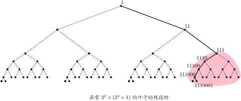

---

# preorder 编号


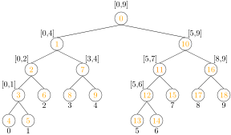

设 $x$ 号节点不是叶子，它对应的区间是 $[l, r]$；令 $m = \lfloor(l+r)/2\rfloor$，那么
- $x$ 的左孩子的编号为 $x+1$。
- $x$ 的右孩子的编号为 $x + 2(m - l+1)$。

---

# inorder 编号

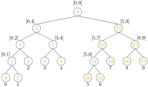

- 叶子的编号是偶数，非叶子节点的编号是奇数。
- 第 $i$ 个叶子的编号是 $2i$。
- 设 $x$ 号节点对应区间是 $[l,r]$，那么
若 $l=r$ 则 $x = 2l = l + r$，否则 $x = l+r + [l+r是偶数]$。

---


# 在线段树上查询区间信息

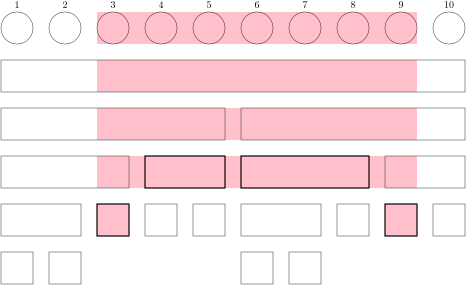

- 自顶向下，把要查询的区间**拆解**为线段树的节点。把这些节点上的信息**合并**起来，得到要查询的区间的信息。
- 在线段树的每一层里最多访问 $4$个点。
- 一共访问 $O(\log N)$ 个点。

---


# 例一：静态 RMQ

给你一个长为 $N$ 的整数序列 $A_1, A_2, \dots, A_N$。依次处理 $Q$ 个询问：

- $l_i$ $r_i$：输出 $\min(A_{l_i}, A_{l_i + 1}, \dots, A_{r_i})$。

###### 限制

- $1 \le N, Q \le 5 \times 10^5$
- $0 \le A_i \le 10^9$
- $1 \le l_i \le r_i \le N$

---

# 例子

$A = (3, 1, 4, 1, 5, 9, 2, 6, 5, 3)$

## 构建线段树

- 自底向上


## 查询区间最小值

- 询问 $\min(A_3, \dots, A_9)$。

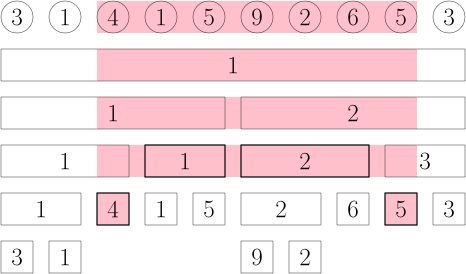

---


## 构建线段树

```cpp
const int maxn = 5e5 + 5;
int a[maxn];
int tree[4 * maxn];
// 节点x对应的区间：[l, r]
void build(int x, int l, int r) {
    if (l == r) {
        tree[x] = a[l];
        return;
    }
    int m = (l + r) / 2;
    build(x * 2, l, m);
    build(x * 2 + 1, m + 1, r);
    tree[x] = min(tree[x * 2], tree[x * 2 + 1]);
}
// build(1, 1, n)
```

---


## 查询区间最小值

```cpp
// 节点x对应的区间：[l, r]，查询区间：[ql, qr]
int query(int x, int l, int r, int ql, int qr) {
    if (r < ql || qr < l) return 1e9 + 5;
    if (ql <= l && r <= qr) return tree[x];
    int m = (l + r) / 2;
    return min(query(x * 2, l, m, ql, qr),
               query(x * 2 + 1, m + 1, r, ql, qr));
}
// query(1, 1, 10, 3, 9)
```

---

# 修改序列的一项


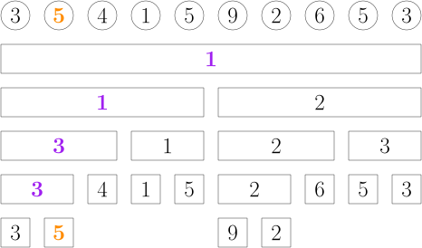
- 把 $A_2$ 修改为 $5$：修改跟 $A_2$ 对应的叶子，自底向上，重新计算它的每个祖先节点上的信息。

```cpp
// 把 a[p] 改成 v
void set(int x, int l, int r, int p, int v) {
    if (!(l <= p && p <= r)) return;
    if (l == r) {
        tree[x] = v;
        return;
    }
    int m = (l + r) / 2;
    set(x * 2, l, m, p, v);
    set(x * 2 + 1, m + 1, r, p, v);
    tree[x] = min(tree[x * 2], tree[x * 2 + 1]);
}
// set(1, 1, 10, 2, 5)
```

---

# 例二：单点加区间求和

给你一个长为 $N$ 的整数序列 $a_1, a_2, \dots, a_{N}$。依次处理 $Q$ 个询问：
- 0 $p$ $x$：$a_p \gets a_p + x$
- 1 $l$ $r$：输出 $\sum_{i=l}^{r} a_i$ 

###### 限制

- $1 \le N, Q \le 5 \times 10^5$
- $0 \le a_i, x \le 10^9$
- $1 \le p \le N$
- $1 \le l \le r \le N$

---

# 用线段树维护区间操作

---

# 例三：区间加单点求值

给定长为 $N$ 的整数序列 $A = (A_1, A_2, \dots, A_N)$。处理 $Q$ 个询问：

- $\mathtt{add}$ $l$ $r$ $v$：对于每个 $i = l, l+1, \dots, r$，$A_i \gets A_i + v$。
- $\mathtt{get}$ $i$：输出 $A_i$。

###### 限制

- $1 \le N, Q \le 5\times 10^5$
- $0 \le A_i, v \le 10^9$
- $1 \le l \le r \le N$
- $1 \le i \le N$

---

# 例子

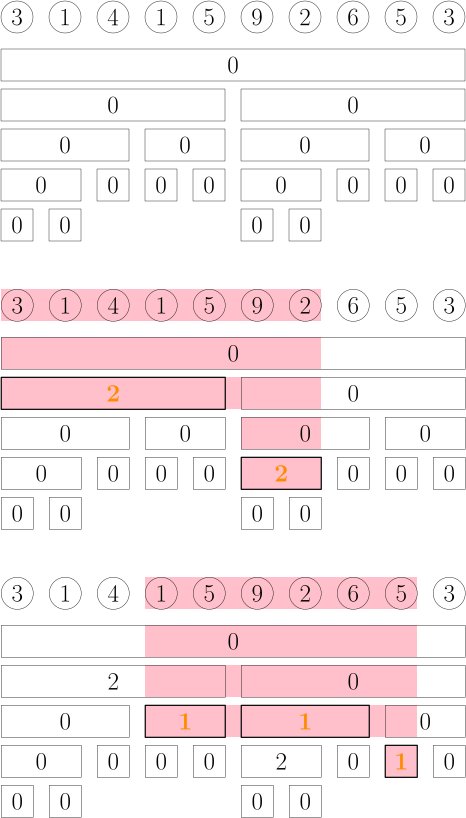


$A = (3, 1, 4, 1, 5, 9, 2, 6, 5, 3)$

## 区间加

- $\mathtt{add}\  1 \ 7\ 2$
- $\mathtt{add}\  4 \ 9\ 1$

```cpp
const int maxn = 5e5 + 5;
long long tree[4 * maxn];
void add(int x, int l, int r, int ql, int qr, int v) {
    if (qr < l || r < ql) return;
    if (ql <= l && r <= qr) {
        tree[x] += v;
        return;
    }
    int m = (l + r) / 2;
    add(x * 2, l, m, ql, qr, v);
    add(x * 2 + 1, m + 1, r, ql, qr, v);
}
```

---

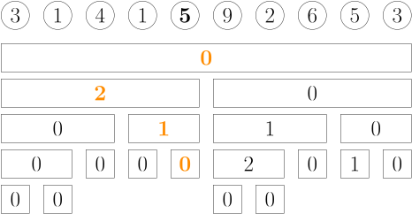

## 单点求值

- $\mathtt{get}\  5$

$A_5 = 0 + 1 + 2 + 0 + 5$

```cpp
long long get(int x, int l, int r, int p) {
    if (!(l <= p && p <= r)) return 0;
    if (l == r) return tree[x];
    int m = (l + r) / 2;
    return tree[x] + get(x * 2, l, m, p)
            + get(x * 2 + 1, m + 1, r, p);
}
```

---


# 例四：Range Affine Point Get

给定长为 $N$ 的整数序列 $A = (A_1, A_2, \dots, A_N)$。处理 $Q$ 个询问：

- affine $l$ $r$ $b$ $c$：对于每个 $i=l,l+1,\dots,r$，$A_i \gets b \times A_i + c$。
- get $i$：输出 $A_i \bmod 998244353$

###### 限制

- $1 \le N, Q\le 5\times 10^5$
- $0 \le A_i, c < 998244353$
- $1 \le b < 998244353$
- $1 \le l \le r \le N$

---

# 操作：可交换 vs 不可交换

- 例一的 add 操作是**可交换**的而例二的 affine 操作是**不可交换**的。
- $x \xrightarrow{加2} x + 2 \xrightarrow{加3} (x+2) + 3 = x+5$ 跟
$x \xrightarrow{加3} x + 3 \xrightarrow{加2} (x+3) + 2 = x+5$ 相同。
- $x \xrightarrow{乘2加3} 2x+3 \xrightarrow{乘5加4} 5(2x+3)+4 = 10x+19$ 跟
$x \xrightarrow{乘5加4} 5x+4 \xrightarrow{乘2加3} 2(5x+4)+3 = 10x+11$ **不同**。

---

# 操作的合成

- 加 $2$ 然后加 $3$ 相当于加 $5$。
- 乘 $2$ 加 $3$ 然后乘 $5$ 加 $4$ 相当于乘 $10$ 加 $19$
- 操作 $f$ 和 $g$ 的**合成**是这样**一个操作**：先进行操作 $g$ 然后进行操作 $f$；记作 $f \circ g$。
例如，把乘 $b$ 加 $c$ 这个操作表示为 $(b, c)$，那么 $(5,4) \circ (2,3)$ 就是 $(10, 19)$。

---

# 恒等操作

- 一种操作中往往有一个不变操作，对任何一个东西施加这个操作都保持这个东西不变，称之为**恒等操作**。
- 例如，对于 add 操作来说，加 $0$ 就是恒等操作；对于 affine 操作来说，乘 $1$ 加 $0$ 就是恒等操作。
- 恒等操作通常记为 $\mathrm{id}$。
- 对于任一操作 $f$，有 $\mathrm{id} \circ f = f\circ \mathrm{id} = f$。

---

# 用线段树维护 range affine 操作

## 例子

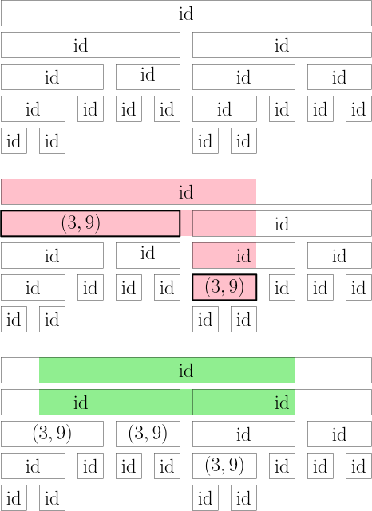
对序列 $A = (3, 1, 4, 1, 5, 9, 2, 6, 5, 3)$ 的 range affine 操作：

affine 1 7 3 9
affine 2 8 4 7


---

# 用线段树维护 range affine 操作

## 例子

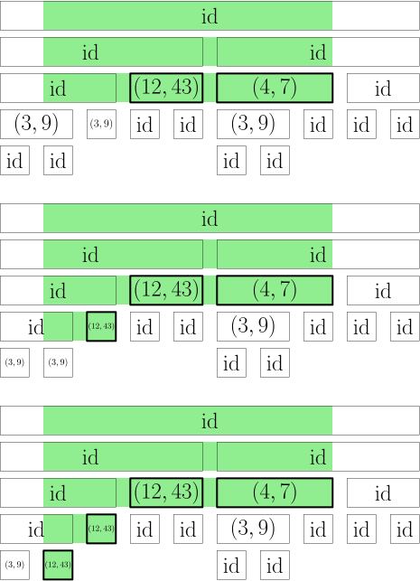
对序列 $A = (3, 1, 4, 1, 5, 9, 2, 6, 5, 3)$ 的 range affine 操作：

affine 1 7 3 9
affine 2 8 4 7

---

# 用线段树维护区间操作和查询区间信息

## 带懒标记的线段树（lazy segtree）

---

# 例五：Range Affine Range Sum


给定长为 $N$ 的整数序列 $A = (A_1, A_2, \dots, A_N)$。处理 $Q$ 个询问：

- 0 $l$ $r$ $b$ $c$：对于每个 $i=l,l+1,\dots,r$，$A_i \gets b \times A_i + c$。
- 1 $l$ $r$：输出 $\sum_{i=l}^{r} A_i \bmod 998244353$

###### 限制

- $1 \le N, Q\le 5\times 10^5$
- $0 \le A_i, c < 998244353$
- $1 \le b < 998244353$
- $1 \le l \le r \le N$


---


# 例六：Point Set Range Composite

给你 $N$ 个一次函数 $f_1, f_2, \dots, f_{N}$。$f_i(x) = a_i x + b_i$。依次处理 $Q$ 个询问。

- 0 $p$ $c$ $d$：把 $f_p$ 改为 $c x +d$。
- 1 $l$ $r$ $x$：输出 $f_{r}(f_{r-1}(\dots f_l(x))) \bmod 998244353$。

###### 限制

- $1 \le N, Q \le 5\times 10^5$
- $1 \le a_i, c < 998244353$
- $0 \le b_i, d, x < 998244353$
- $1 \le p \le N$
- $1 \le l \le r \le N$

---

# 例七：Range Set Range Composite


给你 $N$ 个一次函数 $f_1, f_2, \dots, f_{N}$。$f_i(x)= a_i x + b_i$。依次处理 $Q$ 个询问。

- 0 $l$ $r$ $c$ $d$：对每个 $i = l, \dots, r$，把 $f_i$ 改为 $cx +d$。
- 1 $l$ $r$ $x$：输出 $f_{r}(f_{r-1}(\dots f_l(x))) \bmod 998244353$。

###### 限制

- $1 \le N, Q \le 5\times 10^5$
- $1 \le a_i, c < 998244353$
- $0 \le b_i, d, x < 998244353$
- $1 \le l \le r \le N$

